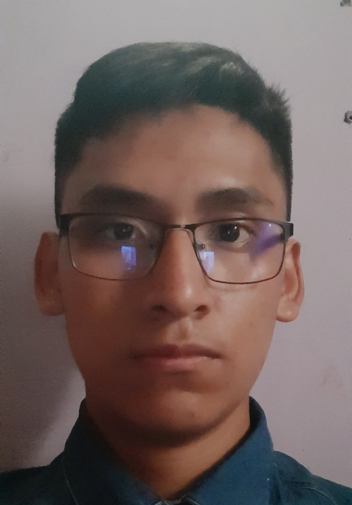

# Andy Taipe Sicha

* Código : 20211404I
* Ciclo Relativo : 5to
* Correo personal: andytaipesicha@gmail.com
* Correo institucional: ronny.taipe.s@uni.pe
* Edad: 21
* **GitHub:** [TaipeAndy](https://github.com/TaipeAndy)
## Presentación
•¿Por qué la UNI - FIIS?
La carrera que deseaba y el prestigio de la universidad fueron las razones principales del porq elegir la carrera de ingeniería de sistemas en la FIIS.

•¿Cómo evalúo mi experiencia con los cursos de la carrera hasta el momento?
Ningún tipo de aprendizaje es innecesario o inservible, pero en cierto modo siento que algunos cursos no son del todo esenciales para las diferentes líneas de carrera dentro de la facultad, si hubiese cursos más centrados a la programación o manejo de datos ya sea en el avance curricular o de manera electiva, muchos estarían más que contentos.

•¿Cuál es mi experiencia en programación y bases de datos?
Desde primer ciclo se lleva 1 curso de programación, por ello tengo experiencia en programación en python,c++, java y sql, además de haber llevado los cursos de python para ingenieria y base de datos mysql.

•¿Cómo fue mi experiencia en el curso de Modelado Conceptual de datos y qué tema elegí?
Elegí el tema de transporte, mi experiencia en el curso MCD fue un poco complicada, pues como muchos lo conocen es conocida como un curso filtro, algunos mencionando que es por los profesores, pero a mi parecer elrendimiento en el curso que tenga un alumno  es un 80% de este y 20% del docente.

•¿Qué espero del curso?
Espero reforzar conocimientos que quizá no me quedaron del todo claro en el curso anterior de manera práctica y también aprender más de lo referente a base de datos y aplicaciones que lo complementen.

•¿Cómo me veo en 10 años?
Me veo como el líder de un equipo de trabajo remoto de una empresa de prestigio.

**[Ver a integrantes](../integrantes.md)**

***[Regresar al índice](../../README.md)***
