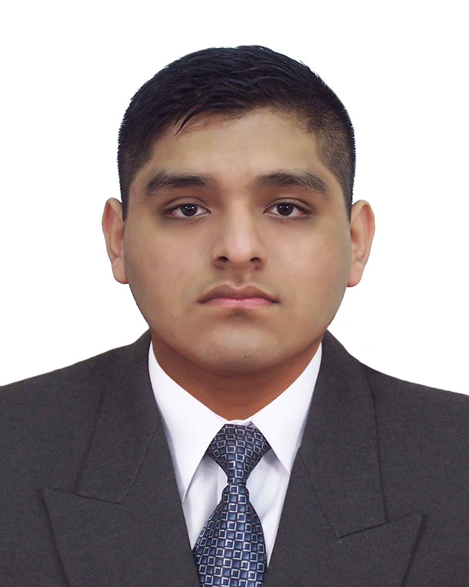

# Jhon Damian

Hola, mi nombre es Jhon Kenedy Damian Cutisaca y estoy estudiando la carrera de Ingenieria de Sistemas en la Universidad Nacional de Ingenieria

* Ciclo relativo : 5
* Codigo UNI : 20212568E
* Correo personal : jkdamian11@gmail.com
* Correo institucional : jhon.damian.c@uni.pe
* Usuario de Github: [kenedy428](https://github.com/kenedy428) 

# Presentacion

**¿Por qué la UNI - FIIS?**

Por que siempre me gustaron los temas relacionados a la tecnología, además de que quería ser ingeniero, y la UNI me parecía la mejor opción en relación calidad-costo.

**¿Cómo evalúo mi experiencia con los cursos de la carrera hasta el momento?**

Fue una experiencia inolvidable, cada curso era una experiencia diferente, en un curso podría estar tranquilo y gustoso, y en otro andaría estresado. Si bien hubo cursos que cada tanto me hacían preguntar por qué esta esto en la carrera, no me molesta haberlos llevado.

**¿Cuál es mi experiencia en programación y bases de datos?**

Mi experiencia con la programación fue aceptable únicamente con los cursos que llevé en la carrera,como Python,c++,y java,y con respecto a la base de datos, vi de manera básica lo que es el SQL.

**¿Cómo fue mi experiencia en el curso de Modelado Conceptual de datos y qué tema elegí?**

Mi experiencia en el curso de modelado conceptual de datos fue placentera, escogí una empresa de ponedora de huevos, y con mi grupo nos dedicamos a modelar el área de crianza de gallinas.

**¿Qué espero del curso?**

Espero comprender mejor el modelamiento de datos, y poder plasmarlo en un programa, ya que en el anterior curso solo fue en un documento.

**¿Cómo me veo en 10 años?**

En 10 años ya me veo como un ingeniero de sistemas, trabajando en una empresa formada junto a un grupo de compañeros que tengo, y poco a poco estamos avanzando.

**[Ver a integrantes](../integrantes.md)**

***[Regresar al índice](../../README.md)***
