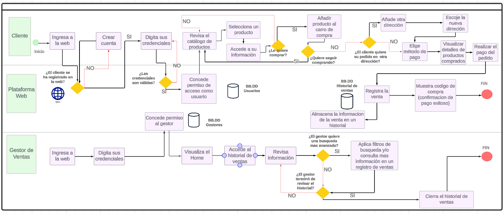
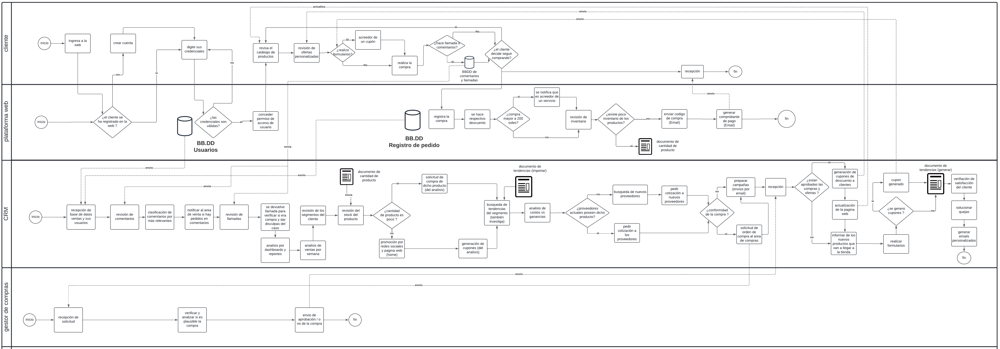

## 1. Descripción de la Empresa, del Proceso de Negocio Elegido y Motivación
### 1.1 Datos de la empresa
- Descripción de la empresa: Es una microempresa que vende maquillaje y papelería que busca traer productos de buena calidad y buen precio, sus principales productos son maquillaje, lapiceros, cuadernos.

- RUC: 20602390510
- Razón social: VASOA srl
- Direción: Tienda Virtual
- Teléfono: 914166070
- Misión: Nuestra misión es ser un referente en el mercado por la diversidad y calidad de nuestros productos en papelería y maquillaje. Buscamos ofrecer una orientación personalizada a nuestros clientes para encontrar los productos que mejor se adapten a sus gustos con la única finalidad de satisfacerlos.💗✨
- Visión: Nuestra visión es ser reconocidos como el espacio preferido para aquellos que buscan una experiencia de compra excepcional en el mundo del maquillaje y la papelería por lo que nos esforzamos por crear un ambiente acogedor y emocionante, donde los clientes puedan explorar una amplia diversidad de productos y recibir asesoramiento personalizado por parte de nuestro equipo capacitado. Es así que aspiramos establecer relaciones sólidas y duraderas con nuestros clientes, basadas en la confianza, la satisfacción y la lealtad hacia nuestro servicio por eso es que nos innovaremos constantemente para mantenernos a la vanguardia de las tendencias y necesidades de nuestros público, sin descuidar la dedicación y calidad procurada. 💗
- Productos ofrecidos:
  - Papelería:
    - Cuadernos
    - Lapiceros
  - Maquillaje
    - Paletas
    - Rubores
    - Primers
    - Polvos y correctores
    - Glitter
    - Delineadores de ojos y labios
    - Labiales y glosses
    - Máscaras de pestañas
### 1.2 Descripción del proceso de negocio

- Proceso de compra - Este proceso se refiere a las compras de los diversos productos mediante la aceptación de ofertas realizadas por los proveedores, estos productos posteriormente irán al almacén de la empresa.
- Proceso de venta - Este proceso es acerca de los procesos de venta en la empresa que inicia desde que el cliente nos contacta para venderle el producto.
- Proceso de almacen - Este proceso se refiere a cómo se gestiona el almacén de manera que constatemente se verifica el stock de los productos.
- Proceso de distribucion - Este proceso se refiere a las actividades que abarcan llevar el producto hasta el cliente.
- Proceso de marketing - Este proceso es acerca de las actividades que realizan para llamar al cliente.
- Proceso de finanzas - Este proceso abarca las diversas actividades en que se gestionan las ganancias y perdidas en base a las compras, los gastos, pagos y las ventas.
- Proceso de CRM - Este proceso abarca las actividades para mapear a los clientes y saber mejor sus necesidades.

### PROCESO AS IS

- Proceso de Compra

|Secuencia | Actividad | Descripción | Responsable |
|:----:|:----------------:|:--------------------------:|:-----------:|
| 1 | Solicitud del área de almacén para realizar una compra | El área de almacén solicitó realizar una compra porque ya no quedan existencias de algún producto. | Gestor de almacén |
| 2 | Aprobación para solicitar una compra | El área de compra recibe la solicitud de falta de productos y procede a aprobarla | Gestor de compras |
| 3 | Elección de productos a comprar | El área de compra revisa los productos faltantes emitidos en la solicitud y procede a revisar la cantidad que comprara de dichos productos | Gestor de compras |
| 4 | Evaluación del proveedor | El área de compra revisa todas las ofertas realizadas por los proveedores y decide aceptarlas o rechazarlas en función al precio que ofrezcan | Gestor de compras |
| 5 | Emisión de solicitud de compra | El área de compra se acepta una propuesta del proveedor y procede a emitir una solicitud de compra hacia dicho proveedor | Gestor de compras |
| 6 | Recepción de la solicitud por parte del proveedor| El proveedor recepciona la solicitud emitida por el área de compras. | Proveedor |
| 7 | Realización del pago | El área de compra realiza el pago acordado hacia el proveedor | Gestor de compras |
| 8 | Recepción del comprobante de pago del Proveedor | El área de compras recepciona el comprobante de pago que realizo hacia el proveedor | Gestor de compras |
| 9 | Validación de la Factura | Se valida la factura emitida hacia la empresa| Contador |
| 10 | Almacenar Documento | Se almacena la factura que fue emitida | Contador | 
| 11 | Registrar la compra en Excel | Se registran los productos comprados en un Excel | Gestor de Compra |
| 12 | Recepción de productos | La empresa recepciona los productos que fueron entregados | Gestor de compra |
| 13 | Envió al almacén | Se envía al almacén todos los productos recepcionados para su posterior revisión | Gestor de compra |
| 14 | Recepción en almacén | En el almacén recepciona todos los productos y serán revisados para asegurarse que llegaron en correcto estado | Gestor de almacén |

- Proceso de Venta

| Secuencia | Actividad                                | Descripción                                                                                                      | Responsable      |
|-----------|------------------------------------------|------------------------------------------------------------------------------------------------------------------|------------------|
| 1         | Cliente contacta a la empresa           | El cliente se comunica con la empresa a través de llamadas telefónicas o correos electrónicos.                  | Gestor de Ventas |
| 2         | Realizar pedido                          | El cliente proporciona los detalles del pedido (productos, cantidades, etc.) durante la comunicación con la empresa. | Gestor de Ventas         |
| 3         | Recepción del pedido                    | Un empleado de ventas registra manualmente el pedido del cliente en los registros de la empresa.                 | Gestor de Ventas |
| 4         | Revisión de inventarios                 | Se requiere que un empleado  verifique manualmente la disponibilidad de los productos en inventario e informe dicha disponibilidad al cliente.                  | Gestor de Ventas |
| 5         | Confirmación de pedido al cliente       | Un empleado de ventas confirma el pedido al cliente a través de llamadas telefónicas o correos electrónicos.     | Gestor de Ventas |
| 6         | Elección de método de pago              | Se discute con el cliente los métodos de pago disponibles durante la comunicación.                                | Gestor de Ventas |
| 7         | Realizar el pago                        | El cliente realiza el pago a través de los métodos de pago acordados, como transferencia bancaria o depósito en efectivo. | Gestor de Ventas         |
| 8        | Confirmación de pago                    | Un empleado de ventas verifica manualmente el pago recibido y actualiza el estado del pedido en los registros.    | Gestor de Ventas |
| 9        | Envío de código de compra               | Se genera manualmente un código de compra único y se envía al cliente por correo electrónico.                    | Gestor de Ventas |
| 10      | Emitir comprobante de pago electrónico | Se genera manualmente un comprobante de pago y se envía al cliente por correo electrónico. | Gestor de Ventas |

- Proceso de Almacén

| Secuencia | Actividad                                | Descripción                                                                                                      | Responsable      |
|-----------|------------------------------------------|------------------------------------------------------------------------------------------------------------------|------------------|
|1| Buscar Mercancía|Al confirmase una venta, la persona que lo realizó busca los productos en almacén| Gestor de Almacén|
|2| Despachar Mercancía|Se prepara el producto para su entrega en el lugar establecido| Gestor de Almacén|
|3| Registrar Nuevo Stock|Se registra el la cantidad final que queda del producto (conteo rápido)| Gestor de Almacén|
|4| Realizar Cotización de Nuevos Productos|Si el Stock es 0, se cotiza con la lista de proveedores para recibir nueva mercadería| Gestor de Almacén|
|5| Actualizar|Al comprar nueva mercancía, se deja el stock en almacén y se registra la cantidad que se compró| Gestor de Almacén|

- Proceso de Distribución
  

|Secuencia|Proceso|Descripcion|Responsable|
|---------|-------|-----------|-----------|
|1        |Preparacion del pedido solicitado|Se separan los productos que se van a entregar.|Gestor de ventas|
|2|Coordinacion del lugar|El cliente y el gestor de ventas coordinan el lugar de entrega del producto|Gestor de ventas y cliente|
|3|Cotizacion de delivery|Si el lugar de entrega no se encuentra dentro de los puntos de encuentro disponibles, se cotiza el transporte realizado de acuerdo al lugar|Gestor de ventas|
|4|Coordinar la fecha y hora|Escogido el lugar de encuentro, se establece la hora y fecha de entrega|Gestor de ventas y cliente|
|5|Actualizacion del pedido|Se actualiza el estado del pedido en PENDIENTE|Gestor de ventas|
|6|Cancelacion de entrega|El cliente ha cancelado la entrega y el proceso termina|Cliente|
|7|Preparacion del pedido|Se empaqueta los productos para su respectiva entrega|Gestor de ventas |
|8|Eleccion del personal disponible para la entrega|Se elige al personal que se encuentra disponible y listo para la entrega|Repartidor|
|9|Personal en el punto de entrega|El personal llega al punto de entrega|Repartidor|
|10|Emision de nueva fecha de entrega|Si el cliente tiene demora en el punto de encuentro|Gestor de ventas |
|11|Verificacion de código de compra|Se verifica si el código de compra que presenta el cliente es correcto|Repartidor|
|12|Recepcion del producto por el cliente|Si el código es correcto,el cliente recibe el producto |Repartidor|
|13|Actualizar el estado de productos de almacen|Si la entrega se realiza con éxito,se actualiza el estado del pedido a ENTREGADO|Repartidor|

- Proceso de Marketing

| Secuencia | Actividad                                | Descripción                            | Responsable      |
|-----------|------------------------------------------|-----------------------------------------------------------------------|------------------|
| 1         | Creación de campaña | Aquí se brinda una descripción general del concepto de la campaña, como que productos se van a publicitar o la temática respecto a la temporada del año.| Gestor de marketing |
| 2         | Notificación de productos en almacén | Se le notifica al Director de marketing que hay existencias del producto a publicitar. | Gestor de almacén |
| 3         | Compra | Proceso principal del negocio, en este caso se comprarán los productos que se quieran publicitar ya que no hay suficientes existencias en stock. | Gestor de compras |
| 4         | Almacén | Proceso principal del negocio, se almacenarán los productos solicitados en el proceso de compra. | Gestor de almacén |
| 5         | Diseños de estrategias de marketing | Se define cuando se iniciará la campaña dependiendo de la temporada o demanda de productos, además de ver el público objetivo, realización  de sorteos, entre otros. | Equipo de marketing |
| 6         | Se propone un mes de campaña | Ya que el producto a publicitar es nuevo, se le da un margen de un mes para darse a conocer y acoplarse al proceso de venta de la organización. | Equipo de marketing |
| 7         | Se propone una semana de campaña | El producto ya se estaba vendiendo antes, se le da una semana de duración a la campaña. | Equipo de marketing |
| 8         | Definición de medios publicitarios | Se define que medios se van a utilizar para publicitar la campaña. | Equipo de marketing |
| 9        | Definición de medios de pago | Se define que medios de pago podrá utilizar el cliente en el proceso de venta. | Equipo de marketing |
| 10        | Envio de nueva campaña | Se le envía la campaña al Director de marketing para su revisión. | Equipo de marketing |
| 11        | Revisión de la campaña | El Director de marketing revisa la campaña, su decisión definirá si la campaña será publicada o no. | Gestor de marketing |
| 12        | Realización de correcciones | La campaña que no ha sido aprobada se corregirá en los puntos que el Director de marketing haya considerado no aprovechables o que reduzcan la eficacia de la publicidad. | Equipo de marketing |
| 13        | Se publica la campaña | La campaña será publicada dependiendo de lo acordado y aprobado anteriormente. | Gestor de marketing |

- Proceso de CRM

| Secuencia | Actividad                                | Descripción                            | Responsable      |
|-----------|------------------------------------------|-----------------------------------------------------------------------|------------------|
| 1         | recepción de información |El proceso comienza con la recepción de información semanal , ya que en base a esto se preparan para analizar la fidelización de los clientes| gestor CRM |
| 2         | analisis de las ventas por semana | Se hace una revisión de las ventas de la semana y ver que productos son rentables comprar ya que hay productosque se quedan por mucho tiempo en almacén | gestor CRM  |
| 3         |revisión del segmento del cliente |Ver que tanto aumento o disminuyo , por ende en base a esto se tomará las medidas correspondientes para mejorar las ventas del segmento que son de interes  | gestor CRM |
| 4         |compra del producto |En base al analisis se hace la compra correspondiente , veamoslo de manera de rotación de activos por margen de venta , en caso se queda mucho producto y no rota , se hace promoción y se genera cupones si el analisis lo permite| gestor CRM  |
| 5         | busqueda de tendencias | Se hace una busqueda de los productos que estan siendo mas comprados por el segmento que es de nuestro interes | gestor CRM|
| 6         | compra de productos en tendencia | En base al analisis con respecto a las tendencias , se busca los productos en proveedores que tenemos o en nuevos proveedores , haciendo comparativas de las cotizaciones | gestor CRM |
| 7         | confirmación de la compra| Con las otras areas se llega al acuerdo por lo cual solo resta esperar a que el nuevo producto llegue |  gestor CRM  |
| 8         | preparar las campañas por redes sociales | El nuevo producto se debe avisar por varios medios para que tenga mayor alcance| gestor CRM |
| 9        | verificación de ofertas| En esta parte se verifica si es posible incluir ofertas en los productos nuevos , por la compra de muchos de estos | gestor CRM |
| 10        |Información y puesta en marcha | Se envian las campañas y avisos a los clientes , asi que si se dio el caso de ofertas|gestor CRM 
| 11     | revision de la calidad hacia el cliente | se revisan los libros de reclamaciones para ver posibles quejas y puntos a mejorar  | gestor CRM |

- Proceso de Finanzas

| Secuencia | Proceso                       | Descripción                                                                                                                       | Autor    |
|-----------|-------------------------------|-----------------------------------------------------------------------------------------------------------------------------------|----------|
| 1         | Generar un presupuesto de compra    | Generar un monto  de cuánto se dispone a tener de presupuesto para realizar las compras | Gestor de costos |
| 2         | Enviar el presupuesto al área de compras | Envíar el presupuesto al área de compras para que en base a eso procedan a comprar los productos.| Gestor de costos |
| 3         | Recepción de las compras | Recibir las compras realizadas. | Gestor de costos |
| 4         | Validar las compras | Revisar las compras que registro concuerdan con lo recibido| Gestor de costos |
| 5         | Recepción de los gastos administrativos | Recibe en un excel todos los gastos de la administración. | Gestor de costos |
| 6         | Realizar la suma total de compras y gastos | Realizar operaciones de suma total para obtener cuánto se está costando el producto. | Gestor de costos |
| 7         | Recepción de costos | Recibir los costos realizados de las compras y los gastos administrativos | Contador |
| 8         | Asegurar la obtención de los comprobantes de pago de las compras  | Verificar que todos los comprobante de pago en las compras están registrados. | Contador |
| 9         | Recepción de ventas | Recibir toda la información respecto a las ventas realizadas dentro de la empresa. | Gestor de costos |
| 10        | Validar las ventas | Revisar que las ventas que registró concuerdan con lo recibido | Gestor de costos|
| 11        | Realizar la suma total de ventas | Realizar operaciones de suma total para obtener cuánto se está vendiendo. | Gestor de costos |
| 12        | Recepción de ventas | Recibir toda la información respecto a las ventas realizadas dentro de la empresa. | Contador |
| 13        | Asegurar la obtención de los comprobantes de pago de las ventas.  | Verificar que todos los comprobante de pago en las ventas están registrados. | Contador |
| 14        | Registrar Facturas | Se registra todas las facturas de compra de proveedores, ventas y gastos. | Contador |
| 15        | Registrar transacciones | Se registran los pagos realizados como el flujo de efectivo y bancos. | Contador |
| 16        | Realizar los asientos contables | Según las operaciones obtenidas se registran en una tabla donde muestra el haber y der en excel. | Contador |
| 17        | Realizar el estado de resultado | Con los datos registrados se puede calcular la venta total, coste total y utilidades para ver la ganacia verdadera. | Contador |
| 18        | Realizar Reportes | Realizar reportes de las ganancias, cuento se vende, que producto es más vendido, las pérdidas, etc. | Contador |

### PROCESO TO BE

- Proceso de Compra

|Secuencia | Actividad | Descripción | Responsable |
|:----:|:----------------:|:--------------------------:|:-----------:|
| 1 | Solicitud del área de almacén para realizar una compra | El área de almacén solicitó realizar una compra porque ya no quedan existencias de algún producto. | Gestor de almacén |
| 2 | Aprobar solicitud para la compra | El área de compra recibe la solicitud del área del almacén y luego de revisarlo se acepta | Gestor de compras |
| 3 | Elección de productos a comprar | El área de compra revisa los productos faltantes emitidos en la solicitud y procede a revisar la cantidad que comprara de dichos productos | Gestor de compras |
| 4 | Enviar solicitud de compra a los proveedores | El área de compra envía solicitudes a los proveedores de los productos que les hacen falta | Gestor de compras |
| 5 | Registrar oferta en la web | El gestor de compras registra su oferta en la web para posteriormente poder visualizarlo en la pestaña de historial | Gestor de compras|
| 6 | Evaluar ofertas del proveedor | El área de compra revisa todas las ofertas realizadas por los proveedores y decide aceptarlas o rechazarlas | Gestor de compras |
| 7 | Emisión de solicitud de compra | El área de compras envía una solicitud de compra al proveedor que fue aceptado su oferta | Gestor de compras |
| 8 | Recepción de la solicitud por parte del proveedor| El proveedor recepciona la solicitud emitida por el área de compras. | Proveedor |
| 9 | Realización del pago | El área de compra realiza el pago acordado hacia el proveedor | Gestor de compras |
| 10 | Recepción del comprobante de pago del Proveedor | El área de compras recepciona el comprobante de pago que realizo hacia el proveedor | Gestor de compras |
| 11 | Validación de la Factura | Se valida la factura emitida hacia la empresa| Gestor de compras |
| 12 | Almacenar Factura | Se almacena la factura en una base de datos que luego revisara el contador | Gestor de compras | 
| 13 | Recepción de productos | La empresa recepciona los productos que fueron entregados | Gestor de compra |
| 14 | Enviar al almacén | Se envía al almacén todos los productos recepcionados para su posterior revisión | Gestor de compra |
| 15 | Recepción en almacén | En el almacén recepciona todos los productos y serán revisados para asegurarse que llegaron en correcto estado | Gestor de almacén |

- Proceso de Venta

| Secuencia | Actividad                                           | Descripción                                                   | Responsable      |
|-----------|-----------------------------------------------------|---------------------------------------------------------------|------------------|
| 1         | Cliente ingresa a la web y se logea                | El cliente accede a la plataforma web e inicia sesión.        | Cliente/Plataforma |
| 2         | Plataforma verifica credenciales y da acceso       | La plataforma valida las credenciales ingresadas por el cliente. Si son correctas, se le concede acceso. | Plataforma       |
| 3         | Cliente navega por el catálogo de productos        | El cliente explora los productos disponibles en la plataforma. | Cliente          |
| 4         | Cliente añade productos al carrito de compra       | El cliente selecciona los productos que desea comprar y los agrega al carrito de compra. | Cliente          |
| 5         | Cliente realiza la compra                           | El cliente procede a confirmar la compra de los productos en su carrito. | Cliente          |
| 6         | Plataforma registra la compra                       | La plataforma registra la transacción de compra realizada por el cliente. | Plataforma       |
| 7         | Plataforma envía y muestra código de compra único  | La plataforma genera un código de compra único y lo muestra al cliente. Además, se lo envía. | Plataforma       |
| 8         | Plataforma envía comprobante de pago por email     | La plataforma envía un comprobante de pago al correo electrónico del cliente. | Plataforma       |

### Cambios que se implementarán en ventas
1) Se implementará la pagina web que permite realizar **log in**. Los usuarios podrán hacer sus **pedidos** directamente en el **sitio web**.
2) Para crear su cuenta se le pedirá al usuario que añada sus datos personales, así como su dirreción actual para asi poder tenerlo en cuenta a la hora de
   realizar el envío de pedidos. En caso contrario, puede añadir otra dirección por si quiere que los pedidos lleguen a esa nueva dirección. Esto
   evita estar haciendo coordinaciones previas y lo hace más dinámico.
4) De la misma forma, el usuario elige sus **metodos de pago** en la **plataforma web**. Se cuenta por ahora, con pagos por tarjeta de crédito y débito.
5) Los clientes pueden acceder a su **carro de compras** donde podrán encontrar información sobre su producto. A travez del catalogo se puede añadir los
   productos al carro de compras.
6) La **emision de comprobante de pago** ya no será manual. La misma página los puede enviar.

- Proceso de Almacén

|Secuencia | Actividad | Descripción | Responsable |
|:----:|:----------------:|:--------------------------:|:-----------:|
| 1 | Recepción de la órden de despacho | El área de ventas, al concretar la venta de un producto con el cliente, emitirpa una orden de despacho al área de almacén para que éste pueda preparar la lista de productos para su entrega. | Gestor de Almacén |
| 2 | Picking | El reponsable derivado a la órden de despacho selecciona y recoge los productos de los diferentes lugares del almacén donde se encuentre los productos de la órden. | Personal de almacén |
| 3 | Packing | El reponsable derivado a la órden de despacho empaqueta y embala los productos selecionados garantiznado las condiciones adecuadas para el envío.| Personal de almacén |
| 4 | Despachar Mercancía | Los producto empaquetados son llevados al área de distribución para su respectiva entrega| Personal de almacén |
| 5 | Actualizar stock | En el sistema de almacén se registra la salida del producto (cantidad) con la fecha y hora para la actualización en tiempo real del inventario | Gestor de almacén |
| 6 | Realizar control inventario | Al terminar con la actualización del Stock, el sistema evaluará la condición de que si para el producto ingresado se tiene su stock mínimo; si es así, se genera un reporte de salidas (al final del día) para el registro de inventario que se enviará a Ventas para que tenga la cantidad exacta existente a promocionar. | Gestor de almacén |
| 7 | Realizar requerimiento de compra | Si para los producto despechados no se cuenta con su stock mínimo, el sistema realizará una lista de requerimiento que se enviará al área de compras. | Gestor de almacén |
| 8 | Recepción de mercancía | Si llega un registro de compra de proveedores a almacen, los encargados hará la recepción de la mercancía (descarga del medio de transporte) y marcarán la fecha y hora en que lo hacen como indicador de tiempo. | Gestor Ventas  y Encargado de almacén |
| 9 | Verificar artículos | Verificar el estado de cada artículo comprado para ver si hay defectuosos y proceder a realizar una observación y posible cambio o devolución si se encuentra en ese estado. | Personal de almacén |
| 10 | Actualizar stock | Si el artículo está en buena condición, se registra la cantidad en el sistema con su respectivo código y ubicación de donde se colocará en el almacén para un rápido picking | Gestor de almacén |
| 11 | Almacenar mercanción | El personal distribuirá los articulos según su ubicación correspondiente en los andamios del almacén. | Personal de almacén |
| 12 | Registrar artículo defectuoso | Si se encuentra un producto defectuoso, se registrará en el sistema con las características defectuosa, el proveedor y código del producto. | Gestor de almacén |

- Proceso de Distribución
  

|Secuencia|Proceso|Descripcion|Responsable|
|---------|-------|-----------|-----------|
|1        |Actualizacion de pedido en la lista de "mis pedidos"|El pedido aparece en la lista de "mis pedidos" del cliente|Cliente|
|2|Coordinar la fecha y hora|En la vista de "mis pedidos" el cliente establece la hora y fecha de entrega|Cliente|
|3|Actualizacion del pedido en la lista de pedidos|Se actualiza el estado del pedido en PENDIENTE y aparece en la vista del gestor de ventas|Gestor de ventas|
|4|Asignacion del repartidor disponible para la entrega|Se elige al repartidor que se encuentra disponible para la entrega|Gestor de ventas|
|5|Actualizacion del pedido en la lista del repartidor|El pedido aparece en la lista del repartidor al que se ha asignado|Repartidor|
|6|Cancelacion de entrega|El cliente cancela la entrega y se reprograma una nueva fecha|Cliente|
|7|Actualizacion de pedido a "CANCELADO"|El pedido se actualiza en "CANCELADO" en la lista de pedidos del gestor de ventas y de pedidos pendientes del repartidor si es que ya se le habia asignado|Gestor de ventas y repartidor|
|8|Preparacion del pedido|Se empaqueta los productos para su respectiva entrega|Gestor de ventas |
|9|Repartidor acepta el pedido|El repartidor entra en la lista de sus pedidos pendientes y acepta el pedido que va a entregar|Repartidor|
|10|Actualizacion de estado de pedido "SU PEDIDO ESTA EN CAMINO"|El pedido se actualiza en la lista de "mis pedidos" del cliente a "SU PEDIDO ESTA EN CAMINO"|Cliente|
|11|El repartidor llega al punto de encuentro|El repartidor se dirige al lugar de entrega hasta llegar al punto|Repartidor|
|12|Verificacion de código de compra|El repartidor se encuentra con el cliente y verifica si el código de compra que presenta el cliente es correcto|Repartidor y cliente|
|13|Recepcion del producto por el cliente|Verificado que el código es correcto,el cliente recibe el producto |Cliente|
|14|Actualizar el estado del pedido a "ENTREGADO"|El repartidor entra a la lista de sus pedidos y confirma que se ha entregado el pedido ,lo que actualiza el estado del pedido a ENTREGADO automaticamente en la lista del gestor de ventas|Repartidor|
|15|Reprogramar pedido|El pedido por alguna razon,como que el cliente no llegó al punto de encuentro,el codigo de compra era incorrecto, no se pudo entregar,el repartidor oprime la opcion de reprogramar pedido y el cliente debe establecer nueva fecha|Repartidor|

- Proceso de Marketing

| Secuencia | Actividad                                | Descripción                            | Responsable      |
|-----------|------------------------------------------|-----------------------------------------------------------------------|------------------|
| 1         | Creación de campaña | Aquí se brinda una descripción general del concepto de la campaña, como que productos se van a publicitar o la temática respecto a la temporada del año.| Gestor de marketing |
| 2         | Notificación de productos en almacén | Se le notifica al Director de marketing que hay existencias del producto a publicitar. | Gestor de almacén |
| 3         | Compra | Proceso principal del negocio, en este caso se comprarán los productos que se quieran publicitar ya que no hay suficientes existencias en stock. | Gestor de compras |
| 4         | Almacén | Proceso principal del negocio, se almacenarán los productos solicitados en el proceso de compra. | Gestor de almacén |
| 5         | Consultar posibles precios de oferta | Se hace una consulta al área de finanzas de los precios en los cuales el producto se puede ofertar, el área nos comunicará el precio nuevo del producto o la negación de la rebaja. | Equipo de marketing |
| 6         | Realizar combos de productos | Al no poder rebajar el precio de los productos en su venta unitaria, se realizan combos de los productos consigo mismos o con otros que tengan una demanda generalmente alta.| Equipo de marketing |
| 7         | Diseños de estrategias de marketing | Se define cuando se iniciará la campaña dependiendo de la temporada o demanda de productos, además de ver el público objetivo, creación de cupones, entre otros. | Equipo de marketing |
| 8         | Se propone un mes de campaña | Ya que el producto a publicitar es nuevo, se le da un margen de un mes para darse a conocer y acoplarse al proceso de venta de la organización. | Equipo de marketing |
| 9         | Se propone una semana de campaña | El producto ya se estaba vendiendo antes, se le da una semana de duración a la campaña. | Equipo de marketing |
| 10         | Definición de medios publicitarios | Se define que medios se van a utilizar para publicitar la campaña. | Equipo de marketing |
| 11        | Definición de medios de pago | Se define que medios de pago podrá utilizar el cliente en el proceso de venta. | Equipo de marketing |
| 12        | Envio de nueva campaña | Se le envía la campaña al Director de marketing para su revisión. | Equipo de marketing |
| 13        | Revisión de la campaña | El Director de marketing revisa la campaña, su decisión definirá si la campaña será publicada o no. | Gestor de marketing |
| 14        | Realización de correcciones | La campaña que no ha sido aprobada se corregirá en los puntos que el Director de marketing haya considerado no aprovechables o que reduzcan la eficacia de la publicidad. | Equipo de marketing |
| 15        | Se publica la campaña | La campaña será publicada dependiendo de lo acordado y aprobado anteriormente. | Gestor de marketing |

- Proceso de Finanzas

| Secuencia | Proceso                       | Descripción                                                                                                                       | Autor    |
|-----------|-------------------------------|-----------------------------------------------------------------------------------------------------------------------------------|----------|
| 1         | Revisar Reportes | Se obtendrá reportes dentro del sistema que da´ran las diferente áreas mediante su alamcenamiento dentro del sistema. | Gestor de costos |.
| 2         | Registrar el presupuesto en el sistema. | Registrar el presupuesto para que llegue al área de compras para que en base a eso procedan a comprar los productos.| Gestor de costos |
| 3         | Realizar la suma total de compras , ventas y  gastos dentro del sistema donde solo tendrá que revisar y verificar. | Realizar operaciones de suma total para obtener cuánto se está costando el producto. | Gestor de costos |
| 4         | Recepción de costos | Recibir los costos realizados de las compras y los gastos administrativos dentro del sistema | Contador |
| 5         | Asegurar la obtención de los comprobantes de pago de las compras y si no está podrá notificar mediante el sistema. | Verificar que todos los comprobante de pago en las compras están registrados. | Contador |
| 6         | Registrar Facturas dentro de las ventana emergentes del sistema. | Se registra todas las facturas de compra de proveedores, ventas y gastos. | Contador |
| 7         | Registrar transacciones | Se registran los pagos realizados como el flujo de efectivo y bancos. | Contador |
| 8         | Realizar los asientos contables | Según las operaciones obtenidas se registran en una tabla donde muestra el haber y der en excel. | Contador |
| 9         | Realizar el estado de resultado | Con los datos registrados se puede calcular la venta total, coste total y utilidades para ver la ganacia verdadera. | Contador |
| 10        | Realizar Reportes | Realizar reportes de las ganancias, cuento se vende, que producto es más vendido, las pérdidas, etc. | Contador |

## Cambios implementados: 
- Anteriormente los registro se hacen mediante un excel y cuando se recepciona hacia el gesto de costos es median un correo o whattsap pero con el nuevo sistema podra registrar todo en el sitio web de manera que al registrar las ventas, los gastos, costos y pagos automáticamente se tendrá la suma total de todos que se alamnecará en una base datos de manera que eso servirá para realizar automáticamente los asientos contables y el estado de resultados además que dentro del sistema web podra registrar todas las facturas y transacciones donde podra ver el resumen de ello y darse cuenta más fácil que facturas faltan pagar o cobrar.

  
- Proceso de CRM

### 1.3 Motivación
-  La principal motivación para elegir a "Migni Store" y desarrollar una página web es el potencial de crecimiento que ofrece. Al ser una empresa pequeña en el mercado de la venta de papelería y maquillaje para dama, el 
   lanzamiento de una plataforma en línea puede abrir nuevas oportunidades para expandir su alcance, atraer a más clientes y aumentar sus ventas. Una presencia en línea sólida puede llevar a "Migni Store" a competir de 
   manera más efectiva en un mercado cada vez más digitalizado y ofrecer una experiencia de compra conveniente y satisfactoria para sus clientes.
## 2. Módulos
### 2.1 Módulo Compra-Proveedores
- Descripción: Este módulo de compra-proveedores permite al gestor de compras añadir nuevos proveedores a la base de datos de la empresa, así como también facilita la gestión de las ofertas recibidas de dichos proveedores. Desde aceptar hasta rechazar ofertas, además permite la visualización completa de los datos del proveedor, desde sus datos hasta el historial de ofertas que han realizado a la empresa, este modulo tiene el fin de poder optimizar el proceso de gestión de compras realizadas a los proveedores.

- Responsabilidades: Gestionar el proceso de compra, elección de proveedores, añadir nuevos proveedores, subir los archivos de la cotizacion que el proveedor le ofrece y confirmar o rechazar las ofertas del proveedor.

- Interacción: Con el módulo de almacen y finanzas.

- Funcionalidad:

  **- Home Gestor Compra**
    - Responsabilidades: Permite al gestor de compras tener su propia vista de las partes que constituyen su módulo, como son la visualizacion de proveedores, acceso al stock y acceso a finanzas.

  **- Proveedores Actuales**
    - Responsabilidades: Permite al gestor visualizar y acceder al historial de todos los proveedores con las que la empresa esta trabajando.

  **- Añadir proveedores**
    - Responsabilidades: Permite al gestor de compras añadir nuevos proveedores con los que va a trabajar.

  **- Perfil del proveedor**
    - Responsabilidades: Permite al gestor de compras visualizar, gestionar y actualizar la información de los proveedores con los que está trabajando.

  **- Historial del proveedor**
    - Responsabilidades: Muestra al gestor de compras un registro detallado de las ofertas no aceptadas, aceptadas y pendientes por aceptar/rechazar, dentro de la plataforma a lo largo del tiempo. Además permite que el gestor pueda realizar un seguimiento de sus ofertas pasadas.

  **- Datos de cotización**
    - Responsabilidades: Permite visualizar el detalle de la cotización de productos que ha realizado el proveedor a la empresa.

  **- Confirmar Oferta**
    - Responsabilidades: Permite al gestor de compras aceptar o rechazar la oferta final que ha realizado el proveedor hacia la empresa.

### 2.2 Módulo Venta
- Descripción: EL módulo de ventas se encarga de gestionar y registrar todas las transacciones comerciales realizadas por los clientes.Este módulo se encarga de 
  facilitar el proceso de compra desde que el cliente ingresa al sitio web hasta que completa la transacción.
    
- Responsabilidades: Supervisar y optimizar el proceso de compra desde que el cliente ingresa al sitio web hasta que completa la transacción, gestionar los 
  diferentes tipos o métodos de pago, enviar y gestionar los comprobantes de pago a los clientes,enviar y gestionar los codigos de compra únicos para los 
  clientes, gestionar el historial de ventas de la empresa.

- Interacción: El modulo de ventas interactúa con el módulo de distribución debido a que son procesos instantáneos. Distribución necesita que se realice la 
  venta y utiliza los datos del cliente y la compra de este, para poder hacer su labor. Tambien con el modulo CRM pues utiliza el historial de ventas para armar 
  planes de fidelización. 

- Funcionalidad:

  **- Home Gestor Vendedor**
    - Responsabilidades: Permite al gestor de ventas manejar y acceder a ventanas y pantallas que permitan cumplir sus responsabilidades.
  
  **- Historial de Ventas**
    - Responsabilidades: Permite al gestor hacer un seguimiento de las ventas que se realizan en un periodo específico (ventas del día, ventas del mes, etc.) con 
      datos relevantes (como código de compra, remitente, fecha, importe total de venta, etc.) que brinda a otros módulos (finanzas y CRM) información.
       
  **- Carrito de compras**
    - Responsabilidades: Es la ventana que permite al usuario visualizar y editar sus productos. Se visualizarán los productos que compre, la cantidad, el código 
      del producto y el precio total así como si tiene descuento aplicado a ese producto. Permite la posibilidad de volver al catálogo, visualizar información 
      detallada del producto a comprar, permite seguir con el proceso de compra y pasar a la siguiente ventana de elegir método de pago. También permite ver la 
      dirección a donde se va a distribuir este pedido.
      
  **- Pago (Métodos de pago)**
    - Responsabilidades: Permite al cliente elegir su método de pago, da una pequeña información del producto (un resumen antes de pagar), permite la función de   
      hacer el pago respectivo luego de elegir su método de pago.
      
  **- Añadir una nueva dirección**
    - Responsabilidades: Permite al cliente la posibilidad de añadir una nueva dirección si este lo requiere. Básicamente al logearse el usuario tiene que colocar     su dirección para que se guarde y se muestre en el carro de compras. Si el usuario quiere otra dirección lo puede hacer en este apartado del módulo.
 
  **- Catalogo de prodductos**
    - Responsabilidades: Permite al cliente navegar en la pagina web mostrandole todos los productos que tiene que tiene a su disposicion. Puede agregarlos al 
    carro de compra con un simple boton, tambien puede acceder a mas detalles presionando la imagen (detalles de producto). Por ultimo, es el principal pantalla 
    que hace que el proceso de venta se pueda realizar. 

  
### 2.3 Módulo Almacén
- Descripción: Este módulo permite a la empresa a conocer, gestionar, informarse para la toma de decisiones, y tener control sobre el inventario y el flujo de entradas y salidas de la mercancía adquirida. Proporciona información detallada de cada producto y sus características, del Kardex en el registro de movimientos y agregar nuvos ítems al inventario.

- Responsabilidades: Gestionar el proceso de recibir, buscar, ordenar, controlar, preparar y entregar la mercancía que la empresa desea vender.

- Interacción: Con el módulo de ventas, compras, marketing, CRM, finanzas y distribución.

- Funcionalidad:

  **- Ingresos General**
    - Responsabilidades: Permite al gestor de almacén ver los ingresos que se han hecho durante cierto periodo en el almacén.
  **- Salidas General**
    - Responsabilidades: Permite al gestor de almacén ver las respectivas salidas que se han hecho durante cierto periodo en el almacén y de cada producto.
    -   **- Inventario**
    - Responsabilidades: Permite al gestor de almacén ver los movimientos efectuados y el stock disponible de cada producto; asi mismo de agregar un nuevo artículo para su venta.
    - 
### 2.4 Módulo Distribución

- Descripcion: Este modulo de distribucion permite al cliente ver el estado de sus pedidos,al gestor de ventas acceder a la base de datos de los pedidos para ver los detalles de las entregas y asignarles un repartidor,y este ultimo podra visualizar la lista de pedidos pendientes que se les asigno accediendo a la base datos y actualizar los estados de los pedidos.

- Responsabilidades: Gestionar las entregas de los pedidos,asignarles una fecha,elegir el repartidor,ver detalles de la entrega,actualizar los estados de entrega,y notificarle al cliente la llegada de su pedido.

- Interacción: Con el módulo de ventas y almacen.

- Detalles de estado:

  - CANCELADO: El pedido ha sido reprogramado,el cliente cambió la fecha,por lo que se cancela la entrega del pedido en la fecha pre-establecida.
  - PENDIENTE: El pedido aun no ha sido entregado.
  - ENTREGADO: El pedido fue entregado al cliente con exito.

- Funcionalidad:

  **- Home Gestor Ventas**
    - Responsabilidades: Permite al gestor de ventas tener su propia vista de las partes que constituyen su módulo, como son el acceso al historial de ventas, pedidos y gestion de los pedidos .

  **- Gestionar pedidos**
    - Responsabilidades: Permite al gestor de ventas vizualizar los pedidos,su estado y si hay asignado o no un repartidor para cada entrega.

  **- Asignar repartidor**
    - Responsabilidades: Permite al gestor de ventas asignar un repartidor a cada pedido para su respectiva entrega.

  **- Ver mas**
    - Responsabilidades: Permite al gestor de ventas y el repartidor visualizar los detalles de la entrega,nombre del cliente,fecha,hora,dirrecion,y los detalles del repartidor.

  **- Eliminar X-gestor de ventas**
    - Responsabilidades: Permite al gestor de ventas eliminar pedidos cancelados o entregados de la lista de gestion de pedidos,estos pasan automaticamente al historial de pedidos.

  **- Historial de pedidos-gestor de ventas**
    - Responsabilidades: Permite al gestor de ventas visualizar todos los pedidos,entregados o cancelados, que se realizaron en el mes.

  **- Home Repartidor**
    - Responsabilidades: Permite al repartidor tener su propia vista de las partes que constituyen su módulo, como son el acceso al la lista de sus pedidos pendientes y el historial de sus entregas .

  **- Pedidos pendientes**
    - Responsabilidades: Permite al repartidor visualizar los pedidos que se le asignaron,sus detalles y estado.

  **- Aceptar-repartidor**
    - Responsabilidades: Permite al repartidor,que esta listo con el pedido para la entrega,aceptar el pedido para dirigirse a la direccion dada,lo cual actualiza y notifica al cliente con "SU PEDIDO ESTA EN CAMINO".

  **- Entregado-repartidor**
    - Responsabilidades: Permite al repartidor,que ya hizo la entrega, actualizar el estado del pedido de "PENDIENTE" a "ENTREGADO",tanto para la lista del gestor de ventas y para el historial del repartidor.

  **- Eliminar X-repartidor**
    - Responsabilidades: Permite al repartidor eliminar pedidos cancelados de su lista de pedidos pendientes,estos pasan automaticamente a su historial de pedidos.    

  **- Reprogramar-repartidor**
    - Responsabilidades: Permite al repartidor,que no logro entregar el pedido,por codigo incorrecto o ausencia del cliente,hacer una reprogramacion de la fecha.

  **- Ver mis pedidos**
    - Responsabilidades: Permite al cliente visualizar el estado de sus pedidos y sus detalles.

  **- Ver detalles de su compra**
    - Responsabilidades: Permite al cliente ver los detalles de la compra que realizó,como la fecha,hora,los productos que compró,su precio y el monto total .

  **- Establecer la fecha y hora de entrega**
    - Responsabilidades: Permite al cliente establecer la hora y la fecha en la que se va a realizar la entrega.

  **- Reprogramar fecha**
    - Responsabilidades: Permite al cliente reprogramar la fecha de la entrega de su producto,dado el caso que ocurra un imprevisto,lo cual cancela la entrega del pedido con la antigua fecha.

  **- Ver detalles de la entrega**
    - Responsabilidades: Permite al cliente ver los detalles de la entrega,como la fecha,hora,el perfil del repartidor que fue asignado.

### 2.5 Módulo Marketing

- Descripción: Este módulo de gestión de publicidad permite al gestor de marketing tener control sobre las campañas realizadas por el equipo de maeketing con el fin de atraer más clientes. El gestor de marketing puede visualizar y editar las campañas vigentes, además puede revisar y tomar decisiones sobre las campañas propuestas comunicandose con el equipo de marketing encargado, pues estos han sido asignados a una campaña en la opción de generar campaña disponible para el administrador.

- Responsabilidades: Gestionar las campañas vigentes, asignar equipos de marketing a una nueva campaña, revisar aceptando o rechazando campañas propuestas, comunicar observaciones al equipo de marketing designado a la campaña en caso de rachazar. 

- Interacción: Con el módulo de compras y almacén.

- Detalles de estado:
  - VIGENTE: La campaña esta vigente, se puedeneditar algunos aspectos como la fecha final y la modalidad de la publicidad, además de agregar o quitar algunos productos y /o servicios y cambiar el archivo de publicidad.
  - PROPUESTA: La campaña esta a disposición del gerente de marketing, dependiendo de su desición, esta puede pasar a ser aceptada o rechazada.
  - ACEPTADA: La campaña ha sido aceptada, por lo tanto estará en espera a entrar en vigencia dependiendo de su fecha de inicio y fecha final.
  - RECHAZADA: La campaña ha sido rechazada, el director de marketing le comunica las observaciones al equipo de marketing para su corrección.

- Funcionalidad:

  **- Home Gestor de marketing**
    - Responsabilidades: Permite al gestor de marketing tener acceso a las funciones de campañas vigentes, campañas propuestas y generar campaña.

  **- Campañas vigentes**
    - Responsabilidades: Permite al gestor visualizar las campañas vigentes, además de mostrar un histograma de todas las entradas generadas por los anuncios por día.

  **- Editar campaña**
    - Responsabilidades: Permite al gestor editar las campañas vigentes, puede cambiar información limitada correspondiente a cada campaña.
    - 
  **- Campañas propuestas**
    - Responsabilidades: Permite al gestor de marketing visualizar las campañas propuestas por el equipo de marketing designado, además de poder desplegar la vista de revisar campaña.

  **- Revisar campaña**
    - Responsabilidades: Permite al gestor de marketing visualizar los datos pertenecientes a la propuesta y tomar la desición de aceptarla o rechazarla en base a su criterio.
      
  **- Registrar observaciones**
    - Responsabilidades: Permite al gestor de marketing comunicar observaciones al equipo de marketing después de rechazar su propuesta de campaña correspondiente.

  **- Generar campaña**
    - Responsabilidades: Permite al gestor de marketing asignar un equipo de marketing a una campaña dandoles una descripción general de las especificaciones.

### 2.6 Módulo Finanzas
    - Descripción: Este módulo permite obtener las fcaturas y cómo es el estdo de ellas de manera que permite realizar los asientos contable de cuando a los ingresos y gastos que se tienen con las compras ventas gastos y pagos para poder hacer el  estado de resultados y hacer un reporte para ver las ganancias.
    - Responsabilidades: Registrar facturas, ver resumen contable, ver reporte contable, ver asientos contables y ver estado de resultados.
    - Funciones:
    Historial de Ventas y Compras:

     - Mostrar un registro detallado de todas las transacciones de ventas y compras realizadas por la empresa.
      Filtrar y buscar transacciones por fecha, cliente, proveedor, producto, etc.
      Registro Automatizado de Facturas:
      
     - Permitir el registro automático de facturas de ventas y compras.
      Reconocimiento automático de datos relevantes en las facturas para facilitar el proceso de registro.
      Asientos Contables Automatizados:
      
      -Generar automáticamente asientos contables basados en las transacciones registradas.
      Integrar con el módulo de ventas y compras para capturar datos necesarios para la contabilidad.
      Estado de Resultados Automatizado:
      
     - Calcular automáticamente el estado de resultados utilizando la información de ventas, compras, gastos y pagos.
      Mostrar ingresos, costos de ventas, gastos operativos, y beneficios netos.
      Reportes Financieros:
      
     - Generar reportes financieros personalizados como balances generales, estados de resultados, y flujos de efectivo.
      Permitir la exportación de informes en diferentes formatos como PDF, Excel, etc.
      Alertas y Notificaciones:
      
      -Enviar alertas sobre transacciones pendientes, vencimientos de pagos, y otras actividades financieras importantes.
      Integración con Otros Módulos:
      
     - Integrar con módulos de inventario, nómina, y otros sistemas relacionados para obtener una visión completa de la situación financiera de la empresa.
      Acceso Múltiple y Seguridad:
      
     - Permitir el acceso a diferentes usuarios con roles y permisos específicos.
      Garantizar la seguridad de los datos mediante encriptación y medidas de protección contra accesos no autorizados.
      Gestión de Proveedores y Clientes:
      
      -Mantener un registro detallado de proveedores y clientes, incluyendo información de contacto, historial de transacciones, y términos de pago.
      Análisis Financiero:
      
     -Ofrecer herramientas de análisis financiero para evaluar la rentabilidad, liquidez, y solvencia de la empresa.
      Realizar proyecciones financieras y escenarios hipotéticos para la toma de decisiones estratégicas.
### 2.7 Módulo CRM

- Descripción: Este módulo especificamente de fidelización , permite al gestor de CRM tener control sobre control de información para retención de personas. Este gestor es el encargado de visualizar y editar tanto las ofertas y personalización de las vistas (usuarios) de los clientes , siendo asi realizar envios masivos de correos como de envio de formularios , para los cuales se le ha habilitado las opciones de vista de usuarios , importanción de información , creación de correos y formularios , toma decisiones sobre ofertas y soluciones a quejas y reclamos , tomando en cuenta también la revisión de comentarios que hacen en la plataforma , asi como la revisión de la llamadas que se registran en el sentido de devolver llamadas para verificación de clientes potenciales.

- Responsabilidades: Gestión de ofertas y personalización de vista de usuarios , creación de correos y formularios , vista de todos los usuarios agrupación de usuarios segun caracteristicas especificas , revisión de analitica y tendencias , solcuión de quejas y reclamos.

- Interacción: Con el módulo de compras y almacen.

- Detalles de estado:
  -PREPARACIÓN: Proceso de creación de formularios e mails, en este caso se agrupa por tipo de cliente y se notifica ofertas,noticias , soluciones 
   a quejas asi como encuestas.
  -ENVIADA:En esta fase se ha hecho envio de los de los formularios e mails , en proceso de espera de una respuesta o de un numero considerable de 
   respuestas.
  -REVISIÓN:Se hace clasificación y se guardan en base de datos para su posterior analisis , de modo para poder tener una visión del impacto 
   generado y que tanto mejoran las ventas o retención de clientes en la empresa .
  
- Funcionalidad:

  **- Home Gestor de CRM**
    - Responsabilidades: Permite al gestor de CRM tener acceso a las funciones de creación de formularios y mails , visualización de los 
      datos almacenados y su analisis , asi como modificación de las ofertas para usuarios , osea una vista después del inicio de sesión.

  **- Creacion de forms**
    - Responsabilidades: Permite al gestor la creación de formularios , para varios fines como los de valor e impacto que genera en los clientes,
    verificación o gusto de un nuevo producto , ver quejas y fallas , asi como hacer campañas.

  **- creación de mails**
    - Responsabilidades: Permite al gestor crear mails de manera masiva , con el fin de generar informar o de soluciones personalizadas , con el   
    fin de poder solucionar imprevistos , notificar de nuevos productos y servicios .
    - 
  **- edición de vista de ofertas**
    - Responsabilidades: Permite al gestor editar esta vista a los usuarios tratando de ser llamativo , para asi poder generar un impacto a los 
     clientes ,incentivando a comprar mediante descuentos y productos personalizados .

  **- revisión de comentarios**
    - Responsabilidades: Permite al gestor ver todos los comentarios ,con el fin de ver el punto de vista directo de las personas con la pagina 
     web , que les parecio o si tuvieron algun inconveniente , poder orientar y poder generar propuestas de cambio.
      
  **- creación de base de datos con información relevante**
    - Responsabilidades: Esta parte es la inserción de la información tanto de formularios , mails , comentarios que los potenciales clientes 
     dejan sobre la pagina web y los productos o servicios que se brinda, todo para su posterior analisis.

  **- revisión de lista de llamadas**
    - Responsabilidades: Permite al gestor poder hacer una revisión de llamadas perdidas con el fin de poder comunicarnos con los potenciales 
     clientes que se pudo haber tenido solucionando la problematica , con el fin de que puedan adquirir nuestro producto o servicio.
  **- analisis de las bases de datos**
     - Responsabilidades: Permite al gestor tener una vista de cuanto aumentaron las ventas , si en segmento de cliente de nuestro interes aumenta 
    sus compras, asi como que tan bueno y necesario , fue en general la pataforma , asi como productos y servicios , todo esto mediante metodos de 
    analisis.

## 3. Requerimientos
### 3.1 Requerimientos Funcionales

**Caso de uso N°1: Añadir proveedor**

| Objetivo | 
Permitir que el Gestor de compras pueda añadir proveedores a la página de Migni Store.
 | 
|:--------------:|--------------|
| Descripción | Proceso de registro de proveedores en la aplicación, con datos de empresa ya sea nombre, dirección, numero, rubro, correo y sitio web.  | 
| Actor primario   | Gestor de compras | 
|Actor secundario| - |
|Precondiciones | El proveedor ya debe haber contactado con la empresa previamente |
| Paso | 
 Acción 
 |
| 1 | El gestor de compras accede a la pagina web |
| 2 | El gestor de compras ingresa sus datos de inicio de sesión |
| 3 | El gestor de compras se dirige al apartado de proveedores |
| 4 | El gestor de compras se dirige a “añadir proveedores”|
| 5 | El gestor de compras registra el nombre, teléfono, dirección, correo electrónico, rubro, sitio web y foto del proveedor |
| 6 | El sistema guarda los datos del proveedor |
| 7 | El sistema confirma de la creación de un nuevo proveedor |
| 8 | El caso termina |

**Caso de uso N°2: Aceptar/Rechazar oferta del proveedor**

| Objetivo | 
 Permitir que el gestor de compras pueda aceptar o rechazar la oferta realizada por el proveedor d
 | 
|:--------------:|--------------|
| Descripción | Proceso en el cual se puede visualizar la oferta, con estado pendiente y aceptar o rechazar dicha oferta| 
| Actor primario   | Gestor de compras | 
|Actor secundario| - |
|Precondiciones | El proveedor debe haber sido registrado por el gestor de compras |
| Paso | 
 Acción 
 |
| 1  | El gestor de compras ingresa a la plataforma web con su correo y contraseña|
| 2  | El gestor de compras se dirige a la sección de proveedores |
| 3  | El gestor de compras selecciona el proveedor que desee verificar su historial |
| 4  | El gestor de compras accede a la parte de registros del proveedor elegido |
| 5  | El gestor de compras revisa las solicitudes pendientes |
| 6  | El gestor de compras ingresa a la solicitud pendiente|
| 7  | El gestor de compras acepta o rechaza la oferta del proveedor |
| 8  | Se actualiza el estado de la oferta  |
| 9 | El caso se termina |

**Caso de uso N°3: Visualizar proveedores/historial**

| Objetivo | 
  Permitir a los gestores poder acceder  y visualizar los proveedores y registros, con sus datos. 
 | 
|:--------------:|--------------|
| Descripción | Proceso mediante el cual los gestores pueden acceder a la visualización de proveedores y sus registros de compras.  | 
| Actor primario | Gestor de compras | 
|Actor secundario| - |
|Precondiciones | El proveedor debe haber sido registrado por el gestor de compras |
| Paso | 
 Acción 
 |
| 1 | El gestor de compras ingresa a la plataforma web con su correo y contraseña. |
| 2 | El gestor de compras ingresa a la sección de Proveedores |
| 3 | El sistema muestra la sección de Proveedores que fueron registrados|
| 4 | El gestor de compras elige de que proveedor va a revisar la información |
| 5 | El gestor de compras selecciona la opción de registros |
| 6 | El sistema muestra el historial de ofertas que fueron subidas a la pagina web y su estado|
| 7 | El caso termina |

**Caso de uso N°4: Editar campaña**

| Objetivo | 
 Permitir que el Gestor de marketing edite las campañas vigentes.
 | 
|:--------------:|--------------|
| Descripción | Proceso mediante el cual el Gestor de marketing puede editar las campañas que ya están vigentes, se limita a los datos necesarios y posibles de editar. | 
| Actor primario   | Gestor de marketing | 
|Actor secundario| - |
|Precondiciones | Debe existir al menos una campaña vigente. |
| Paso | 
 Acción 
 |
| 1 | El gestor de marketing inicia sesión en su cuenta de la página web de Migni Store. |
| 2 | El gestor de marketing accede a la sección "campañas vigentes". |
| 3 | La página muestra la vista de campañas vigentes y un histograma que muestra la cantidad de clientes que han ingresado a travez de los medios de publicidad. |
| 4 | El gestor de marketing accede a la opción de "editar" de la respectiva campaña.|
| 5 | El gestor de marketing puede eliminar la campaña. |
| 6 | El gestor de marketing procede a editar los datos necesarios y posibles de editar. |
| 7 | En caso de que se quiera cancelar la edición, el gestor de marketing accede a la opción de "cancelar" y será redirigido a la pantalla anterior. |
| 8 | En caso de querer guardar los cambios realizados, el gestor de marketing accede a la opción de "guardar" y la campaña será guardada. |
| 9 | El caso termina |

**Caso de uso N°5: Revisar campaña**

| Objetivo | 
 Permitir que el Gestor de marketing revise la campaña brindada por el equipo de marketing correspondiente.
 | 
|:--------------:|--------------|
| Descripción | Proceso mediante el cual el Gestor de marketing puede revisar las campañas propuestas por el equipo de marketing, su criterio definirá si la campaña será aceptada o rechazada, en el caso de ser rechazada se enviarán las observaciones al equipo de marketing.  | 
| Actor primario   | Gestor de marketing | 
|Actor secundario| - |
|Precondiciones | El equipo de marketing debe haber propuesto una campaña. |
| Paso | 
 Acción 
 |
| 1 | El gestor de marketing inicia sesión en su cuenta de la página web de Migni Store. |
| 2 | El gestor de marketing accede a la sección "campañas propuestas". |
| 3 | La página muestra la vista de campañas propuestas. |
| 4 | El gestor de marketing accede a la opción de "ver más" de la respectiva campaña a revisar.|
| 5 | El gestor de marketing analiza los datos presentados y toma decisiones estratégicas basadas en la información proporcionada. |
| 6 | En caso de que considere correcta la información proporcionada, el gestor de marketing lo publicará. |
| 7 | En caso de que se considere incorrecta la información proporcionada, el gestor de marketing rechazará la campaña. |
| 8 | En caso de rechazar la campaña, el gerente de marketing relizará las observaciones y se las enviará al equipo de marketing. |
| 9 | El caso termina |

**Caso de uso N°6: Generar campaña**

| Objetivo | 
 Permitir que el Gestor de marketing genere una campaña y la asigne a un equipo de marketing.
 | 
|:--------------:|--------------|
| Descripción | Proceso mediante el cual el Gestor de marketing puede generar la campaña y asignarla a un equipo de marketing, se enviará una descripción general del concepto de la campaña. | 
| Actor primario   | Gestor de marketing | 
|Actor secundario| - |
|Precondiciones | - |
| Paso | 
 Acción 
 |
| 1 | El gestor de marketing inicia sesión en su cuenta de la página web de Migni Store. |
| 2 | El gestor de marketing accede a la sección "generar campaña". |
| 3 | La página muestra la vista de generar campaña. |
| 4 | El gestor de marketing introduce la id del equipo de marketing al que se va a designar la formulación de la campaña.|
| 5 | El gestor de marketing introduce la descripción general del concepto de la campaña, esta contiene principalmente los productos que se quieren promocionar y la temática de la campaña respecto de la temporada. |
| 6 | El gestor de marketing envia la campaña generada al equipo de marketing correspondiente con la opción enviar. |
| 7 | El caso termina |

Distribucion

**Caso de uso N°: Establecer fecha y hora de entrega del pedido**

| Objetivo | 
Permitir que el cliente establezca la entrega de pedido .
 | 
|:--------------:|--------------|
| Descripción | Proceso de asignacion de la fecha y hora de la entrega del pedido,con actualizaciones de estado en el apartado del cliente y la lista de pedidos del gestor de ventas.  | 
| Actor primario   | Cliente | 
|Actor secundario| - |
|Precondiciones | El cliente realizo el pedido y el pago respectivo |
| Paso | 
 Acción 
 |
| 1 | El cliente accede a la pagina web |
| 2 | El cliente ingresa sus datos de inicio de sesión |
| 3 | El cliente se dirige al apartado de mis pedidos |
| 4 | El cliente selecciona "Establecer fecha y hora de entrega" de la seccion de uno de sus pedidos|
| 5 | El cliente asigna la fecha y hora de entrega |
| 6 | El sistema actualiza la base de datos con la fecha y hora asignada de entrega |
| 7 | El sistema actualiza la seccion del pedido del cliente,quitando la seleccion "Establecer fecha y hora de entrega" y añadiendo la opcion "Reprogramar fecha" |
| 8 | El sistemas actualiza la base de datos de la lista de "gestionar pedidos" del apartado del gestor de ventas y añade el pedido |
|9|El sistema asigna el estado del pedido en la lista de "Gestionar pedidos" del apartado del gestor de ventas a "PENDIENTE" |
|10|El caso termina|

**Caso de uso N°: Asignar repartidor**

| Objetivo | 
Permitir que el Gestor de ventas pueda asignar un repartidor a cada pedido.
 | 
|:--------------:|--------------|
| Descripción | Proceso de eleccion de repartidores disponibles para cada entrega de un pedido.  | 
| Actor primario   | Gestor de ventas | 
|Actor secundario| - |
|Precondiciones | El pedido deberia tener una direccion,fecha y hora establecida de entrega |
| Paso | 
 Acción 
 |
| 1 | El gestor de ventas accede a la pagina web |
| 2 | El gestor de ventas ingresa sus datos de inicio de sesión |
| 3 | El gestor de ventas se dirige al apartado de gestionar pedidos |
| 4 | El gestor de ventas presiona la parte “ASIGNAR” en la columna de repartidor,de cualquier pedido |
| 5 | El gestor de ventas escoge al repartidor entre todos los disponibles |
| 6 | El sistema actualiza el pedido con los datos del repartidor asignado |
| 7 | El sistema actualiza la base de datos del repartidor asignado |
| 8 | El pedido aparece en la lista de pendientes del repartidor |
|9|El pedido se actualiza en la columna de repartidor a "ASIGNADO"|
|10|El caso termina|

**Caso de uso N°: Cancelar entrega**

| Objetivo | 
Permitir que el cliente establezca una nueva fecha de entrega del pedido.
 | 
|:--------------:|--------------|
| Descripción | Proceso de cancelacion de entrega de un pedido y establecimiento de una nueva fecha de entrega de un pedido.  | 
| Actor primario   | Cliente | 
|Actor secundario| - |
|Precondiciones | El pedido se le asignó una fecha y hora de entrega |
| Paso | 
 Acción 
 |
| 1 | El cliente de ventas accede a la pagina web |
| 2 | El cliente ingresa sus datos de inicio de sesión |
| 3 | El cliente se dirige al apartado de "mis pedidos" |
| 4 | El cliente selecciona "REPROGRAMAR FECHA" de la seccion de uno de sus pedidos |
| 5 | El cliente establece una nueva fecha de entrega del pedido |
| 6 | El sistema actualiza el pedido con los datos de la nueva fecha de entrega |
| 7 | El sistema actualiza la base de datos del gestor de ventas y asigna el estado del pedido a "CANCELADO" |
| 8 | El sistema actualiza la base de datos del gestor de ventas y añade un nuevo pedido con la nueva fecha |
|9|El sistema actualiza la base de datos del repartidor si el pedido ya se le habia asignado uno,y asigna el estado del pedido a "CANCELADO"|
|10|El caso termina|

**Caso de uso N°: Actualizar estado de pedido a ENTREGADO**

| Objetivo | 
Permitir que el repartidor logre la entrega de pedido y actualice el estado .
 | 
|:--------------:|--------------|
| Descripción | Proceso de entrega del pedido,con actualizaciones de estado en el apartado del cliente y la lista de pedidos del gestor de ventas.  | 
| Actor primario   | Repartidor | 
|Actor secundario| - |
|Precondiciones | El pedido fue asignado a un repartidor |
| Paso | 
 Acción 
 |
| 1 | El repartidor accede a la pagina web |
| 2 | El repartidor ingresa sus datos de inicio de sesión |
| 3 | El repartidor se dirige al apartado de pedidos pendientes |
| 4 | El repartidor acepta el pedido|
| 5 | El sistema actualiza el estado del pedido en el apartado de "mis pedidos" del cliente a "SU PEDIDO ESTA EN CAMINO" |
| 6 | El repartidor realiza la entrega |
| 7 | El repartidor vuelve a ingresar a la pagina web y se dirige a su apartado |
| 8 | El repartidor confirma que se ha entregado el pedido |
|9|El sistema quita el pedido del la seccion de "Pedidos pendientes" del repartidor |
|10|El sistema agrega el pedido entregado y actualiza la base de datos del historial de pedidos del repartidor |
|11|El sistema actualiza el estado del pedido a "ENTREGADO" en la seccion de gestionar pedidos del gestor de ventas|
|12|El caso termina|

**Caso de uso N°: Reprogramar nueva fecha de entrega**

| Objetivo | 
Permitir que el repartidor establezca una nueva fecha de entrega del pedido,por incovenientes en la entrega.
 | 
|:--------------:|--------------|
| Descripción | Proceso de reprogramacion de una nueva fecha de entrega de un pedido,dado el caso que la entrega no se haya realizado con exito,ya sea codigo incorrecto de compra o cliente ausente.  | 
| Actor primario   | Repartidor | 
|Actor secundario| - |
|Precondiciones | El pedido se le asigno a un repartidor |
| Paso | 
 Acción 
 |
| 1 | El repartidor accede a la pagina web |
| 2 | El repartidor ingresa sus datos de inicio de sesión |
| 3 | El repartidor se dirige al apartado de pedidos pendientes |
| 4 | El repartidor acepta el pedido|
| 5 | El sistema actualiza el estado del pedido en el apartado de "mis pedidos" del cliente a "SU PEDIDO ESTA EN CAMINO" |
| 6 | El repartidor no logra entregar el pedido,por codigo incorrecto o cliente ausente |
| 7 | El repartidor vuelve a ingresar a la pagina web y accede a su apartado |
| 8 | El repartidor selecciona "reprogramar" en la fila del pedido antes aceptado |
|9|El sistema actualiza la base de datos del repartidor y asigna el estado del pedido a "CANCELADO"|
|10|El sistema actualiza la base de datos del gestor de ventas y asigna el estado del pedido a "CANCELADO"|
|11|El sistema pide al cliente la reprogramacion de una nueva fecha|
|10|El caso termina|

### Casos de uso relacionado a modulo ventas
**Caso de Uso: Inicio de Sesión del Gestor de Ventas**

| Objetivo | 
Permitir al gestor de ventas acceder al sistema iniciando sesión en la plataforma web.
 | 
|:--------------:|--------------|
| Actor Principal   | Gestor de Ventas | 
| Precondiciones | El gestor de ventas debe estar afiliado a la empresa. |
| Paso | 
 Acción 
 |
| 1 | El gestor de ventas accede a la página web de "Migni Store". |
| 2 | El sistema presenta la página de inicio de sesión. |
| 3 | El gestor de ventas ingresa su nombre de usuario y contraseña. |
| 4 | El sistema valida las credenciales del gestor de ventas. |
| 5 | El sistema redirige al gestor de ventas a su página de inicio. |
| Postcondiciones | El gestor de ventas ha iniciado sesión en la plataforma web y puede comenzar a utilizar las funciones disponibles para su rol. |

**Caso de uso N°: Realizar una Compra**

| Objetivo | 
Permitir que el cliente realice una compra en la plataforma de ventas.
 | 
|:--------------:|--------------|
| Descripción | Facilitar el proceso de compra para el cliente, desde la selección de productos hasta la finalización de la transacción.  | 
| Actor primario   | Cliente | 
| Actor secundario | Plataforma de Ventas |
| Precondiciones | El cliente ha accedido a la plataforma de ventas |
| Paso | 
 Acción 
 |
| 1 | El cliente accede a la plataforma de ventas |
| 2 | El cliente navega por el catálogo de productos |
| 3 | El cliente selecciona los productos deseados y los agrega al carrito de compras |
| 4 | El cliente decide seguir comprando y vuelve al catálogo para explorar más productos |
| 5 | El cliente repite los pasos 2 y 3 según sea necesario |
| 6 | El cliente revisa el carrito de compras y procede al proceso de pago |
| 7 | El cliente elige un método de pago y proporciona la información necesaria |
| 8 | La plataforma de ventas procesa el pago y registra la transacción |
| 9 | La plataforma de ventas envía un comprobante de pago al cliente por correo electrónico |
| 10 | El cliente recibe el comprobante de pago y finaliza la compra |
| 11 | El caso termina |

**Caso de uso N°: Consultar Historial de Ventas de la Empresa**

| Objetivo | 
Permitir que el gestor acceda al historial de ventas de la empresa en la plataforma de ventas.
 | 
|:--------------:|--------------|
| Descripción | Facilitar al gestor el acceso a información detallada sobre las ventas realizadas por la empresa, incluyendo datos como fechas, productos vendidos, montos y clientes.  | 
| Actor primario   | Gestor de Ventas | 
| Actor secundario | Plataforma de Ventas |
| Precondiciones | El gestor ha accedido a la plataforma de ventas |
| Paso | 
 Acción 
 |
| 1 | El gestor accede a la plataforma de ventas |
| 2 | El gestor inicia sesión en su cuenta de gestor |
| 3 | El gestor navega hasta la sección de historial de ventas |
| 4 | La plataforma de ventas muestra una lista de las ventas realizadas por la empresa |
| 5 | El gestor puede aplicar filtros para buscar ventas específicas por fecha, producto, monto, etc. |
| 6 | El gestor selecciona una venta específica para ver más detalles |
| 7 | La plataforma de ventas muestra los detalles de la venta seleccionada, incluyendo fecha, productos vendidos, monto total y cliente asociado |
| 8 | El gestor puede optar por exportar o imprimir el detalle de la venta para su análisis |
| 9 | El gestor cierra la consulta del historial de ventas |
| 10 | El caso termina |

**Caso de uso N°: Elegir Método de Pago**

| Objetivo | 
Permitir que el cliente elija el método de pago al realizar una compra en la plataforma de ventas.
 | 
|:--------------:|--------------|
| Descripción | Facilitar al cliente la selección de su método de pago preferido durante el proceso de compra, limitando las opciones a tarjeta de débito o crédito.  | 
| Actor primario   | Cliente | 
| Actor secundario | Plataforma de Ventas |
| Precondiciones | El cliente ha accedido a la plataforma de ventas y ha agregado productos al carrito de compras |
| Paso | 
 Acción 
 |
| 1 | El cliente revisa el carrito de compras y procede al proceso de pago |
| 2 | La plataforma de ventas presenta al cliente las opciones de método de pago disponibles |
| 3 | El cliente elige la opción de pago con tarjeta de débito o crédito |
| 4 | La plataforma de ventas solicita al cliente que ingrese los detalles de su tarjeta (número de tarjeta, fecha de vencimiento, código de seguridad, etc.) |
| 5 | El cliente proporciona la información requerida |
| 6 | La plataforma de ventas valida la información ingresada por el cliente |
| 7 | Si la información es válida, la plataforma procede con el proceso de pago |
| 8 | Si la información no es válida, la plataforma notifica al cliente y le solicita que corrija los detalles de su tarjeta |
| 9 | El cliente confirma la elección del método de pago |
| 10 | El caso termina |

**Caso de uso N°: Ver Detalles del Producto**

| Objetivo | 
Permitir que el cliente acceda a una vista detallada del producto en la plataforma de ventas después de rellenar los datos de su tarjeta.
 | 
|:--------------:|--------------|
| Descripción | Facilitar al cliente la visualización de información detallada sobre un producto seleccionado, incluyendo descripción, código, marca, catálogo, tipo de producto, venta, stock restante, precio y cantidad disponible.  | 
| Actor primario   | Cliente | 
| Actor secundario | Plataforma de Ventas |
| Precondiciones | El cliente ha iniciado el proceso de pago y ha ingresado los datos de su tarjeta |
| Paso | 
 Acción 
 |
| 1 | Después de ingresar los datos de la tarjeta, el cliente accede a la vista general de productos disponibles |
| 2 | El cliente examina la lista de productos y decide ver más detalles de un producto específico |
| 3 | El cliente hace clic en el botón de información (o enlace similar) asociado al producto seleccionado |
| 4 | La plataforma de ventas muestra una vista detallada del producto, que incluye información como descripción, código, marca, catálogo, tipo de producto, venta, stock restante, precio y cantidad disponible |
| 5 | El cliente puede revisar la información detallada del producto y decidir continuar con la compra o regresar a la lista de productos |
| 6 | El cliente puede ajustar la cantidad de productos a comprar si lo desea |
| 7 | El cliente puede optar por agregar el producto al carrito de compras o seguir explorando otros productos |
| 8 | El caso termina |

**Caso de uso N°: Ver Catálogo de Productos**

| Objetivo | 
Permitir que el cliente visualice el catálogo completo de productos disponibles en la plataforma de ventas.
 | 
|:--------------:|--------------|
| Descripción | Facilitar al cliente la exploración de todos los productos disponibles para su compra, mostrando información básica de cada producto.  | 
| Actor primario   | Cliente | 
| Actor secundario | Plataforma de Ventas |
| Precondiciones | El cliente ha accedido a la plataforma de ventas |
| Paso | 
 Acción 
 |
| 1 | El cliente accede a la plataforma de ventas |
| 2 | El cliente navega hasta la sección de catálogo de productos |
| 3 | La plataforma de ventas muestra una lista de productos disponibles, organizados de manera clara y accesible |
| 4 | Para cada producto, se muestra información básica como nombre, imagen, precio y una breve descripción |
| 5 | El cliente puede examinar la lista de productos desplazándose hacia arriba o hacia abajo |
| 6 | El cliente puede hacer clic en un producto específico para ver más detalles |
| 7 | El cliente puede decidir agregar el producto al carrito de compras o continuar explorando otros productos |
| 8 | El cliente puede aplicar filtros o categorías para refinar su búsqueda si lo desea |
| 9 | El caso termina |

**Caso de uso N°: Ver Detalle de Producto desde el Catálogo**

| Objetivo | 
Permitir que el cliente acceda a una vista detallada de un producto mientras navega por el catálogo en la plataforma de ventas.
 | 
|:--------------:|--------------|
| Descripción | Facilitar al cliente la visualización de información detallada sobre un producto específico mientras navega por el catálogo de la plataforma de ventas, brindando detalles como descripción, código, marca, tipo de producto, precio y disponibilidad en stock. | 
| Actor primario   | Cliente | 
| Actor secundario | Plataforma de Ventas |
| Precondiciones | El cliente ha iniciado sesión en la plataforma de ventas |
| Paso | 
 Acción 
 |
| 1 | El cliente accede al catálogo de productos en la plataforma de ventas |
| 2 | El cliente examina la lista de productos disponibles |
| 3 | Para un producto específico, el cliente hace clic en el enlace o imagen del producto para ver más detalles |
| 4 | La plataforma de ventas muestra una vista detallada del producto seleccionado, que incluye información como descripción, código, marca, tipo de producto, precio y disponibilidad en stock |
| 5 | El cliente decide si agregar el producto directamente al carrito de compras o proceder a la compra inmediata |
| 6 | Si el cliente desea agregar el producto al carrito de compras, selecciona esta opción |
| 7 | Si el cliente decide proceder a la compra inmediata, selecciona esta opción |
| 8 | El caso termina |

**Caso de uso N°: Añadir Nueva Dirección de Envío**

| Objetivo | 
Permitir que el cliente agregue una nueva dirección de envío para recibir sus productos comprados en la plataforma de ventas.
 | 
|:--------------:|--------------|
| Descripción | Facilitar al cliente la posibilidad de registrar una dirección adicional donde desee recibir sus pedidos, aumentando la flexibilidad en la entrega de productos.  | 
| Actor primario   | Cliente | 
| Actor secundario | Plataforma de Ventas |
| Precondiciones | El cliente ha iniciado sesión en su cuenta en la plataforma de ventas |
| Paso | 
 Acción 
 |
| 1 | El cliente accede a la configuración de su cuenta o a la sección de direcciones de envío |
| 2 | El cliente selecciona la opción para añadir una nueva dirección |
| 3 | La plataforma de ventas presenta un formulario para que el cliente ingrese los detalles de la nueva dirección, como nombre del destinatario, dirección, distrito, código postal, etc. |
| 4 | El cliente completa el formulario con la información de la nueva dirección |
| 5 | El cliente guarda la nueva dirección |
| 6 | La plataforma valida la información ingresada por el cliente para asegurar que todos los campos requeridos estén completos y sean válidos |
| 7 | Si la información es válida, la plataforma confirma que la nueva dirección ha sido añadida con éxito |
| 8 | Si la información no es válida, la plataforma muestra un mensaje de error y solicita al cliente que corrija los campos incorrectos |
| 9 | El cliente puede optar por volver a la lista de direcciones o realizar otras acciones en su cuenta |
| 10 | El caso termina |

### Casos de uso relacionado a modulo almacén
 | Caso de uso: Ver Ingresos, Salidas e Inventario de Productos |
 |---------------------|
 | *Descripción:*|
 | El Gestor de Almacén puede acceder a la sección que muestra el ingreso de los productos comprados, para su respectiva venta o para su respectivo uso dentro de la empresa Migni Store, ver dónde están ubicados. De igual manera puede informarse de las salidas que se registran con las ventas con un reporte de Importe de Inventario para saber el Capital Actual. Y el inventario de cada producto con su seguimiento y stock disponible.|
 | *Flujo de Eventos*:|
 | - El Gestor de Almacén inicia sesión en su cuenta en la página web de Migni Store.   - Accede a la sección de "Almacén".   - Visualiza la lista de productos disponibles, incluyendo detalles como nombre, descripción, cantidad en stock y precios.   - Accede a la función de "Ingresos" para generar reportes, registrar nuevos ingresos de productos.   - Accede a la función de "Salidas" para generar una Guía de Remisión al Área de Distribución o una Guía de Salida para distruir bienes dentro de las áreas de la empresa.   - Puede "Solicitar Compra" si el Stock Actual del producto es igual al Stock Mínimo que debe de contabilizarse en Almacén.   - En la función "Inventario" puede ver el flujo de entradas y salidas de cada producto y su Importe Total Existente para una toma de decisiones para el área de marketing| 
|*Requerimientos:*|
| Funcionales:|
| - Acceder al inventario de productos disponibles.   - Actualizar la disponibilidad de productos.   - Generar Solicitues de Compras para productos de bajo Stock.   -Generar reportes de flujo de entrada y salida.   Registrar nuevo producto en almacén y saber su ubicación para un rápido picking.   -Informar sobre la presentación del producto.   - Generar Guías para un mayor control del inventario. |
| No Funcionales:| 
|- Interoperabilidad: Integración fácil y eficiente con el sistema de Migni Store.   - Fiabilidad: Garantía de que las actualizaciones en el inventario se reflejen correctamente.   - Usabilidad: Interfaz clara y fácil de usar para la gestión de productos y cotizaciones.|

Finanzas:
  ## Caso de Uso: Añadir Factura

  | Aspecto            | Detalles |
  |--------------------|----------|
  | **Actores**        | Usuario, Sistema |
  | **Precondiciones** | - El usuario ha iniciado sesión en el sistema. - El usuario tiene permisos para añadir facturas. |
  | Paso | 
 Acción 
 |
  | 1 | El usuario selecciona la opción de "Añadir Factura" en el menú principal. |
  | 2 | El sistema muestra un formulario para ingresar los detalles de la factura.|
  | 3 | El usuario completa el formulario con la información de la factura.
  | 4 | El usuario confirma la creación de la factura.
  | 5 | El sistema valida la información ingresada y registra la factura en la base de datos.|
  | 6 | El sistema genera automáticamente el asiento contable correspondiente a la factura. |
  | **Flujo Alternativo** | - Si hay errores en los datos ingresados, el sistema muestra mensajes de error y permite al usuario corregir la información. |

   ## Caso de Uso: Ver Resumen Contable

  | Aspecto            | Detalles |
  |--------------------|----------|
  | **Actores**        | Usuario, Sistema |
  | **Precondiciones** | - El usuario ha iniciado sesión en el sistema. - El usuario tiene permisos para ver el resumen contable. |
  | **Paso**           | 
 Acción 
 |
  | 1 | El usuario selecciona la opción de "Ver Resumen Contable" en el menú principal. |
  | 2 | El sistema muestra un resumen contable con el total de ingresos, gastos, activos, pasivos y patrimonio. |
  | 3 | El sistema presenta un desglose detallado de cada categoría contable. |
  | 4 | El usuario puede filtrar y buscar transacciones específicas dentro del resumen. |
  | 5 | El caso termina. |
  | **Flujo Alternativo** | - Si el usuario no tiene permisos para acceder al resumen contable, el sistema muestra un mensaje de error. |

  ## Caso de Uso: Ver Estado de Resultados

  | Aspecto            | Detalles |
  |--------------------|----------|
  | **Actores**        | Usuario, Sistema |
  | **Precondiciones** | - El usuario ha iniciado sesión en el sistema. - El usuario tiene permisos para ver el estado de resultados. |
  | **Paso**           | 
 Acción 
 |
  | 1 | El usuario selecciona la opción de "Ver Estado de Resultados" en el menú principal. |
  | 2 | El sistema muestra el estado de resultados que incluye ingresos, costos de ventas, gastos operativos, y beneficios netos. |
  | 3 | El sistema calcula automáticamente los valores basados en las transacciones registradas. |
  | 4 | El usuario puede filtrar y buscar transacciones específicas dentro del estado de resultados. |
  | 5 | El caso termina. |
  | **Flujo Alternativo** | - Si el usuario no tiene permisos para acceder al estado de resultados, el sistema muestra un mensaje de error. |

  ## Caso de Uso: Ver Asientos Contables

  | Aspecto            | Detalles |
  |--------------------|----------|
  | **Actores**        | Usuario, Sistema |
  | **Precondiciones** | - El usuario ha iniciado sesión en el sistema. - El usuario tiene permisos para ver los asientos contables. |
  | **Paso**           | 
 Acción 
 |
  | 1 | El usuario selecciona la opción de "Ver Asientos Contables" en el menú principal. |
  | 2 | El sistema muestra una lista de asientos contables ordenados por fecha. |
  | 3 | El usuario puede seleccionar un asiento contable para ver detalles adicionales como cuentas afectadas, descripción, y montos. |
  | 4 | El usuario puede filtrar y buscar asientos contables específicos por fecha, número, o tipo. |
  | 5 | El caso termina. |
  | **Flujo Alternativo** | - Si el usuario no tiene permisos para acceder a los asientos contables, el sistema muestra un mensaje de error. |
  ## Caso de Uso: Ver Reporte Contable en Formato Descargable para GitHub

  | Aspecto            | Detalles |
  |--------------------|----------|
  | **Actores**        | Usuario, Sistema |
  | **Precondiciones** | - El usuario ha iniciado sesión en el sistema. - El usuario tiene permisos para descargar reportes contables. |
  | **Paso**           | 
 Acción 
 |
  | 1 | El usuario selecciona la opción de "Descargar Reporte Contable" en el menú principal. |
  | 2 | El sistema genera el reporte contable en formato descargable (por ejemplo, CSV o JSON). |
  | 3 | El usuario selecciona la opción para guardar el archivo en su dispositivo. |
  | 4 | El usuario sube el archivo al repositorio de GitHub. |
  | 5 | El caso termina. |
  | **Flujo Alternativo** | - Si el usuario no tiene permisos para descargar reportes contables, el sistema muestra un mensaje de error. |

### 3.2 Requerimientos de atributos de Calidad

   **Simplicidad y Facilidad de Uso:**
   - La página web debe ser intuitiva y fácil de usar, especialmente para usuarios nuevos. Se deben evitar interfaces complicadas que puedan confundir a los 
     usuarios.
   **Rendimiento:**
   - La página web debe cargar rápidamente y proporcionar una experiencia de usuario fluida en todos los dispositivos y conexiones a internet. Se debe minimizar 
     el tiempo de carga de las páginas y optimizar el rendimiento del sitio.

### Restricciones:

   **Compatibilidad con Navegadores:**
   - La página web debe ser compatible con una variedad de navegadores web modernos, incluidos Chrome, Firefox, Safari y Edge, para garantizar una experiencia de 
     usuario consistente.

   **Cumplimiento Legal Básico:**
   - Se deben cumplir con las leyes y regulaciones básicas relacionadas con la protección de datos y la privacidad en línea, pero considerando la capacidad 
     limitada de recursos para cumplir con estándares más complejos desde el principio.

## 4. Prototipo
- Para ver el prototipo de forma general debe ingresar al siguiente enlace:

[Figma](https://www.figma.com/file/JaEtbwPTFhxpp8rVLio8Lc/Proyecto-Migni-Store?type=design&node-id=56-105&mode=design&t=6vRNAXtGiQCHDJhl-0)

[Balsemiq (Momentáneo Almacén)](https://balsamiq.cloud/s8kcngg/pm8ichu)

## 5. Modelado Conceptual
### 5.1 Diagrama de entidad relación
- Modelo Conceptual

## 6. Modelado Relacional
### 6.1 Modelo Lógico

# ENTREVISTA
## Link
- [Entrevista1](https://drive.google.com/drive/folders/1TTn2h-Z3sSz5ciMGMDi5mqIKiaWJ94f7?usp=sharing)

# VIDEOS INDIVIDUALES
 
[Quispe Mitma Cesar](../../06.Videos_Individuales/VideosPC1/Quispe%20Mitma%20Cesar%20Fernando%20-%20Video%20Individual.md)

[Damian Cutisaca Jhon Kenedy](../../06.Videos_Individuales/VideosPC1/DamianCutisacaJhonKenedy_video_individual.md)

[Taipe Sicha Ronny Andy](../../06.Videos_Individuales/VideosPC1/TaipeSichaRonnyAndy_VideoIndividual.md)

[Salazar Uribe Christian Johmar](../../06.Videos_Individuales/VideosPC1/SalazarUribeChristianJohmar_VideoIndividual.md)

[Peralta Gil, Alexandra ](https://youtu.be/boQK4ulGiNI)

[Loza Sanchez Gianmarco](../../06.Videos_Individuales/VideosPC1/GianmarcoLozaSanchez_videoindividual.md)

[Montes Lozano Diego](../../06.Videos_Individuales/VideosPC1/MontesLozanoDiegoMartín_Video%20Individual.md)
