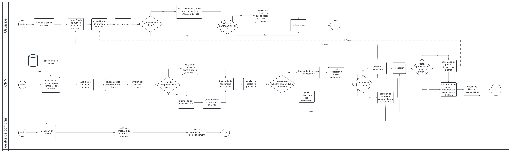

## 1. Descripción de la Empresa, del Proceso de Negocio Elegido y Motivación
### 1.1 Datos de la empresa
- Descripción de la empresa: Es una microempresa que vende maquillaje y papelería que busca traer productos de buena calidad y buen precio, sus principales productos son maquillaje, lapiceros, cuadernos.

- RUC:
- Razón social:
- Dirección:
- Teléfono:
- Misión: Nuestra misión es ser un referente en el mercado por la diversidad y calidad de nuestros productos en papelería y maquillaje. Buscamos ofrecer una orientación personalizada a nuestros clientes para encontrar los productos que mejor se adapten a sus gustos con la única finalidad de satisfacerlos.💗✨
- Visión: Nuestra visión es ser reconocidos como el espacio preferido para aquellos que buscan una experiencia de compra excepcional en el mundo del maquillaje y la papelería por lo que nos esforzamos por crear un ambiente acogedor y emocionante, donde los clientes puedan explorar una amplia diversidad de productos y recibir asesoramiento personalizado por parte de nuestro equipo capacitado. Es así que aspiramos establecer relaciones sólidas y duraderas con nuestros clientes, basadas en la confianza, la satisfacción y la lealtad hacia nuestro servicio por eso es que nos innovaremos constantemente para mantenernos a la vanguardia de las tendencias y necesidades de nuestros público, sin descuidar la dedicación y calidad procurada. 💗
- Productos ofrecidos:
  - Papelería:
    - Cuadernos
    - Lapiceros
  - Maquillaje
    - Paletas
    - Rubores
    - Primers
    - Polvos y correctores
    - Glitter
    - Delineadores de ojos y labios
    - Labiales y glosses
    - Máscaras de pestañas
### 1.2 Descripción del proceso de negocio

- Proceso de compra - Este proceso se refiere a las compras de los diversos productos para el almacén de la empresa y poder venderlos.
- Proceso de venta - Este proceso es acerca de los procesos de venta en la empresa que inicia desde que el cliente nos contacta para venderle el producto.
- Proceso de almacen - Este proceso se refiere a cómo se gestiona el almacén de manera que constatemente se verifica el stock de los productos.
- Proceso de distribucion - Este proceso se refiere a las actividades que abarcan llevar el producto hasta el cliente.
- Proceso de marketing - Este proceso es acerca de las actividades que realizan para llamar al cliente.
- Proceso de finanzas - Este proceso abarca las diversas actividades en que se gestionan las ganancias y perdidas en base a las compras, los gastos y las ventas.
- Proceso de CRM - Este proceso abarca las actividades para mapear a los clientes y saber mejor sus necesidades.

### PROCESO AS IS

- Proceso de Compra

- Proceso de Venta

- Proceso de Almacén

- Proceso de Distribución
  

- Proceso de Marketing

- Proceso de CRM

- Proceso de Finanzas

### PROCESO TO BE

- Proceso de Compra

- Proceso de Venta

- Proceso de Almacén

- Proceso de Distribución
  

- Proceso de Marketing

- Proceso de Finanzas

- Proceso de CRM

### 1.3 Motivación
-
## 2. Módulos
### 2.1 Módulo 1
### 2.2 Módulo 2
### 2.3 Módulo 3
### 2.4 Módulo 4
### 2.5 Módulo 5
### 2.6 Módulo 6
### 2.7 Módulo 7
## 3. Requerimientos
## 4. Prototipo
- Para ver el prototipo debe ingresar al siguiente enlace:

[Figma](https://www.figma.com/file/JaEtbwPTFhxpp8rVLio8Lc/Proyecto-Migni-Store?type=design&node-id=56-105&mode=design&t=6vRNAXtGiQCHDJhl-0)

## 5. Modelado Conceptual
### 5.1 Diagrama de entidad relación
- Modelo Conceptual

## 6. Modelado Relacional
### 6.1 Modelo Lógico
[Se inserta imagen][o tambien el link]

