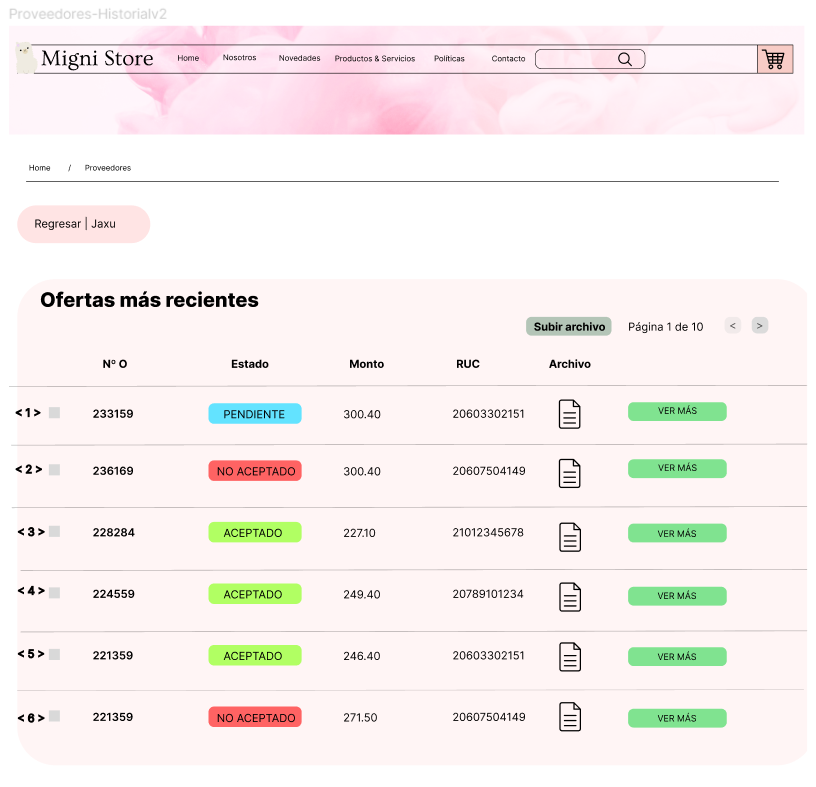

# 1. Ajustes al Modelamiento
## Módulo de Marketing
Se agregaron más tablas en coordinación con el módulo de marketing, se hicieron cambios en el modelo conceptual y lógico, afectando a las tablas y consecuentemente al códigl generador de las tablas en nuestra base de datos (Postgresql), se trastocaron funcionamientos en el figma y se agregaron funciones faltantes para el equipo de marketing y el gestor de marketing.

# 2. Asignación de Códigos por Requerimientos y Prototipos de Interfaces de Usuario

# 3. Sentencias SQL por cada prototipo
## 3.1 Modulo de Compras
### Código Requerimiento : R - 001
### Codigo interfaz : I - 001
### Imagen interfaz : 

### Sentecias SQL:
### Eventos: 
* **Boton Añadir Proveedor: Nos permite ingresar los datos de un proveedor para ser guardado en la base de datos** 
```
INSERT INTO proveedor(ruc_proveedor, razon_social, web_proveedor, rubro, direccion, telefono, id_est_proveedor)
VALUES (<1>, <2>, <3>, <4>, <5>, <6>, 'A');
```

### Código Requerimiento : R - 002
### Codigo interfaz : I - 002
### Imagen interfaz : 

### Sentecias SQL:
### Eventos: 
* **Pantalla Detalle Proveedores: Se mostrará todos los datos de los proveedores activos en la empresa**
```
SELECT ruc_proveedor, razon_social, web_proveedor, rubro, direccion, telefono, id_est_proveedor
FROM proveedor
WHERE ruc_proveedor = <1> AND razon_social = <2> AND web_proveedor = <3> AND rubro = <4> 
AND direccion = <5> AND telefono = <6> AND id_est_proveedor = 'A';
```

### Código Requerimiento : R - 003
### Codigo interfaz : I - 003
### Imagen interfaz : 

### Sentecias SQL:
### Eventos: 
* **Pantalla Historial Cotizaciones: Se mostrará el historial de todas las cotizaciones aceptadas, no aceptadas y pendientes** 
```
SELECT id_cotizacion, id_est_cotizacion, monto_total, ruc_proveedor
FROM cotizacion
WHERE id_cotizacion = <1> OR id_cotizacion = <2> OR id_cotizacion = <3> OR id_cotizacion = <4> OR id_cotizacion = <5> OR id_cotizacion = <6>
```

### Código Requerimiento : R - 004
### Codigo interfaz : I - 004
### Imagen interfaz : 

### Sentecias SQL:
### Eventos: 
* **Pantalla Detalle Cotización: Nos permite visualizar todos los datos de una cotizacion, los productos y sus cantidades, ademas de los datos del proveedor.** 
```
SELECT p.ruc_proveedor, p.razon_social, p.rubro, p.direccion, p.telefono, p.web_proveedor, c.monto_total
FROM proveedor p
INNER JOIN cotizacion c ON c.ruc_proveedor = p.ruc_proveedor
WHERE c.id_cotizacion = <1>;

SELECT pd.nombre_producto, cx.cantidad
FROM proveedor p
INNER JOIN cotizacion c ON c.ruc_proveedor = p.ruc_proveedor
INNER JOIN cotizaciónxproducto cx ON cx.id_cotizacion = c.id_cotizacion
INNER JOIN producto pd ON pd.id_producto = cx.id_producto
WHERE c.id_cotizacion = <1>;
```

### Código Requerimiento : R - 005
### Codigo interfaz : I - 005
### Imagen interfaz : 

### Sentecias SQL:
### Eventos: 
* **BOTON Aceptar Oferta: Actualiza el estado de una cotizacion pendiente a un estado de Aceptado**
* **BOTON Rechazar Oferta: Actualiza el estado de una cotizacion pendiente a un estado de No Aceptado** 
```
-- BOTON Aceptar Oferta
UPDATE cotizacion 
SET id_est_cotizacion = 'A'
WHERE id_cotizacion = <1>;

-- BOTON Rechazar Oferta
UPDATE cotizacion 
SET id_est_cotizacion = 'N'
WHERE id_cotizacion = <1>;
```


# 4. Carga de Datos
La carga de datos se ha hecho mediante archivos .csv

[Tabla tipo_prod](ArchivosCSV/Tipo_prod.csv)

[Tabla Persona](ArchivosCSV/Personas.csv)

[Tabla Equipo de marketing](ArchivosCSV/Equipo_Marketing.csv)

[Tabla Cupón](ArchivosCSV/Cupón.csv)

[Tabla Campaña](ArchivosCSV/Campaña.csv)

[Tabla CampañaXProd](ArchivosCSV/CampañaXProd.csv)

[Tabla Canal](ArchivosCSV/Canal.csv)

[Tabla CampañaXCanal](ArchivosCSV/CampañaXCanal.csv)

[Tabla Observacion](ArchivosCSV/Observacion.csv)

# 5. Funcionalidad Primaria Elegida (por módulo)

# 6. Stack Tecnológico elegido para su aplicación

# 7. Primera Versión de su Aplicación (BONUS)

# 8. Videos individuales

