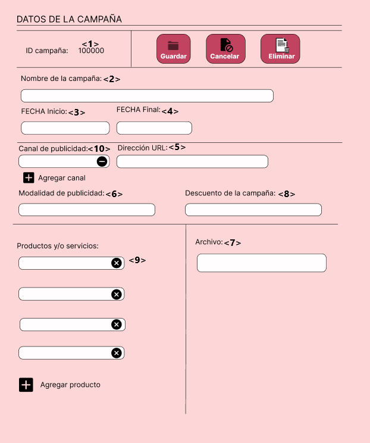

# 1. Ajustes al Modelamiento
## Módulo de Compras
El módulo no fue alterado, se mantuvieron las tablas ya presentadas anteriormente de Proveedor, Cotizacion, CotizacionxProducto, tipo_est_proveedor, tipo_est_cotizacion estas serán las tablas definitivas que se usaran en el módulo de compras.

## Módulo de Marketing
Se agregaron más tablas en coordinación con el módulo de marketing, se hicieron cambios en el modelo conceptual y lógico, afectando a las tablas y consecuentemente al códigl generador de las tablas en nuestra base de datos (Postgresql), se trastocaron funcionamientos en el figma y se agregaron funciones faltantes para el equipo de marketing y el gestor de marketing.


# 2. Asignación de Códigos por Requerimientos y Prototipos de Interfaces de Usuario

## 2.1. Codificacion de Requerimientos
### 2.1.1. Modulo de Compras

| Código | R001  |
|----------|----------|
|Nombre  |Visualizar proveedores|
|Objetivo  |Permitir a los gestores poder visualizar los proveedores que estan registrados.|
| Descripción   | Proceso mediante el cual los gestores pueden acceder a la visualización de todos los proveedores dentro de los registros|
| Actor primario    | Gestor de compras |
| Actor secundario    | -  |
| Precondiciones    | El proveedor ya debe haber contactado con la empresa previamente |

| Código | R002  |
|----------|----------|
|Nombre  |Añadir proveedor|
|Objetivo  |Permitir que el Gestor de compras pueda añadir proveedores a la página de Migni Store|
| Descripción   | Proceso de registro de proveedores en la aplicación, con datos de empresa ya sea ruc, razon social, dirección, telefono, rubro, correo y sitio web|
| Actor primario    | Gestor de compras |
| Actor secundario    | -  |
| Precondiciones    | El proveedor ya debe haber contactado con la empresa previamente |

| Código | R003  |
|----------|----------|
|Nombre  |Detalle proveedores|
|Objetivo  |Permitir a los gestores poder acceder y visualizar de un proveedor específico dentro de los registros|
| Descripción   | Proceso mediante el cual los gestores pueden acceder a la visualización de un proveedor específico dentro de los registros |
| Actor primario    | Gestor de compras|
| Actor secundario    | -  |
| Precondiciones    | El proveedor ya debe haber contactado con la empresa previamente |

| Código | R004  |
|----------|----------|
|Nombre  |Historial cotizaciones|
| Objetivo  |Permitir a los gestores poder acceder y visualizar las cotizaciones realizadas por un proveedor|
| Descripción   |Proceso mediante el cual los gestores pueden acceder a la visualización de las cotizaciones, con sus respectivos datos|
| Actor primario    | Gestor de compras|
| Actor secundario    | -  |
| Precondiciones    | El proveedor ya debe haber contactado con la empresa previamente |

| Código | R005  |
|----------|----------|
|Nombre  |Detalle Cotizaciones|
|Objetivo  |Permitir a los gestores poder acceder y visualizar de una cotizacion específica dentro del historial|
| Descripción   | Proceso mediante el cual los gestores pueden acceder a la visualización de una cotizacion específica dentro del historial|
| Actor primario    | Gestor de compras|
| Actor secundario    | -  |
| Precondiciones    | El proveedor ya debe haber contactado con la empresa previamente|

| Código | R006  |
|----------|----------|
|Nombre  |Aceptar/Rechazar cotizacion del proveedor|
|Objetivo  |Permitir que el gestor de compras pueda aceptar o rechazar la cotizacion realizada por el proveedor |
| Descripción   | Proceso en el cual se puede visualizar la cotizacion, con estado pendiente y aceptar o rechazar dicha cotizacion|
| Actor primario    | Gestor de compras |
| Actor secundario    | -  |
| Precondiciones    | El proveedor debe haber sido registrado por el gestor de compras |

### 2.1.2. Módulo de Marketing

| Código | R007  |
|----------|----------|
|Nombre  | Proponer Campaña |
| Objetivo | <p align="left"> Permitir que el Equipo de marketing proponga una campaña.</p> | 
| Descripción | Proceso mediante el cual el Equipo de marketing puede proponer una campaña para su posterior revisión de parte del Gestor de marketing. | 
| Actor primario   | Equipo de marketing | 
|Actor secundario| Gestor de marketing |
|Precondiciones | - |

| Código | R008  |
|----------|----------|
|Nombre  | Revisar campañas |
| Objetivo | <p align="left"> Permitir que el Gestor de marketing revise la campaña brindada por el equipo de marketing correspondiente.</p> | 
| Descripción | Proceso mediante el cual el Gestor de marketing puede revisar las campañas propuestas por el equipo de marketing, su criterio definirá si la campaña será aceptada o rechazada, en el caso de ser rechazada se enviarán las observaciones al equipo de marketing.  | 
| Actor primario   | Gestor de marketing | 
|Actor secundario| Equipo de marketing |
|Precondiciones | El equipo de marketing debe haber propuesto una campaña. |

| Código | R009  |
|----------|----------|
|Nombre  | Observar campaña |
| Objetivo | <p align="left"> Enviar observaciones de una campaña es específico al equipo de marketing que la diseño.</p> | 
| Descripción | Proceso mediante el cual el Gestor de marketing envía las observaciones de campañas propuestas al equipo de amrketing correspondiente. | 
| Actor primario   | Gestor de marketing | 
|Actor secundario| Equipo de marketing |
|Precondiciones | El equipo de marketing debe haber propuesto una campaña |

| Código | R010  |
|----------|----------|
|Nombre  | Atender Observaciones |
| Objetivo | <p align="left"> Permitir que el Equipo de marketing realice las correcciones de una campaña.</p> | 
| Descripción | Proceso mediante el cual el Equipo de marketing puede realizar las correcciones de campañas que les corresponda, siguiendo las observaciones realizadas por el Gestor de marketing. | 
| Actor primario   | Equipo de marketing | 
|Actor secundario| Gestor de marketing |
|Precondiciones | El Gestor de marketing debe haber realizado una observación a la campaña. |

| Código | R011  |
|----------|----------|
|Nombre  | Editar campañas vigentes |
| Objetivo | <p align="left"> Permitir que el Gestor de marketing edite las campañas vigentes.</p> | 
| Descripción | Proceso mediante el cual el Gestor de marketing puede editar las campañas que ya están vigentes, se limita a los datos necesarios y posibles de editar. | 
| Actor primario   | Gestor de marketing | 
|Actor secundario| - |
|Precondiciones | Debe existir al menos una campaña vigente. |

### 2.1.3. Módulo de Ventas

| Código | R012 |
|----------|----------|
|Nombre  | Ver Catálogo de Productos|
| Objetivo | <p align="left"> Permitir que el cliente visualice el catálogo completo de productos disponibles en la plataforma de ventas.</p> | 
| Descripción |  Facilitar al cliente la exploración de todos los productos disponibles para su compra, mostrando información básica de cada producto. | 
| Actor primario   | Cliente | 
|Actor secundario| Plataforma de Ventas|
|Precondiciones |El cliente ha accedido a la plataforma de ventas|

| Código | R013 |
|----------|----------|
|Nombre  | Ver Detalle de Producto desde el Catálogo|
| Objetivo | <p align="left"> Permitir que el cliente acceda a una vista detallada de un producto mientras navega por el catálogo en la plataforma de ventas.</p>| 
| Descripción | Facilitar al cliente la visualización de información detallada sobre un producto específico mientras navega por el catálogo de la plataforma de ventas, brindando detalles como descripción, código, marca, tipo de producto, precio y disponibilidad en stock.| 
| Actor primario   | Cliente | 
|Actor secundario| Plataforma de Ventas|
|Precondiciones |El cliente ha iniciado sesión en la plataforma de ventas |

| Código | R014 |
|----------|----------|
|Nombre  | Realizar una compra (carrito de compras)|
| Objetivo | <p align="left"> Permitir que el cliente realice una compra en la plataforma de ventas y pueda cambiar su dirección de envío antes de finalizar la transacción si lo desea.</p> | 
| Descripción | Facilitar el proceso de compra para el cliente, desde la selección de productos hasta la finalización de la transacción. | 
| Actor primario   | Cliente | 
|Actor secundario| Plataforma de Ventas|
|Precondiciones |El cliente ha accedido a la plataforma de ventas y ha agregado productos al carrito de compras. |

| Código | R015 |
|----------|----------|
|Nombre  | Elegir Método de Pago|
| Objetivo | <p align="left"> Permitir que el cliente elija el método de pago al realizar una compra en la plataforma de ventas.</p> | 
| Descripción | Facilitar al cliente la selección de su método de pago preferido durante el proceso de compra, limitando las opciones a tarjeta de débito o crédito. | 
| Actor primario   | Cliente | 
|Actor secundario| Plataforma de Ventas|
|Precondiciones |El cliente ha accedido a la plataforma de ventas y ha agregado productos al carrito de compras|

| Código | R016 |
|----------|----------|
|Nombre  | Ver Detalles del Producto|
| Objetivo | <p align="left"> Permitir que el cliente acceda a una vista detallada del producto en la plataforma de ventas después de elegir su método de pago correspondiente.</p> | 
| Descripción | Facilitar al cliente la visualización de información detallada sobre un producto seleccionado. | 
| Actor primario   | Cliente | 
|Actor secundario| Plataforma de Ventas|
|Precondiciones |El cliente ha iniciado el proceso de pago y ha ingresado los datos de su tarjeta|

| Código | R017 |
|----------|----------|
|Nombre  | Añadir Nueva Dirección de Envío|
| Objetivo | <p align="left"> Permitir que el cliente agregue una nueva dirección de envío para recibir sus productos comprados en la plataforma de ventas.</p> | 
| Descripción | Facilitar al cliente la posibilidad de registrar una dirección adicional donde desee recibir sus pedidos, aumentando la flexibilidad en la entrega de productos. | 
| Actor primario   | Cliente | 
|Actor secundario| Plataforma de Ventas|
|Precondiciones |El cliente ha iniciado sesión en su cuenta en la plataforma de ventas|


| Código | R018 |
|----------|----------|
|Nombre  | Consultar Historial de Ventas de la Empresa|
| Objetivo | <p align="left"> Permitir que el gestor acceda al historial de ventas de la empresa en la plataforma de ventas.</p> | 
| Descripción | Facilitar al gestor el acceso a información detallada sobre las ventas realizadas por la empresa, incluyendo datos como fechas, productos vendidos, montos y clientes. | 
| Actor primario   | Gestor de Ventas | 
|Actor secundario| Plataforma de Ventas|
|Precondiciones |El gestor ha accedido a la plataforma de ventas|


## 2.2. Codificación de prototipos de interfaz
### 2.2.1. Modulo de Compras

| Código Interfaz | I001 |
|----------|----------|
|Imagen interfaz||

| Código Interfaz | I002 |
|----------|----------|
|Imagen interfaz||

| Código Interfaz | I003  |
|----------|----------|
|Imagen interfaz||

| Código Interfaz | I004  |
|----------|----------|
|Imagen interfaz||

| Código Interfaz | I005  |
|----------|----------|
|Imagen interfaz||

| Código Interfaz | I006  |
|----------|----------|
|Imagen interfaz||

| Código Interfaz | I007  |
|----------|----------|
|Imagen interfaz||

| Código Interfaz | I008  |
|----------|----------|
|Imagen interfaz||

| Código Interfaz | I009  |
|----------|----------|
|Imagen interfaz||

| Código Interfaz | I010  |
|----------|----------|
|Imagen interfaz||

| Código Interfaz | I011  |
|----------|----------|
|Imagen interfaz||

# 3. Sentencias SQL por cada prototipo
## 3.1 Modulo de Compras
### Código Requerimiento : R - 001
### Codigo interfaz : I - 001
### Imagen interfaz : 

### Sentecias SQL:
### Eventos: 
* **Pantalla Visualizar Proveedores: Se mostrará todos los proveedores dentro de la empresa con un estado de activo**
```
SELECT razon_social 
FROM proveedor
WHERE id_est_proveedor = 'A'
```

### Código Requerimiento : R - 002
### Codigo interfaz : I - 002
### Imagen interfaz : 

### Sentecias SQL:
### Eventos: 
* **Boton Añadir Proveedor: Nos permite ingresar los datos de un proveedor para ser guardado en la base de datos** 
```
INSERT INTO proveedor(ruc_proveedor, razon_social, web_proveedor, rubro, direccion, telefono, id_est_proveedor)
VALUES (<1>, <2>, <3>, <4>, <5>, <6>, 'A');
```

### Código Requerimiento : R - 003
### Codigo interfaz : I - 003
### Imagen interfaz : 

### Sentecias SQL:
### Eventos: 
* **Pantalla Detalle Proveedores: Se mostrará todos los datos de los proveedores activos en la empresa**
```
SELECT ruc_proveedor, razon_social, web_proveedor, rubro, direccion, telefono, id_est_proveedor
FROM proveedor
WHERE ruc_proveedor = <1> AND razon_social = <2> AND web_proveedor = <3> AND rubro = <4> 
AND direccion = <5> AND telefono = <6> AND id_est_proveedor = 'A';
```

### Código Requerimiento : R - 004
### Codigo interfaz : I - 004
### Imagen interfaz : 

### Sentecias SQL:
### Eventos: 
* **Pantalla Historial Cotizaciones: Se mostrará el historial de todas las cotizaciones aceptadas, no aceptadas y pendientes** 
```
SELECT id_cotizacion, id_est_cotizacion, monto_total, ruc_proveedor
FROM cotizacion
WHERE id_cotizacion = <1> OR id_cotizacion = <2> OR id_cotizacion = <3> OR id_cotizacion = <4> OR id_cotizacion = <5> OR id_cotizacion = <6>
```

### Código Requerimiento : R - 005
### Codigo interfaz : I - 005
### Imagen interfaz : 

### Sentecias SQL:
### Eventos: 
* **Pantalla Detalle Cotización: Nos permite visualizar todos los datos de una cotizacion, los productos y sus cantidades, ademas de los datos del proveedor.** 
```
SELECT p.ruc_proveedor, p.razon_social, p.rubro, p.direccion, p.telefono, p.web_proveedor, c.monto_total
FROM proveedor p
INNER JOIN cotizacion c ON c.ruc_proveedor = p.ruc_proveedor
WHERE c.id_cotizacion = <1>;

SELECT pd.nombre_producto, cx.cantidad
FROM proveedor p
INNER JOIN cotizacion c ON c.ruc_proveedor = p.ruc_proveedor
INNER JOIN cotizaciónxproducto cx ON cx.id_cotizacion = c.id_cotizacion
INNER JOIN producto pd ON pd.id_producto = cx.id_producto
WHERE c.id_cotizacion = <1>;
```

### Código Requerimiento : R - 006
### Codigo interfaz : I - 006
### Imagen interfaz : 

### Sentecias SQL:
### Eventos: 
* **BOTON Aceptar Oferta: Actualiza el estado de una cotizacion pendiente a un estado de Aceptado**
* **BOTON Rechazar Oferta: Actualiza el estado de una cotizacion pendiente a un estado de No Aceptado** 
```
-- BOTON Aceptar Oferta
UPDATE cotizacion 
SET id_est_cotizacion = 'A'
WHERE id_cotizacion = <1>;

-- BOTON Rechazar Oferta
UPDATE cotizacion 
SET id_est_cotizacion = 'N'
WHERE id_cotizacion = <1>;
```

### Código Requerimiento : R - 007
### Codigo interfaz : I - 007
### Imagen interfaz : 

### Sentecias SQL:
### Eventos: 
* **Carga de pantalla: la pantalla se llena con el Id_campaña siguiente al último registro y con el Id_equipo_mark con el que se entró a la página**
* **BOTON Enviar: Inserta una nueva fila en la tabla Campaña, además de insertar nuevas filas en la tabla CampañaXProd y CampañaXCanal**
* **BOTON Cancelar: No se realizan cambios en la tabla** 
```
--CARGA:
SELECT MAX(Id_campaña) + 1 AS nuevo_Id_campaña
FROM Campaña;

SELECT id_equipo_mark
FROM persona
WHERE usuario=<12>
AND contraseña=<13>;

-- BOTON Enviar
INSERT INTO Campaña (Id_campaña, nom_campaña, fecha_ini, fecha_fin, dir_url, modalidad, archivo, desc_campaña, Id_equipo_mark, Id_gest_mark)
VALUES
    (<1>, <2>, <3>, <4>, <5>, <6>, <7>, <8>, <9>, 1005);

INSERT INTO CampañaXProd (id_producto, Id_campaña)
VALUES
    (<10>, <1>);

INSERT INTO CampañaXCanal (Id_campaña, Id_canal)
VALUES
    (<1>, <11>);
    
```

### Código Requerimiento : R - 008
### Codigo interfaz : I - 008
### Imagen interfaz : 

### Sentecias SQL:
### Eventos: 
* **Carga de pantalla: La pantalla se llena con los datos correspondientes a la campaña a revisar**
* **Botón Aceptar: No se realizan cambios en las tablas**
* **Botón Rechazar: No se realizan cambios en las tablas, pero se abre la pantalla de envío de observaciones**
```
--CARGA:
SELECT Id_campaña, nom_campaña, fecha_ini, fecha_fin, dir_url, modalidad, archivo, desc_campaña, Id_equipo_mark
FROM Campaña
WHERE Id_campaña = <1>;

SELECT id_producto
FROM CampañaXProd
WHERE Id_campaña = <1>;

SELECT Id_canal
FROM CampañaXCanal
WHERE Id_campaña = <1>;
```

### Código Requerimiento : R - 009
### Codigo interfaz : I - 009
### Imagen interfaz : 

### Sentecias SQL:
### Eventos: 
* **Carga de pantalla: La pantalla se llena con el Id_observacion siguiente al último registro en la tabla observaciones y con el Id de la campaña asociada**
* **BOTON Enviar: Se inserta una nueva fila en la tabla Observacion, el estado_atendido estará en FALSE porque aun no se atiende**
* **BOTON Cancelar:No se realiza ningun cambio a las tablas, se vuelve a la pantalla anterior** 
```
--CARGA:
SELECT MAX(Id_observacion) + 1 AS nuevo_Id_observacion
FROM Observacion;

SELECT Id_campaña
FROM Campaña
WHERE Id_campaña = <2>;

--BOTÓN ENVIAR:
INSERT INTO Observacion (Id_observacion, descripcion, Id_campaña, estado_atendido)
VALUES
    (<1>,<3> , <2>, FALSE);
```

### Código Requerimiento : R - 010
### Codigo interfaz : I - 010
### Imagen interfaz : 

### Sentecias SQL:
### Eventos: 
* **BOTON Aceptar Oferta: Actualiza el estado de una cotizacion pendiente a un estado de Aceptado**
* **BOTON Rechazar Oferta: Actualiza el estado de una cotizacion pendiente a un estado de No Aceptado** 
```

```

### Código Requerimiento : R - 011
### Codigo interfaz : I - 011
### Imagen interfaz : 

### Sentecias SQL:
### Eventos: 
* **BOTON Aceptar Oferta: Actualiza el estado de una cotizacion pendiente a un estado de Aceptado**
* **BOTON Rechazar Oferta: Actualiza el estado de una cotizacion pendiente a un estado de No Aceptado** 
```

```


# 4. Carga de Datos
La carga de datos se ha hecho mediante archivos .csv

[Tabla tipo_prod](ArchivosCSV/Tipo_prod.csv)

[Tabla categoria_prod](ArchivosCSV/categoria_prod.csv)

[Tabla Proveedores](ArchivosCSV/Proveedores.csv)

[Tabla Cotizaciones](ArchivosCSV/Cotizaciones.csv)

[Tabla Persona](ArchivosCSV/Personas.csv)

[Tabla Equipo de marketing](ArchivosCSV/Equipo_Marketing.csv)

[Tabla Cupón](ArchivosCSV/Cupón.csv)

[Tabla Campaña](ArchivosCSV/Campaña.csv)

[Tabla CampañaXProd](ArchivosCSV/CampañaXProd.csv)

[Tabla Canal](ArchivosCSV/Canal.csv)

[Tabla CampañaXCanal](ArchivosCSV/CampañaXCanal.csv)

[Tabla Observacion](ArchivosCSV/Observacion.csv)

# 5. Funcionalidad Primaria Elegida (por módulo)

# 6. Stack Tecnológico elegido para su aplicación

## 6.1 Stack Tecnológico
| Stack                         | Detalle                                               |
|-------------------------------|-------------------------------------------------------|
| Lenguaje de programación      | Python <br>|
| Librería GUI                  | Tkinter <br> |
| Editor de código              | Visual Studio Code <br> |
| Base de datos                 | PostgreSQL <br> |
| Controlador de base de datos  | pgAdmin <br> |

## 6.2 Diagrama de componentes


# 7. Primera Versión de su Aplicación (BONUS)

# 8. Videos individuales

