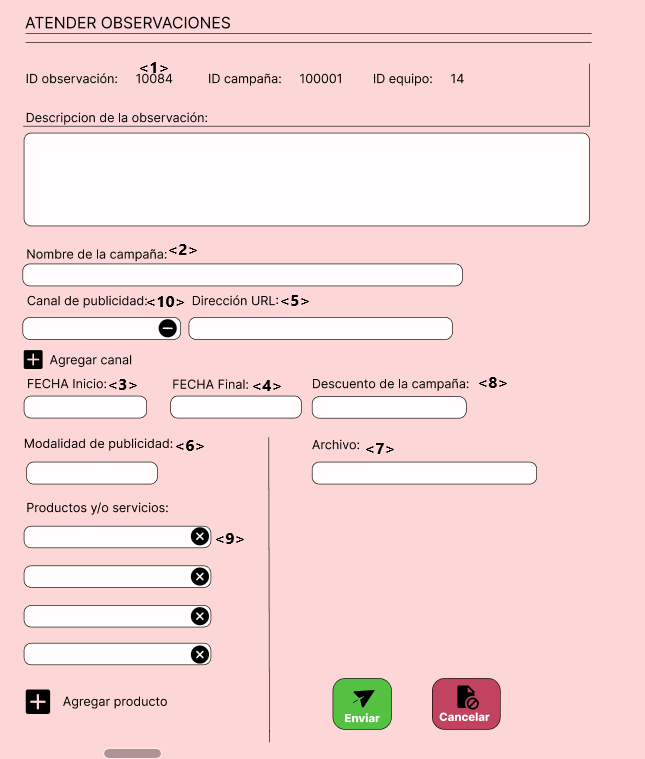

# 1. Ajustes al Modelamiento
## Módulo de Marketing
Se agregaron más tablas en coordinación con el módulo de marketing, se hicieron cambios en el modelo conceptual y lógico, afectando a las tablas y consecuentemente al códigl generador de las tablas en nuestra base de datos (Postgresql), se trastocaron funcionamientos en el figma y se agregaron funciones faltantes para el equipo de marketing y el gestor de marketing.

# 2. Asignación de Códigos por Requerimientos y Prototipos de Interfaces de Usuario

## 2.1. Codificacion de Requerimientos
### 2.1.1. Modulo de Compras

| Código | R001  |
|----------|----------|
|Nombre  |Registro de proveedores|
|Objetivo  ||
| Descripción   | |
| Actor primario    | Gestor de compras |
| Actor secundario    | -  |
| Precondiciones    | El proveedor ya debe haber contactado con la empresa previamente |

| Código | R002  |
|----------|----------|
|Nombre  |Añadir proveedor|
|Objetivo  |Permitir que el Gestor de compras pueda añadir proveedores a la página de Migni Store|
| Descripción   | Proceso de registro de proveedores en la aplicación, con datos de empresa ya sea ruc, razon social, dirección, telefono, rubro, correo y sitio web|
| Actor primario    | Gestor de compras |
| Actor secundario    | -  |
| Precondiciones    | El proveedor ya debe haber contactado con la empresa previamente |

| Código | R003  |
|----------|----------|
|Nombre  |Detalle proveedores|
|Objetivo  |Permitir a los gestores poder acceder y visualizar de un proveedor específico dentro de los registros|
| Descripción   | Proceso mediante el cual los gestores pueden acceder a la visualización de un proveedor específico dentro de los registros |
| Actor primario    | Gestor de compras|
| Actor secundario    | -  |
| Precondiciones    | El proveedor ya debe haber contactado con la empresa previamente |

| Código | R004  |
|----------|----------|
|Nombre  |Historial cotizaciones|
| Objetivo  |Permitir a los gestores poder acceder y visualizar las cotizaciones realizadas por un proveedor|
| Descripción   |Proceso mediante el cual los gestores pueden acceder a la visualización de las cotizaciones, con sus respectivos datos|
| Actor primario    | Gestor de compras|
| Actor secundario    | -  |
| Precondiciones    | El proveedor ya debe haber contactado con la empresa previamente |

| Código | R005  |
|----------|----------|
|Nombre  |Detalle Cotizaciones|
|Objetivo  |Permitir a los gestores poder acceder y visualizar de una cotizacion específica dentro del historial|
| Descripción   | Proceso mediante el cual los gestores pueden acceder a la visualización de una cotizacion específica dentro del historial|
| Actor primario    | Gestor de compras|
| Actor secundario    | -  |
| Precondiciones    | El proveedor ya debe haber contactado con la empresa previamente|

| Código | R006  |
|----------|----------|
|Nombre  |Aceptar/Rechazar cotizacion del proveedor|
|Objetivo  |Permitir que el gestor de compras pueda aceptar o rechazar la cotizacion realizada por el proveedor |
| Descripción   | Proceso en el cual se puede visualizar la cotizacion, con estado pendiente y aceptar o rechazar dicha cotizacion|
| Actor primario    | Gestor de compras |
| Actor secundario    | -  |
| Precondiciones    | El proveedor debe haber sido registrado por el gestor de compras |

### 2.1.2. Módulo de Marketing

| Código | R007  |
|----------|----------|
|Nombre  | Proponer Campaña |
| Objetivo | <p align="left"> Permitir que el Equipo de marketing proponga una campaña.</p> | 
| Descripción | Proceso mediante el cual el Equipo de marketing puede proponer una campaña para su posterior revisión de parte del Gestor de marketing. | 
| Actor primario   | Equipo de marketing | 
|Actor secundario| Gestor de marketing |
|Precondiciones | - |

| Código | R008  |
|----------|----------|
|Nombre  | Revisar campañas |
| Objetivo | <p align="left"> Permitir que el Gestor de marketing revise la campaña brindada por el equipo de marketing correspondiente.</p> | 
| Descripción | Proceso mediante el cual el Gestor de marketing puede revisar las campañas propuestas por el equipo de marketing, su criterio definirá si la campaña será aceptada o rechazada, en el caso de ser rechazada se enviarán las observaciones al equipo de marketing.  | 
| Actor primario   | Gestor de marketing | 
|Actor secundario| Equipo de marketing |
|Precondiciones | El equipo de marketing debe haber propuesto una campaña. |

| Código | R009  |
|----------|----------|
|Nombre  | Observar campaña |
| Objetivo | <p align="left"> Enviar observaciones de una campaña es específico al equipo de marketing que la diseño.</p> | 
| Descripción | Proceso mediante el cual el Gestor de marketing envía las observaciones de campañas propuestas al equipo de amrketing correspondiente. | 
| Actor primario   | Gestor de marketing | 
|Actor secundario| Equipo de marketing |
|Precondiciones | El equipo de marketing debe haber propuesto una campaña |

| Código | R010  |
|----------|----------|
|Nombre  | Atender Observaciones |
| Objetivo | <p align="left"> Permitir que el Equipo de marketing realice las correcciones de una campaña.</p> | 
| Descripción | Proceso mediante el cual el Equipo de marketing puede realizar las correcciones de campañas que les corresponda, siguiendo las observaciones realizadas por el Gestor de marketing. | 
| Actor primario   | Equipo de marketing | 
|Actor secundario| Gestor de marketing |
|Precondiciones | El Gestor de marketing debe haber realizado una observación a la campaña. |

| Código | R011  |
|----------|----------|
|Nombre  | Editar campañas vigentes |
| Objetivo | <p align="left"> Permitir que el Gestor de marketing edite las campañas vigentes.</p> | 
| Descripción | Proceso mediante el cual el Gestor de marketing puede editar las campañas que ya están vigentes, se limita a los datos necesarios y posibles de editar. | 
| Actor primario   | Gestor de marketing | 
|Actor secundario| - |
|Precondiciones | Debe existir al menos una campaña vigente. |

## 2.2. Codificación de prototipos de interfaz
### 2.2.1. Modulo de Compras

| Código Interfaz | I001 |
|----------|----------|
|Imagen interfaz||

| Código Interfaz | I002 |
|----------|----------|
|Imagen interfaz||

| Código Interfaz | I003  |
|----------|----------|
|Imagen interfaz||

| Código Interfaz | I004  |
|----------|----------|
|Imagen interfaz||

| Código Interfaz | I005  |
|----------|----------|
|Imagen interfaz||

| Código Interfaz | I006  |
|----------|----------|
|Imagen interfaz||

| Código Interfaz | I007  |
|----------|----------|
|Imagen interfaz||

| Código Interfaz | I008  |
|----------|----------|
|Imagen interfaz||

| Código Interfaz | I009  |
|----------|----------|
|Imagen interfaz||

| Código Interfaz | I010  |
|----------|----------|
|Imagen interfaz||

| Código Interfaz | I011  |
|----------|----------|
|Imagen interfaz||

# 3. Sentencias SQL por cada prototipo
## 3.1 Modulo de Compras
### Código Requerimiento : R - 001
### Codigo interfaz : I - 001
### Imagen interfaz : 

### Sentecias SQL:
### Eventos: 
* **** 
```

```

### Código Requerimiento : R - 002
### Codigo interfaz : I - 002
### Imagen interfaz : 

### Sentecias SQL:
### Eventos: 
* **Boton Añadir Proveedor: Nos permite ingresar los datos de un proveedor para ser guardado en la base de datos** 
```
INSERT INTO proveedor(ruc_proveedor, razon_social, web_proveedor, rubro, direccion, telefono, id_est_proveedor)
VALUES (<1>, <2>, <3>, <4>, <5>, <6>, 'A');
```

### Código Requerimiento : R - 003
### Codigo interfaz : I - 003
### Imagen interfaz : 

### Sentecias SQL:
### Eventos: 
* **Pantalla Detalle Proveedores: Se mostrará todos los datos de los proveedores activos en la empresa**
```
SELECT ruc_proveedor, razon_social, web_proveedor, rubro, direccion, telefono, id_est_proveedor
FROM proveedor
WHERE ruc_proveedor = <1> AND razon_social = <2> AND web_proveedor = <3> AND rubro = <4> 
AND direccion = <5> AND telefono = <6> AND id_est_proveedor = 'A';
```

### Código Requerimiento : R - 004
### Codigo interfaz : I - 004
### Imagen interfaz : 

### Sentecias SQL:
### Eventos: 
* **Pantalla Historial Cotizaciones: Se mostrará el historial de todas las cotizaciones aceptadas, no aceptadas y pendientes** 
```
SELECT id_cotizacion, id_est_cotizacion, monto_total, ruc_proveedor
FROM cotizacion
WHERE id_cotizacion = <1> OR id_cotizacion = <2> OR id_cotizacion = <3> OR id_cotizacion = <4> OR id_cotizacion = <5> OR id_cotizacion = <6>
```

### Código Requerimiento : R - 005
### Codigo interfaz : I - 005
### Imagen interfaz : 

### Sentecias SQL:
### Eventos: 
* **Pantalla Detalle Cotización: Nos permite visualizar todos los datos de una cotizacion, los productos y sus cantidades, ademas de los datos del proveedor.** 
```
SELECT p.ruc_proveedor, p.razon_social, p.rubro, p.direccion, p.telefono, p.web_proveedor, c.monto_total
FROM proveedor p
INNER JOIN cotizacion c ON c.ruc_proveedor = p.ruc_proveedor
WHERE c.id_cotizacion = <1>;

SELECT pd.nombre_producto, cx.cantidad
FROM proveedor p
INNER JOIN cotizacion c ON c.ruc_proveedor = p.ruc_proveedor
INNER JOIN cotizaciónxproducto cx ON cx.id_cotizacion = c.id_cotizacion
INNER JOIN producto pd ON pd.id_producto = cx.id_producto
WHERE c.id_cotizacion = <1>;
```

### Código Requerimiento : R - 006
### Codigo interfaz : I - 006
### Imagen interfaz : 

### Sentecias SQL:
### Eventos: 
* **BOTON Aceptar Oferta: Actualiza el estado de una cotizacion pendiente a un estado de Aceptado**
* **BOTON Rechazar Oferta: Actualiza el estado de una cotizacion pendiente a un estado de No Aceptado** 
```
-- BOTON Aceptar Oferta
UPDATE cotizacion 
SET id_est_cotizacion = 'A'
WHERE id_cotizacion = <1>;

-- BOTON Rechazar Oferta
UPDATE cotizacion 
SET id_est_cotizacion = 'N'
WHERE id_cotizacion = <1>;
```

### Código Requerimiento : R - 007
### Codigo interfaz : I - 007
### Imagen interfaz : 

### Sentecias SQL:
### Eventos: 
* **Carga de pantalla: la pantalla se llena con el Id_campaña siguiente al último registro y con el Id_equipo_mark con el que se entró a la página**
* **BOTON Enviar: Inserta una nueva fila en la tabla Campaña, además de insertar nuevas filas en la tabla CampañaXProd y CampañaXCanal**
* **BOTON Cancelar: No se realizan cambios en la tabla** 
```
--CARGA:
SELECT MAX(Id_campaña) + 1 AS nuevo_Id_campaña
FROM Campaña;

SELECT id_equipo_mark
FROM persona
WHERE usuario=<12>
AND contraseña=<13>;

-- BOTON Enviar
INSERT INTO Campaña (Id_campaña, nom_campaña, fecha_ini, fecha_fin, dir_url, modalidad, archivo, desc_campaña, Id_equipo_mark, Id_gest_mark)
VALUES
    (<1>, <2>, <3>, <4>, <5>, <6>, <7>, <8>, <9>, 1005);

INSERT INTO CampañaXProd (id_producto, Id_campaña)
VALUES
    (<10>, <1>);

INSERT INTO CampañaXCanal (Id_campaña, Id_canal)
VALUES
    (<1>, <11>),
    
```

### Código Requerimiento : R - 008
### Codigo interfaz : I - 008
### Imagen interfaz : 

### Sentecias SQL:
### Eventos: 
* **Carga de pantalla: La pantalla se llena con los datos correspondientes a la campaña a revisar**
* **Botón Aceptar: No se realizan cambios en las tablas**
* **Botón Rechazar: No se realizan cambios en las tablas, pero se abre la pantalla de envío de observaciones**
```
--CARGA:
SELECT Id_campaña, nom_campaña, fecha_ini, fecha_fin, dir_url, modalidad, archivo, desc_campaña, Id_equipo_mark
FROM Campaña
WHERE Id_campaña = <1>;

SELECT id_producto
FROM CampañaXProd
WHERE Id_campaña = <1>;

SELECT Id_canal
FROM CampañaXCanal
WHERE Id_campaña = <1>;
```

### Código Requerimiento : R - 009
### Codigo interfaz : I - 009
### Imagen interfaz : 

### Sentecias SQL:
### Eventos: 
* **BOTON Aceptar Oferta: Actualiza el estado de una cotizacion pendiente a un estado de Aceptado**
* **BOTON Rechazar Oferta: Actualiza el estado de una cotizacion pendiente a un estado de No Aceptado** 
```

```

### Código Requerimiento : R - 010
### Codigo interfaz : I - 010
### Imagen interfaz : 

### Sentecias SQL:
### Eventos: 
* **BOTON Aceptar Oferta: Actualiza el estado de una cotizacion pendiente a un estado de Aceptado**
* **BOTON Rechazar Oferta: Actualiza el estado de una cotizacion pendiente a un estado de No Aceptado** 
```

```

### Código Requerimiento : R - 011
### Codigo interfaz : I - 011
### Imagen interfaz : 

### Sentecias SQL:
### Eventos: 
* **BOTON Aceptar Oferta: Actualiza el estado de una cotizacion pendiente a un estado de Aceptado**
* **BOTON Rechazar Oferta: Actualiza el estado de una cotizacion pendiente a un estado de No Aceptado** 
```

```


# 4. Carga de Datos
La carga de datos se ha hecho mediante archivos .csv

[Tabla tipo_prod](ArchivosCSV/Tipo_prod.csv)

[Tabla Persona](ArchivosCSV/Personas.csv)

[Tabla Equipo de marketing](ArchivosCSV/Equipo_Marketing.csv)

[Tabla Cupón](ArchivosCSV/Cupón.csv)

[Tabla Campaña](ArchivosCSV/Campaña.csv)

[Tabla CampañaXProd](ArchivosCSV/CampañaXProd.csv)

[Tabla Canal](ArchivosCSV/Canal.csv)

[Tabla CampañaXCanal](ArchivosCSV/CampañaXCanal.csv)

[Tabla Observacion](ArchivosCSV/Observacion.csv)

# 5. Funcionalidad Primaria Elegida (por módulo)

# 6. Stack Tecnológico elegido para su aplicación

# 7. Primera Versión de su Aplicación (BONUS)

# 8. Videos individuales

