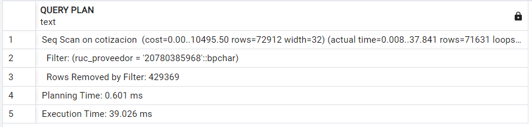
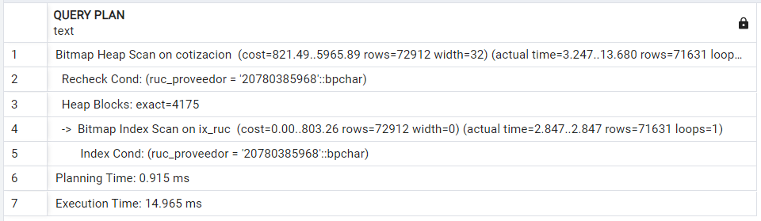
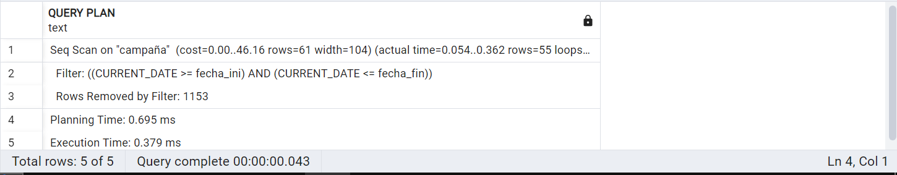
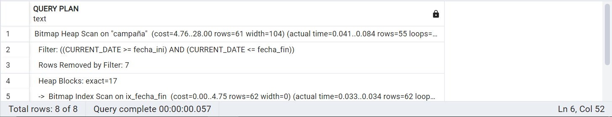

# 1. Índices y otros objetos de BD

## 1.1 Índices

### Índice RUC
```sql
DROP INDEX IX_RUC;
CREATE INDEX IX_RUC ON cotizacion(ruc_proveedor);

EXPLAIN ANALYZE
SELECT * FROM cotizacion
WHERE ruc_proveedor = '20780385968';
```
Proceso Sin Índice:


Proceso Con Índice:


### Índice fecha_fin
```sql
DROP INDEX IX_fecha_fin;
CREATE INDEX IX_fecha_fin ON campaña(fecha_fin);

EXPLAIN ANALYZE
SELECT * FROM campaña
WHERE CURRENT_DATE BETWEEN fecha_ini AND fecha_fin;
```
Proceso Sin Índice:


Proceso Con Índice:


### Indice Nro_Factura

Vista de Factura
```sql
CREATE VIEW FACTURA AS
	select f.nro_factura, f.fecha_emision,
	f.monto,f.id_persona, f.ruc_proveedor,  tif.tipo_fac, e.nom_estado
	from factura f
	inner join Tipo_Factura tif on f.id_tip_fac = tif.id_tip_fac
	inner join Estado e on f.id_estado = e.id_estado
	order by f.nro_factura;
```
Creando Indices:
```sql
  DROP INDEX IXFactura;
  CREATE INDEX IXFactura ON Factura(nro_factura);
```
Análisis
```sql
	EXPLAIN ANALYZE
	SELECT * FROM FACTURA
	WHERE nro_factura = '2022001';
```
Proceso Sin Índice:


Proceso Con Índice:

# 2. PL/pgSQL – Proceso Batch

# 3. Actualizaciones a la Arquitectura de la Aplicación

## 3.1 Stack Tecnológico
| Stack                         | Detalle                                               |
|-------------------------------|-------------------------------------------------------|
| Lenguaje de programación      | Python <br>|
| Librería GUI                  | Tkinter <br> |
| Editor de código              | Visual Studio Code <br> |
| Base de datos                 | PostgreSQL <br> |
| Controlador de base de datos  | pgAdmin <br> |

Lenguaje de programación: Python
- Python es un lenguaje de programación versátil y ampliamente utilizado, conocido por su simplicidad y legibilidad. Su sintaxis clara y su amplia biblioteca estándar facilitan el desarrollo rápido de aplicaciones.

Librería GUI: Tkinter
- Tkinter es la librería estándar de Python para crear interfaces gráficas de usuario (GUI). Es fácil de usar y viene incluida con Python, lo que la hace conveniente para proyectos que requieren una interfaz básica.

Editor de código: Visual Studio Code
- Visual Studio Code (VS Code) es un editor de código fuente ligero pero poderoso, con soporte para depuración, control de versiones, y una amplia gama de extensiones que mejoran la productividad.

Base de datos: PostgreSQL
- PostgreSQL es un sistema de gestión de bases de datos relacional de código abierto, conocido por su robustez, escalabilidad y compatibilidad con SQL estándar. Ofrece características avanzadas como soporte para transacciones, replicación y extensibilidad.

## 3.2 Diagrama de componentes


# 4. Versión Final de la Aplicación
## Módulo de Compras
[Pantallas](MOD_COMPRAS/Pantallas.md)

[CÓDIGO](MOD_COMPRAS/Proveedores)

## Módulo de Marketing
[marketing](MOD_MARKETING)

## Módulo de Ventas
[CÓDIGO](MOD_VENTAS/Ventas.md)
# 5. Próximos Pasos

## Módulo de Compras
#### Cotizaciones por proveedor 
- Como parte de los requerimientos iniciales que se planteo para el proyecto se consideraba que uno podía acceder a cada proveedor individualmente y desde ahí poder ver un historial personalizado de las cotizaciones realizadas por un proveedor. Sin embargo, por el momento lo que se tiene en el aplicativo es un historial general de todas las cotizaciones que se han realizado.
#### Productos por Proveedor
* También se había considerado tener un historial de los precios de cada producto que nos da el proveedor, y tener a partir de ahí poder compararlo con otros proveedores para poder elegir de forma mas eficiente con que proveedor trabajar.

Ambos casos planteados previamente en el módulo de compra podrían ser realizados si se rediseña el aplicativo, optando talvez por el uso de otra tecnología aparte de un aplicativo de escritorio, por ejemplo, librerías personalizadas que nos permiten facilitar ciertas selecciones tanto en las cotizaciones como en los productos ofrecidos por los proveedores.

## Módulo de Marketing
#### Creación de campañas
- En los requerimientos y pantallas mencionados en el anterior entregable se encontraban las vistas para el equipo de marketing, el trabajo actual solo posee las funcionalidades del gestor de marketing, es por ello que se implementará la otra parte del proyecto para la próxima entrega; estas funcionalidades se centraban mas en lo que es creación de campañas y control de observaciones realizadas por el gestor de marketing.
#### Fidelidad con los requerimientos
- Se han ajustado algunos requerimientos en el trabajo actual, se busca que para la entrega de la monografía todas las especificaciones estén implementadas acorde a como se había estipulado anteriormente, esto referente a la muestra de productos y canales en una campaña y tambien al ingreso por pantalla principal por cada equipo de marketing.


# 6. Videos individuales

[Quispe Mitma Cesar](../../06.Videos_Individuales/VideosPC4/Quispe_Mitma_Cesar_Fernando-VideoIndividual.md)

[Taipe Sicha Andy](../../06.Videos_Individuales/VideosPC4/Taipe_Sicha_Ronny_Andy_videoIndividual.md)

[Damian_Cutisaca_Jhon](../../06.Videos_Individuales/VideosPC4/Damian_Cutisaca.md)

[Montes_Lozano_Diego](../../06.Videos_Individuales/VideosPC4/Diego_Montes.md)

[Peralta Gil Alexandra](https://github.com/fiis-bd241/grupo04/blob/main/06.Videos_Individuales/VideosPC4/Peralta%20Gil%20Alexandra.md)
