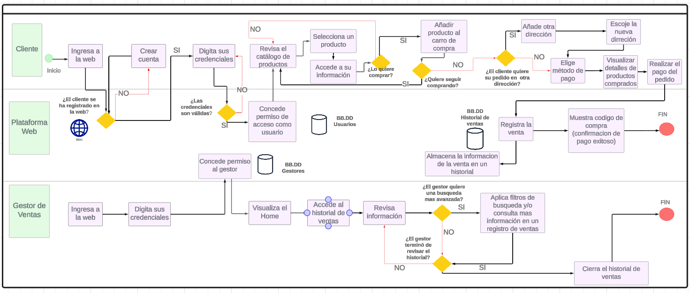

# Capítulo 01: Descripción de la Empresa
## 1.1 Datos de la empresa
- Descripción de la empresa: Es una microempresa que vende maquillaje y papelería que busca traer productos de buena calidad y buen precio, sus principales productos son maquillaje, lapiceros, cuadernos.

- RUC: 20602390510
- Razón social: VASOA srl
- Direción: Tienda Virtual
- Teléfono: 914166070
- Misión: Nuestra misión es ser un referente en el mercado por la diversidad y calidad de nuestros productos en papelería y maquillaje. Buscamos ofrecer una orientación personalizada a nuestros clientes para encontrar los productos que mejor se adapten a sus gustos con la única finalidad de satisfacerlos.💗✨
- Visión: Nuestra visión es ser reconocidos como el espacio preferido para aquellos que buscan una experiencia de compra excepcional en el mundo del maquillaje y la papelería por lo que nos esforzamos por crear un ambiente acogedor y emocionante, donde los clientes puedan explorar una amplia diversidad de productos y recibir asesoramiento personalizado por parte de nuestro equipo capacitado. Es así que aspiramos establecer relaciones sólidas y duraderas con nuestros clientes, basadas en la confianza, la satisfacción y la lealtad hacia nuestro servicio por eso es que nos innovaremos constantemente para mantenernos a la vanguardia de las tendencias y necesidades de nuestros público, sin descuidar la dedicación y calidad procurada. 💗
- Productos ofrecidos:
  - Papelería:
    - Cuadernos
    - Lapiceros
  - Maquillaje
    - Paletas
    - Rubores
    - Primers
    - Polvos y correctores
    - Glitter
    - Delineadores de ojos y labios
    - Labiales y glosses
    - Máscaras de pestañas
## Entrevista
- Conclusión de la entrevista: Se obtuvo principamente los requerimientos del aplicativo que quisiera ya que tenían procesos no optimizados dentro de la empresa considerando el registro de todas sus compras y ventas asi como la recepción de pedidos y confirmaciones de entrega, además pudimos visualizar los productos que tenían así como la explicación detallada de sus procesos de negocio.
- [Entrevista 1 (31-03-24)](Entrevista1/entrevista1.md)
## 1.2 Descripción del proceso de negocio

- Proceso de compra - Este proceso se refiere a las compras de los diversos productos mediante la aceptación de ofertas realizadas por los proveedores, estos productos posteriormente irán al almacén de la empresa.
- Proceso de venta - Este proceso es acerca de los procesos de venta en la empresa que inicia desde que el cliente nos contacta para venderle el producto.
- Proceso de almacen - Este proceso se refiere a cómo se gestiona el almacén de manera que constatemente se verifica el stock de los productos.
- Proceso de distribucion - Este proceso se refiere a las actividades que abarcan llevar el producto hasta el cliente.
- Proceso de marketing - Este proceso es acerca de las actividades que realizan para llamar al cliente.
- Proceso de finanzas - Este proceso abarca las diversas actividades en que se gestionan las ganancias y perdidas en base a las compras, los gastos, pagos y las ventas.
- Proceso de CRM - Este proceso abarca las actividades para mapear a los clientes y saber mejor sus necesidades.

## PROCESO AS IS

### 1. Proceso de Compra

|Secuencia | Actividad | Descripción | Responsable |
|:----:|:----------------:|:--------------------------:|:-----------:|
| 1 | Solicitud del área de almacén para realizar una compra | El área de almacén solicitó realizar una compra porque ya no quedan existencias de algún producto. | Gestor de almacén |
| 2 | Aprobación para solicitar una compra | El área de compra recibe la solicitud de falta de productos y procede a aprobarla | Gestor de compras |
| 3 | Elección de productos a comprar | El área de compra revisa los productos faltantes emitidos en la solicitud y procede a revisar la cantidad que comprara de dichos productos | Gestor de compras |
| 4 | Evaluación del proveedor | El área de compra revisa todas las ofertas realizadas por los proveedores y decide aceptarlas o rechazarlas en función al precio que ofrezcan | Gestor de compras |
| 5 | Emisión de solicitud de compra | El área de compra se acepta una propuesta del proveedor y procede a emitir una solicitud de compra hacia dicho proveedor | Gestor de compras |
| 6 | Recepción de la solicitud por parte del proveedor| El proveedor recepciona la solicitud emitida por el área de compras. | Proveedor |
| 7 | Realización del pago | El área de compra realiza el pago acordado hacia el proveedor | Gestor de compras |
| 8 | Recepción del comprobante de pago del Proveedor | El área de compras recepciona el comprobante de pago que realizo hacia el proveedor | Gestor de compras |
| 9 | Validación de la Factura | Se valida la factura emitida hacia la empresa| Contador |
| 10 | Almacenar Documento | Se almacena la factura que fue emitida | Contador | 
| 11 | Registrar la compra en Excel | Se registran los productos comprados en un Excel | Gestor de Compra |
| 12 | Recepción de productos | La empresa recepciona los productos que fueron entregados | Gestor de compra |
| 13 | Envió al almacén | Se envía al almacén todos los productos recepcionados para su posterior revisión | Gestor de compra |
| 14 | Recepción en almacén | En el almacén recepciona todos los productos y serán revisados para asegurarse que llegaron en correcto estado | Gestor de almacén |

### 2. Proceso de Venta

| Secuencia | Actividad                                | Descripción                                                                                                      | Responsable      |
|-----------|------------------------------------------|------------------------------------------------------------------------------------------------------------------|------------------|
| 1         | Cliente contacta a la empresa           | El cliente se comunica con la empresa a través de llamadas telefónicas o correos electrónicos.                  | Gestor de Ventas |
| 2         | Realizar pedido                          | El cliente proporciona los detalles del pedido (productos, cantidades, etc.) durante la comunicación con la empresa. | Gestor de Ventas         |
| 3         | Recepción del pedido                    | Un empleado de ventas registra manualmente el pedido del cliente en los registros de la empresa.                 | Gestor de Ventas |
| 4         | Revisión de inventarios                 | Se requiere que un empleado  verifique manualmente la disponibilidad de los productos en inventario e informe dicha disponibilidad al cliente.                  | Gestor de Ventas |
| 5         | Confirmación de pedido al cliente       | Un empleado de ventas confirma el pedido al cliente a través de llamadas telefónicas o correos electrónicos.     | Gestor de Ventas |
| 6         | Elección de método de pago              | Se discute con el cliente los métodos de pago disponibles durante la comunicación.                                | Gestor de Ventas |
| 7         | Realizar el pago                        | El cliente realiza el pago a través de los métodos de pago acordados, como transferencia bancaria o depósito en efectivo. | Gestor de Ventas         |
| 8        | Confirmación de pago                    | Un empleado de ventas verifica manualmente el pago recibido y actualiza el estado del pedido en los registros.    | Gestor de Ventas |
| 9        | Envío de código de compra               | Se genera manualmente un código de compra único y se envía al cliente por correo electrónico.                    | Gestor de Ventas |
| 10      | Emitir comprobante de pago electrónico | Se genera manualmente un comprobante de pago y se envía al cliente por correo electrónico. | Gestor de Ventas |

### 3. Proceso de Almacén

| Secuencia | Actividad                                | Descripción                                                                                                      | Responsable      |
|-----------|------------------------------------------|------------------------------------------------------------------------------------------------------------------|------------------|
|1| Buscar Mercancía|Al confirmase una venta, la persona que lo realizó busca los productos en almacén| Gestor de Almacén|
|2| Despachar Mercancía|Se prepara el producto para su entrega en el lugar establecido| Gestor de Almacén|
|3| Registrar Nuevo Stock|Se registra el la cantidad final que queda del producto (conteo rápido)| Gestor de Almacén|
|4| Realizar Cotización de Nuevos Productos|Si el Stock es 0, se cotiza con la lista de proveedores para recibir nueva mercadería| Gestor de Almacén|
|5| Actualizar|Al comprar nueva mercancía, se deja el stock en almacén y se registra la cantidad que se compró| Gestor de Almacén|

### 4. Proceso de Distribución
  

|Secuencia|Proceso|Descripcion|Responsable|
|---------|-------|-----------|-----------|
|1        |Preparacion del pedido solicitado|Se separan los productos que se van a entregar.|Gestor de ventas|
|2|Coordinacion del lugar|El cliente y el gestor de ventas coordinan el lugar de entrega del producto|Gestor de ventas y cliente|
|3|Cotizacion de delivery|Si el lugar de entrega no se encuentra dentro de los puntos de encuentro disponibles, se cotiza el transporte realizado de acuerdo al lugar|Gestor de ventas|
|4|Coordinar la fecha y hora|Escogido el lugar de encuentro, se establece la hora y fecha de entrega|Gestor de ventas y cliente|
|5|Actualizacion del pedido|Se actualiza el estado del pedido en PENDIENTE|Gestor de ventas|
|6|Cancelacion de entrega|El cliente ha cancelado la entrega y el proceso termina|Cliente|
|7|Preparacion del pedido|Se empaqueta los productos para su respectiva entrega|Gestor de ventas |
|8|Eleccion del personal disponible para la entrega|Se elige al personal que se encuentra disponible y listo para la entrega|Repartidor|
|9|Personal en el punto de entrega|El personal llega al punto de entrega|Repartidor|
|10|Emision de nueva fecha de entrega|Si el cliente tiene demora en el punto de encuentro|Gestor de ventas |
|11|Verificacion de código de compra|Se verifica si el código de compra que presenta el cliente es correcto|Repartidor|
|12|Recepcion del producto por el cliente|Si el código es correcto,el cliente recibe el producto |Repartidor|
|13|Actualizar el estado de productos de almacen|Si la entrega se realiza con éxito,se actualiza el estado del pedido a ENTREGADO|Repartidor|

### 5. Proceso de Marketing

| Secuencia | Actividad                                | Descripción                            | Responsable      |
|-----------|------------------------------------------|-----------------------------------------------------------------------|------------------|
| 1         | Creación de campaña | Aquí se brinda una descripción general del concepto de la campaña, como que productos se van a publicitar o la temática respecto a la temporada del año.| Gestor de marketing |
| 2         | Notificación de productos en almacén | Se le notifica al Director de marketing que hay existencias del producto a publicitar. | Gestor de almacén |
| 3         | Compra | Proceso principal del negocio, en este caso se comprarán los productos que se quieran publicitar ya que no hay suficientes existencias en stock. | Gestor de compras |
| 4         | Almacén | Proceso principal del negocio, se almacenarán los productos solicitados en el proceso de compra. | Gestor de almacén |
| 5         | Diseños de estrategias de marketing | Se define cuando se iniciará la campaña dependiendo de la temporada o demanda de productos, además de ver el público objetivo, realización  de sorteos, entre otros. | Equipo de marketing |
| 6         | Se propone un mes de campaña | Ya que el producto a publicitar es nuevo, se le da un margen de un mes para darse a conocer y acoplarse al proceso de venta de la organización. | Equipo de marketing |
| 7         | Se propone una semana de campaña | El producto ya se estaba vendiendo antes, se le da una semana de duración a la campaña. | Equipo de marketing |
| 8         | Definición de medios publicitarios | Se define que medios se van a utilizar para publicitar la campaña. | Equipo de marketing |
| 9        | Definición de medios de pago | Se define que medios de pago podrá utilizar el cliente en el proceso de venta. | Equipo de marketing |
| 10        | Envio de nueva campaña | Se le envía la campaña al Director de marketing para su revisión. | Equipo de marketing |
| 11        | Revisión de la campaña | El Director de marketing revisa la campaña, su decisión definirá si la campaña será publicada o no. | Gestor de marketing |
| 12        | Realización de correcciones | La campaña que no ha sido aprobada se corregirá en los puntos que el Director de marketing haya considerado no aprovechables o que reduzcan la eficacia de la publicidad. | Equipo de marketing |
| 13        | Se publica la campaña | La campaña será publicada dependiendo de lo acordado y aprobado anteriormente. | Gestor de marketing |

### 6. Proceso de CRM

| Secuencia | Actividad                                | Descripción                            | Responsable      |
|-----------|------------------------------------------|-----------------------------------------------------------------------|------------------|
| 1         | recepción de información |El proceso comienza con la recepción de información semanal , ya que en base a esto se preparan para analizar la fidelización de los clientes| gestor CRM |
| 2         | analisis de las ventas por semana | Se hace una revisión de las ventas de la semana y ver que productos son rentables comprar ya que hay productosque se quedan por mucho tiempo en almacén | gestor CRM  |
| 3         |revisión del segmento del cliente |Ver que tanto aumento o disminuyo , por ende en base a esto se tomará las medidas correspondientes para mejorar las ventas del segmento que son de interes  | gestor CRM |
| 4         |compra del producto |En base al analisis se hace la compra correspondiente , veamoslo de manera de rotación de activos por margen de venta , en caso se queda mucho producto y no rota , se hace promoción y se genera cupones si el analisis lo permite| gestor CRM  |
| 5         | busqueda de tendencias | Se hace una busqueda de los productos que estan siendo mas comprados por el segmento que es de nuestro interes | gestor CRM|
| 6         | compra de productos en tendencia | En base al analisis con respecto a las tendencias , se busca los productos en proveedores que tenemos o en nuevos proveedores , haciendo comparativas de las cotizaciones | gestor CRM |
| 7         | confirmación de la compra| Con las otras areas se llega al acuerdo por lo cual solo resta esperar a que el nuevo producto llegue |  gestor CRM  |
| 8         | preparar las campañas por redes sociales | El nuevo producto se debe avisar por varios medios para que tenga mayor alcance| gestor CRM |
| 9        | verificación de ofertas| En esta parte se verifica si es posible incluir ofertas en los productos nuevos , por la compra de muchos de estos | gestor CRM |
| 10        |Información y puesta en marcha | Se envian las campañas y avisos a los clientes , asi que si se dio el caso de ofertas|gestor CRM 
| 11     | revision de la calidad hacia el cliente | se revisan los libros de reclamaciones para ver posibles quejas y puntos a mejorar  | gestor CRM |

### 7. Proceso de Finanzas

| Secuencia | Proceso                       | Descripción                                                                                                                       | Autor    |
|-----------|-------------------------------|-----------------------------------------------------------------------------------------------------------------------------------|----------|
| 1         | Generar un presupuesto de compra    | Generar un monto  de cuánto se dispone a tener de presupuesto para realizar las compras | Gestor de costos |
| 2         | Enviar el presupuesto al área de compras | Envíar el presupuesto al área de compras para que en base a eso procedan a comprar los productos.| Gestor de costos |
| 3         | Recepción de las compras | Recibir las compras realizadas. | Gestor de costos |
| 4         | Validar las compras | Revisar las compras que registro concuerdan con lo recibido| Gestor de costos |
| 5         | Recepción de los gastos administrativos | Recibe en un excel todos los gastos de la administración. | Gestor de costos |
| 6         | Realizar la suma total de compras y gastos | Realizar operaciones de suma total para obtener cuánto se está costando el producto. | Gestor de costos |
| 7         | Recepción de costos | Recibir los costos realizados de las compras y los gastos administrativos | Contador |
| 8         | Asegurar la obtención de los comprobantes de pago de las compras  | Verificar que todos los comprobante de pago en las compras están registrados. | Contador |
| 9         | Recepción de ventas | Recibir toda la información respecto a las ventas realizadas dentro de la empresa. | Gestor de costos |
| 10        | Validar las ventas | Revisar que las ventas que registró concuerdan con lo recibido | Gestor de costos|
| 11        | Realizar la suma total de ventas | Realizar operaciones de suma total para obtener cuánto se está vendiendo. | Gestor de costos |
| 12        | Recepción de ventas | Recibir toda la información respecto a las ventas realizadas dentro de la empresa. | Contador |
| 13        | Asegurar la obtención de los comprobantes de pago de las ventas.  | Verificar que todos los comprobante de pago en las ventas están registrados. | Contador |
| 14        | Registrar Facturas | Se registra todas las facturas de compra de proveedores, ventas y gastos. | Contador |
| 15        | Registrar transacciones | Se registran los pagos realizados como el flujo de efectivo y bancos. | Contador |
| 16        | Realizar los asientos contables | Según las operaciones obtenidas se registran en una tabla donde muestra el haber y der en excel. | Contador |
| 17        | Realizar el estado de resultado | Con los datos registrados se puede calcular la venta total, coste total y utilidades para ver la ganacia verdadera. | Contador |
| 18        | Realizar Reportes | Realizar reportes de las ganancias, cuento se vende, que producto es más vendido, las pérdidas, etc. | Contador |

## PROCESO TO BE

### 1.Proceso de Compra

|Secuencia | Actividad | Descripción | Responsable |
|:----:|:----------------:|:--------------------------:|:-----------:|
| 1 | Solicitud del área de almacén para realizar una compra | El área de almacén solicitó realizar una compra porque ya no quedan existencias de algún producto. | Gestor de almacén |
| 2 | Aprobar solicitud para la compra | El área de compra recibe la solicitud del área del almacén y luego de revisarlo se acepta | Gestor de compras |
| 3 | Elección de productos a comprar | El área de compra revisa los productos faltantes emitidos en la solicitud y procede a revisar la cantidad que comprara de dichos productos | Gestor de compras |
| 4 | Enviar solicitud de compra a los proveedores | El área de compra envía solicitudes a los proveedores de los productos que les hacen falta | Gestor de compras |
| 5 | Registrar oferta en la web | El gestor de compras registra su oferta en la web para posteriormente poder visualizarlo en la pestaña de historial | Gestor de compras|
| 6 | Evaluar ofertas del proveedor | El área de compra revisa todas las ofertas realizadas por los proveedores y decide aceptarlas o rechazarlas | Gestor de compras |
| 7 | Emisión de solicitud de compra | El área de compras envía una solicitud de compra al proveedor que fue aceptado su oferta | Gestor de compras |
| 8 | Recepción de la solicitud por parte del proveedor| El proveedor recepciona la solicitud emitida por el área de compras. | Proveedor |
| 9 | Realización del pago | El área de compra realiza el pago acordado hacia el proveedor | Gestor de compras |
| 10 | Recepción del comprobante de pago del Proveedor | El área de compras recepciona el comprobante de pago que realizo hacia el proveedor | Gestor de compras |
| 11 | Validación de la Factura | Se valida la factura emitida hacia la empresa| Gestor de compras |
| 12 | Almacenar Factura | Se almacena la factura en una base de datos que luego revisara el contador | Gestor de compras | 
| 13 | Recepción de productos | La empresa recepciona los productos que fueron entregados | Gestor de compra |
| 14 | Enviar al almacén | Se envía al almacén todos los productos recepcionados para su posterior revisión | Gestor de compra |
| 15 | Recepción en almacén | En el almacén recepciona todos los productos y serán revisados para asegurarse que llegaron en correcto estado | Gestor de almacén |

### 2. Proceso de Venta

| Secuencia | Actividad                                           | Descripción                                                   | Responsable      |
|-----------|-----------------------------------------------------|---------------------------------------------------------------|------------------|
| 1         | Cliente ingresa a la web y se logea                | El cliente accede a la plataforma web e inicia sesión.        | Cliente/Plataforma |
| 2         | Cliente navega por el catálogo de productos        | El cliente explora los productos disponibles en la plataforma. | Cliente          |
| 3         | Cliente selecciona productos y añade al carrito    | El cliente selecciona los productos que desea comprar y decide si añadirlos al carrito de compra. | Cliente          |
| 4         | Cliente confirma método de pago                    | El cliente elige el método de pago que utilizará para realizar la compra. | Cliente          |
| 5         | Sistema informa los detalles de la compra          | El sistema muestra al cliente un resumen con los detalles de su compra, incluyendo los productos seleccionados y el método de pago. | Plataforma       |
| 6         | Cliente confirma la compra                         | El cliente confirma la compra después de revisar los detalles proporcionados por el sistema. | Cliente          |
| 7         | Plataforma registra la compra                       | La plataforma registra la transacción de compra realizada por el cliente. | Plataforma       |
| 8         | Plataforma envía confirmación de compra con código único | La plataforma envía al cliente una confirmación de compra que incluye un código de compra único. | Plataforma       |

### Cambios que se implementarán en ventas
1) Se implementará la pagina web que permite realizar **log in**. Los usuarios podrán hacer sus **pedidos** directamente en el **sitio web**.
2) Para crear su cuenta se le pedirá al usuario que añada sus datos personales, así como su dirreción actual para asi poder tenerlo en cuenta a la hora de
   realizar el envío de pedidos. En caso contrario, puede añadir otra dirección por si quiere que los pedidos lleguen a esa nueva dirección. Esto
   evita estar haciendo coordinaciones previas y lo hace más dinámico.
4) De la misma forma, el usuario elige sus **metodos de pago** en la **plataforma web**. Se cuenta por ahora, con pagos por tarjeta de crédito y débito.
5) Los clientes pueden acceder a su **carro de compras** donde podrán encontrar información sobre su producto. A travez del catalogo se puede añadir los
   productos al carro de compras.
6) La **emision de comprobante de pago** ya no será manual. La misma página los puede enviar.
7) Con respecto al tema del gestor de ventas, se han establecido permisos para que, al ingresar a la página web en su respectivo rol, pueda acceder a múltiples opciones que un usuario común no puede visualizar, como el historial de ventas. Allí podrá gestionar y revisar la trayectoria de las ventas en cualquier unidad de tiempo, por ejemplo, las ventas del día, de la semana, del mes, etc. Esto con la finalidad de realizar seguimiento a las ventas y los productos más vendidos, tener un mejor conocimiento del inventario que se debe conseguir, y ayuda en las planificaciones financieras en la elaboración de presupuestos.
### 3. Proceso de Almacén

|Secuencia | Actividad | Descripción | Responsable |
|:----:|:----------------:|:--------------------------:|:-----------:|
| 1 | Recepción de la órden de despacho | El área de ventas, al concretar la venta de un producto con el cliente, emitirpa una orden de despacho al área de almacén para que éste pueda preparar la lista de productos para su entrega. | Gestor de Almacén |
| 2 | Picking | El reponsable derivado a la órden de despacho selecciona y recoge los productos de los diferentes lugares del almacén donde se encuentre los productos de la órden. | Personal de almacén |
| 3 | Packing | El reponsable derivado a la órden de despacho empaqueta y embala los productos selecionados garantiznado las condiciones adecuadas para el envío.| Personal de almacén |
| 4 | Despachar Mercancía | Los producto empaquetados son llevados al área de distribución para su respectiva entrega| Personal de almacén |
| 5 | Actualizar stock | En el sistema de almacén se registra la salida del producto (cantidad) con la fecha y hora para la actualización en tiempo real del inventario | Gestor de almacén |
| 6 | Realizar control inventario | Al terminar con la actualización del Stock, el sistema evaluará la condición de que si para el producto ingresado se tiene su stock mínimo; si es así, se genera un reporte de salidas (al final del día) para el registro de inventario que se enviará a Ventas para que tenga la cantidad exacta existente a promocionar. | Gestor de almacén |
| 7 | Realizar requerimiento de compra | Si para los producto despechados no se cuenta con su stock mínimo, el sistema realizará una lista de requerimiento que se enviará al área de compras. | Gestor de almacén |
| 8 | Recepción de mercancía | Si llega un registro de compra de proveedores a almacen, los encargados hará la recepción de la mercancía (descarga del medio de transporte) y marcarán la fecha y hora en que lo hacen como indicador de tiempo. | Gestor Ventas  y Encargado de almacén |
| 9 | Verificar artículos | Verificar el estado de cada artículo comprado para ver si hay defectuosos y proceder a realizar una observación y posible cambio o devolución si se encuentra en ese estado. | Personal de almacén |
| 10 | Actualizar stock | Si el artículo está en buena condición, se registra la cantidad en el sistema con su respectivo código y ubicación de donde se colocará en el almacén para un rápido picking | Gestor de almacén |
| 11 | Almacenar mercanción | El personal distribuirá los articulos según su ubicación correspondiente en los andamios del almacén. | Personal de almacén |
| 12 | Registrar artículo defectuoso | Si se encuentra un producto defectuoso, se registrará en el sistema con las características defectuosa, el proveedor y código del producto. | Gestor de almacén |

### 4. Proceso de Distribución
  

|Secuencia|Proceso|Descripcion|Responsable|
|---------|-------|-----------|-----------|
|1        |Actualizacion de pedido en la lista de "mis pedidos"|El pedido aparece en la lista de "mis pedidos" del cliente|Cliente|
|2|Coordinar la fecha y hora|En la vista de "mis pedidos" el cliente establece la hora y fecha de entrega|Cliente|
|3|Actualizacion del pedido en la lista de pedidos|Se actualiza el estado del pedido en PENDIENTE y aparece en la vista del gestor de ventas|Gestor de ventas|
|4|Asignacion del repartidor disponible para la entrega|Se elige al repartidor que se encuentra disponible para la entrega|Gestor de ventas|
|5|Actualizacion del pedido en la lista del repartidor|El pedido aparece en la lista del repartidor al que se ha asignado|Repartidor|
|6|Cancelacion de entrega|El cliente cancela la entrega y se reprograma una nueva fecha|Cliente|
|7|Actualizacion de pedido a "CANCELADO"|El pedido se actualiza en "CANCELADO" en la lista de pedidos del gestor de ventas y de pedidos pendientes del repartidor si es que ya se le habia asignado|Gestor de ventas y repartidor|
|8|Preparacion del pedido|Se empaqueta los productos para su respectiva entrega|Gestor de ventas |
|9|Repartidor acepta el pedido|El repartidor entra en la lista de sus pedidos pendientes y acepta el pedido que va a entregar|Repartidor|
|10|Actualizacion de estado de pedido "SU PEDIDO ESTA EN CAMINO"|El pedido se actualiza en la lista de "mis pedidos" del cliente a "SU PEDIDO ESTA EN CAMINO"|Cliente|
|11|El repartidor llega al punto de encuentro|El repartidor se dirige al lugar de entrega hasta llegar al punto|Repartidor|
|12|Verificacion de código de compra|El repartidor se encuentra con el cliente y verifica si el código de compra que presenta el cliente es correcto|Repartidor y cliente|
|13|Recepcion del producto por el cliente|Verificado que el código es correcto,el cliente recibe el producto |Cliente|
|14|Actualizar el estado del pedido a "ENTREGADO"|El repartidor entra a la lista de sus pedidos y confirma que se ha entregado el pedido ,lo que actualiza el estado del pedido a ENTREGADO automaticamente en la lista del gestor de ventas|Repartidor|
|15|Reprogramar pedido|El pedido por alguna razon,como que el cliente no llegó al punto de encuentro,el codigo de compra era incorrecto, no se pudo entregar,el repartidor oprime la opcion de reprogramar pedido y el cliente debe establecer nueva fecha|Repartidor|

### 5. Proceso de Marketing

| Secuencia | Actividad                                | Descripción                            | Responsable      |
|-----------|------------------------------------------|-----------------------------------------------------------------------|------------------|
| 1         | Creación de campaña | Aquí se brinda una descripción general del concepto de la campaña, como que productos se van a publicitar o la temática respecto a la temporada del año.| Gestor de marketing |
| 2         | Notificación de productos en almacén | Se le notifica al Director de marketing que hay existencias del producto a publicitar. | Gestor de almacén |
| 3         | Compra | Proceso principal del negocio, en este caso se comprarán los productos que se quieran publicitar ya que no hay suficientes existencias en stock. | Gestor de compras |
| 4         | Almacén | Proceso principal del negocio, se almacenarán los productos solicitados en el proceso de compra. | Gestor de almacén |
| 5         | Consultar posibles precios de oferta | Se hace una consulta al área de finanzas de los precios en los cuales el producto se puede ofertar, el área nos comunicará el precio nuevo del producto o la negación de la rebaja. | Equipo de marketing |
| 6         | Realizar combos de productos | Al no poder rebajar el precio de los productos en su venta unitaria, se realizan combos de los productos consigo mismos o con otros que tengan una demanda generalmente alta.| Equipo de marketing |
| 7         | Diseños de estrategias de marketing | Se define cuando se iniciará la campaña dependiendo de la temporada o demanda de productos, además de ver el público objetivo, creación de cupones, entre otros. | Equipo de marketing |
| 8         | Se propone un mes de campaña | Ya que el producto a publicitar es nuevo, se le da un margen de un mes para darse a conocer y acoplarse al proceso de venta de la organización. | Equipo de marketing |
| 9         | Se propone una semana de campaña | El producto ya se estaba vendiendo antes, se le da una semana de duración a la campaña. | Equipo de marketing |
| 10         | Definición de medios publicitarios | Se define que medios se van a utilizar para publicitar la campaña. | Equipo de marketing |
| 11        | Definición de medios de pago | Se define que medios de pago podrá utilizar el cliente en el proceso de venta. | Equipo de marketing |
| 12        | Envio de nueva campaña | Se le envía la campaña al Director de marketing para su revisión. | Equipo de marketing |
| 13        | Revisión de la campaña | El Director de marketing revisa la campaña, su decisión definirá si la campaña será publicada o no. | Gestor de marketing |
| 14        | Realización de correcciones | La campaña que no ha sido aprobada se corregirá en los puntos que el Director de marketing haya considerado no aprovechables o que reduzcan la eficacia de la publicidad. | Equipo de marketing |
| 15        | Se publica la campaña | La campaña será publicada dependiendo de lo acordado y aprobado anteriormente. | Gestor de marketing |

### 6. Proceso de CRM

### 7. Proceso de Finanzas

| Secuencia | Proceso                       | Descripción                                                                                                                       | Autor    |
|-----------|-------------------------------|-----------------------------------------------------------------------------------------------------------------------------------|----------|
| 1         | Revisar Reportes | Se obtendrá reportes dentro del sistema que da´ran las diferente áreas mediante su alamcenamiento dentro del sistema. | Gestor de costos |.
| 2         | Registrar el presupuesto en el sistema. | Registrar el presupuesto para que llegue al área de compras para que en base a eso procedan a comprar los productos.| Gestor de costos |
| 3         | Realizar la suma total de compras , ventas y  gastos dentro del sistema donde solo tendrá que revisar y verificar. | Realizar operaciones de suma total para obtener cuánto se está costando el producto. | Gestor de costos |
| 4         | Recepción de costos | Recibir los costos realizados de las compras y los gastos administrativos dentro del sistema | Contador |
| 5         | Asegurar la obtención de los comprobantes de pago de las compras y si no está podrá notificar mediante el sistema. | Verificar que todos los comprobante de pago en las compras están registrados. | Contador |
| 6         | Registrar Facturas dentro de las ventana emergentes del sistema. | Se registra todas las facturas de compra de proveedores, ventas y gastos. | Contador |
| 7         | Registrar transacciones | Se registran los pagos realizados como el flujo de efectivo y bancos. | Contador |
| 8         | Realizar los asientos contables | Según las operaciones obtenidas se registran en una tabla donde muestra el haber y der en excel. | Contador |
| 9         | Realizar el estado de resultado | Con los datos registrados se puede calcular la venta total, coste total y utilidades para ver la ganacia verdadera. | Contador |
| 10        | Realizar Reportes | Realizar reportes de las ganancias, cuento se vende, que producto es más vendido, las pérdidas, etc. | Contador |

### Cambios implementados: 
- Anteriormente los registro se hacen mediante un excel y cuando se recepciona hacia el gesto de costos es median un correo o whattsap pero con el nuevo sistema podra registrar todo en el sitio web de manera que al registrar las ventas, los gastos, costos y pagos automáticamente se tendrá la suma total de todos que se alamnecará en una base datos de manera que eso servirá para realizar automáticamente los asientos contables y el estado de resultados además que dentro del sistema web podra registrar todas las facturas y transacciones donde podra ver el resumen de ello y darse cuenta más fácil que facturas faltan pagar o cobrar.

### 1.3 Motivación
-  La principal motivación para elegir a "Migni Store" y desarrollar una página web es el potencial de crecimiento que ofrece. Al ser una empresa pequeña en el mercado de la venta de papelería y maquillaje para dama, el 
   lanzamiento de una plataforma en línea puede abrir nuevas oportunidades para expandir su alcance, atraer a más clientes y aumentar sus ventas. Una presencia en línea sólida puede llevar a "Migni Store" a competir de 
   manera más efectiva en un mercado cada vez más digitalizado y ofrecer una experiencia de compra conveniente y satisfactoria para sus clientes.
