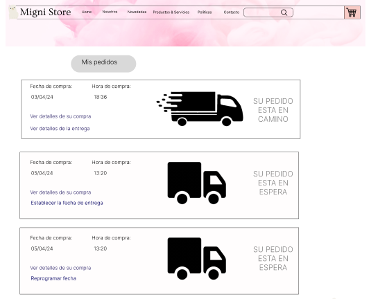
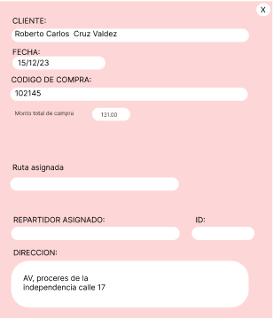

# Capítulo 10: Sentencias SQL por prototipo


## Módulo marketing
### Código Requerimiento : R - 001
### Codigo interfaz : I - 001
### Imagen interfaz : 

### Sentecias SQL:
### Eventos: 
* **Carga de pantalla: la pantalla se llena con el Id_campaña siguiente al último registro y con el Id_equipo_mark con el que se entró a la página**
* **BOTON Enviar: Inserta una nueva fila en la tabla Campaña, además de insertar nuevas filas en la tabla CampañaXProd y CampañaXCanal**
* **BOTON Cancelar: No se realizan cambios en la tabla** 
```
--CARGA:
SELECT MAX(Id_campaña) + 1 AS nuevo_Id_campaña
FROM Campaña;

SELECT id_equipo_mark
FROM persona
WHERE usuario=<12>
AND contraseña=<13>;

-- BOTON Enviar
INSERT INTO Campaña (Id_campaña, nom_campaña, fecha_ini, fecha_fin, dir_url, modalidad, archivo, desc_campaña, Id_equipo_mark, Id_gest_mark)
VALUES
    (<1>, <2>, <3>, <4>, <5>, <6>, <7>, <8>, <9>, 1005);

INSERT INTO CampañaXProd (id_producto, Id_campaña)
VALUES
    (<10>, <1>);

INSERT INTO CampañaXCanal (Id_campaña, Id_canal)
VALUES
    (<1>, <11>);
    
```

### Código Requerimiento : R - 002
### Codigo interfaz : I - 002
### Imagen interfaz : 

### Sentecias SQL:
### Eventos: 
* **Carga de pantalla: La pantalla se llena con el Id_observacion siguiente al último registro en la tabla observaciones y con el Id de la campaña asociada**
* **BOTON Enviar: Se inserta una nueva fila en la tabla Observacion, el estado_atendido estará en FALSE porque aun no se atiende**
* **BOTON Cancelar:No se realiza ningun cambio a las tablas, se vuelve a la pantalla anterior** 
```
--CARGA:
SELECT MAX(Id_observacion) + 1 AS nuevo_Id_observacion
FROM Observacion;

SELECT Id_campaña
FROM Campaña
WHERE Id_campaña = <2>;

--BOTÓN ENVIAR:
INSERT INTO Observacion (Id_observacion, descripcion, Id_campaña, estado_atendido)
VALUES
    (<1>,<3> , <2>, FALSE);
```

### Código Requerimiento : R - 003
### Codigo interfaz : I - 003
### Imagen interfaz : 

### Sentecias SQL:
### Eventos: 
* **Carga de pantalla: La pantalla se llena con el Id_observacion con, el Id_campaña relacionado con sus datos correspondientes, el Id_equipo_marketing que propuso la campaña**
* **BOTON Enviar: Se registran los cambios realizados en la pantalla, además de actualizar el estado_atendido de la observacion a TRUE**
* **BOTON Cancelar: No se realizan cambios en las tablas** 
```
--CARGA
SELECT 
    o.Id_observacion,
    o.descripcion,
    o.Id_campaña,
    c.Id_equipo_mark,
    c.nom_campaña,
    c.fecha_ini,
    c.fecha_fin,
    c.dir_url,
    c.modalidad,
    c.archivo,
    c.desc_campaña
FROM 
    Observacion o
JOIN 
    Campaña c ON o.Id_campaña = c.Id_campaña
WHERE Id_observacion= <1>;

SELECT 
    cxp.id_producto
FROM 
    Observacion o
JOIN 
    Campaña c ON o.Id_campaña = c.Id_campaña
JOIN 
    CampañaXProd cxp ON c.Id_campaña = cxp.Id_campaña
WHERE 
    o.Id_observacion = <1>;

SELECT 
    cxc.id_canal
FROM 
    Observacion o
JOIN 
    Campaña c ON o.Id_campaña = c.Id_campaña
JOIN 
    CampañaXCanal cxc ON c.Id_campaña = cxc.Id_campaña
WHERE 
    o.Id_observacion = <1>;

--BOTON ENVIAR
UPDATE Campaña
SET 
 nom_campaña= <2>,
 fecha_ini= <3>,
 fecha_fin= <4>,
 dir_url= <5>,
 modalidad= <6>,
 archivo= <7>,
 desc_campaña <8>
WHERE Id_campaña = (SELECT Id_campaña FROM Observacion WHERE Id_observacion = <1>);

UPDATE CampañaXProd
SET
 id_producto= <9>
WHERE Id_campaña = (SELECT Id_campaña FROM Observacion WHERE Id_observacion = <1>)
AND id_producto= (SELECT 
    cxp.id_producto
FROM 
    Observacion o
JOIN 
    Campaña c ON o.Id_campaña = c.Id_campaña
JOIN 
    CampañaXProd cxp ON c.Id_campaña = cxp.Id_campaña
WHERE 
    o.Id_observacion = <1>);

UPDATE CampañaXCanal
SET
 Id_canal =<10>
WHERE Id_campaña = (SELECT Id_campaña FROM Observacion WHERE Id_observacion = <1>)
AND id_canal = (SELECT 
    cxc.id_canal
FROM 
    Observacion o
JOIN 
    Campaña c ON o.Id_campaña = c.Id_campaña
JOIN 
    CampañaXCanal cxc ON c.Id_campaña = cxc.Id_campaña
WHERE 
    o.Id_observacion = <1>);

UPDATE Observacion
SET
 estado_atendido =TRUE
WHERE
 Id_observacion=<1>;
```

### Código Requerimiento : R - 004
### Codigo interfaz : I - 004
### Imagen interfaz : 

### Sentecias SQL:
### Eventos: 
* **Carga de pantalla: La pantalla se carga con el id_campaña correspondiente a la campaña a editar y tambien se cargan los datos asociados a esta**
* **BOTON Guardar: Se actualizan los datos de las tablas según los cambios realizados**
* **BOTON Cancelar: No se realizan cambios en las tablas**
* **BOTON Eliminar: Se elimina la campaña y todas las filas de lastablas asociadas que contangan este id_campaña**
```
--CARGA
SELECT
    Id_campaña,
    nom_campaña,
    fecha_ini,
    fecha_fin,
    dir_url,
    modalidad,
    archivo,
    desc_campaña
FROM Campaña
WHERE Id_campaña=<1>;

SELECT id_producto
FROM CampañaXProd
WHERE Id_campaña=<1>;

SELECT Id_canal
FROM CampañaXCanal
WHERE Id_campaña=<1>;

--BOTON ENVIAR
UPDATE Campaña
SET 
 nom_campaña= <2>,
 fecha_ini= <3>,
 fecha_fin= <4>,
 dir_url= <5>,
 modalidad= <6>,
 archivo= <7>,
 desc_campaña <8>
WHERE Id_campaña = <1>;

UPDATE CampañaXProd
SET
 id_producto= <9>
WHERE Id_campaña = <1>
AND id_producto= (SELECT id_producto
FROM CampañaXProd
WHERE Id_campaña=<1>);

UPDATE CampañaXCanal
SET
 id_canal=<10>
WHERE Id_campaña= <1>
AND Id_canal=(SELECT Id_canal
FROM CampañaXCanal
WHERE Id_campaña=<1>);

--BOTON ELIMINAR
DELETE FROM CampañaXProd WHERE Id_campaña=<1>;
DELETE FROM CampañaXCanal WHERE Id_campaña=<1>;
DELETE FROM Observacion WHERE Id_campaña=<1>;
DELETE FROM Campaña WHERE Id_campaña =<1>; 
```

## Modulo de Compras
### Código Requerimiento : R - 005
### Codigo interfaz : I - 005
### Imagen interfaz : 

### Sentecias SQL:
### Eventos: 
* **Pantalla Visualizar Proveedores: Se mostrará todos los proveedores dentro de la empresa con un estado de activo**
```
SELECT razon_social 
FROM proveedor
WHERE id_est_proveedor = 'A'
```

### Código Requerimiento : R - 006
### Codigo interfaz : I - 006
### Imagen interfaz : 

### Sentecias SQL:
### Eventos: 
* **Boton Añadir Proveedor: Nos permite ingresar los datos de un proveedor para ser guardado en la base de datos** 
```
INSERT INTO proveedor(ruc_proveedor, razon_social, web_proveedor, rubro, direccion, telefono, id_est_proveedor)
VALUES (<1>, <2>, <3>, <4>, <5>, <6>, 'A');
```

### Código Requerimiento : R - 007
### Codigo interfaz : I - 007
### Imagen interfaz : 

### Sentecias SQL:
### Eventos: 
* **Pantalla Detalle Proveedores: Se mostrará todos los datos de los proveedores activos en la empresa**
```
SELECT ruc_proveedor, razon_social, web_proveedor, rubro, direccion, telefono, id_est_proveedor
FROM proveedor
WHERE ruc_proveedor = <1>;
```

### Código Requerimiento : R - 008
### Codigo interfaz : I - 008
### Imagen interfaz : 

### Sentecias SQL:
### Eventos: 
* **Pantalla Historial Cotizaciones: Se mostrará el historial de todas las cotizaciones aceptadas, no aceptadas y pendientes** 
```
SELECT id_cotizacion, id_est_cotizacion, monto_total, ruc_proveedor
FROM cotizacion
WHERE id_cotizacion = <1> OR id_cotizacion = <2> OR id_cotizacion = <3> OR id_cotizacion = <4> OR id_cotizacion = <5> OR id_cotizacion = <6>
```

### Código Requerimiento : R - 009
### Codigo interfaz : I - 009
### Imagen interfaz : 

### Sentecias SQL:
### Eventos: 
* **Pantalla Detalle Cotización: Nos permite visualizar todos los datos de una cotizacion, los productos y sus cantidades, ademas de los datos del proveedor.** 
```
SELECT p.ruc_proveedor, p.razon_social, p.rubro, p.direccion, p.telefono, p.web_proveedor, c.monto_total
FROM proveedor p
INNER JOIN cotizacion c ON c.ruc_proveedor = p.ruc_proveedor
WHERE c.id_cotizacion = <1>;

SELECT pd.nombre_producto, cx.cantidad
FROM proveedor p
INNER JOIN cotizacion c ON c.ruc_proveedor = p.ruc_proveedor
INNER JOIN cotizaciónxproducto cx ON cx.id_cotizacion = c.id_cotizacion
INNER JOIN producto pd ON pd.id_producto = cx.id_producto
WHERE c.id_cotizacion = <1>;
```

### Código Requerimiento : R - 010
### Codigo interfaz : I - 010
### Imagen interfaz : 

### Sentecias SQL:
### Eventos: 
* **BOTON Aceptar Oferta: Actualiza el estado de una cotizacion pendiente a un estado de Aceptado**
* **BOTON Rechazar Oferta: Actualiza el estado de una cotizacion pendiente a un estado de No Aceptado** 
```
-- BOTON Aceptar Oferta
UPDATE cotizacion 
SET id_est_cotizacion = 'A'
WHERE id_cotizacion = <1>;

-- BOTON Rechazar Oferta
UPDATE cotizacion 
SET id_est_cotizacion = 'N'
WHERE id_cotizacion = <1>;
```
## 3.4 Modulo de Distribucion
### Código Requerimiento : R - 011
### Codigo interfaz : I - 011
### Imagen interfaz : 

### Sentecias SQL:
### Eventos: 
* **Pantalla Visualizar compras: Se mostrará todas las compras que ha realizado el cliente con id = <1>**
```
select fecha_pago,hora_pago
from venta 
inner join detalle_pago on venta.id_detalle_pago = detalle_pago.id_detalle_pago
where id_persona = <1>
```
### Código Requerimiento : R - 012
### Codigo interfaz : I - 012
### Imagen interfaz : 

### Sentecias SQL:
### Eventos: 
* **BOTON ACEPTAR : Se registrará la fecha de entrega de la compra con id = <4> y se creara un nuevo registro de pedido con estado P, sabiendo que el id_pedido es incrementable**
```
INSERT INTO Pedido (fecha_entrega, id_venta,id_est_pedido)
VALUES (TO_DATE(CONCAT(<3>, '-', <2>, '-', <1>), 'YYYY-MM-DD'),<4>,'P');
```
### Código Requerimiento : R - 013
### Codigo interfaz : I - 013
### Imagen interfaz : 

### Sentecias SQL:
### Eventos: 
* **Pantalla Visualizar pedidos: El gestor de distribucion podra visualizar los pedidos pendientes de la zona <A>,en este caso la 1**
```
SELECT 
    p.id_venta,
    p.fecha_entrega,
    pe.Nombre || ' ' || pe.Primer_apell || ' ' || pe.Segundo_apell AS nombre_cliente,
    p.id_est_pedido AS estado_pedido
FROM pedido p
INNER JOIN venta v ON p.id_venta = v.id_venta
INNER JOIN persona pe ON v.id_persona = pe.id_persona
INNER JOIN distrito d ON pe.id_distrito = d.id_distrito
INNER JOIN zona z ON d.id_zona = z.id_zona
WHERE z.id_zona = 1
AND p.id_est_pedido = 'P'
```
### Código Requerimiento : R - 014
### Codigo interfaz : I - 014
### Imagen interfaz : 

### Sentecias SQL:
### Eventos: 
* **Pantalla Asignar: El gestor de distribucion podra visualizar los repartidores disponibles y asignar una fecha y ruta al pedido de codigo <1>**
```
SELECT r.id_repartidor, r.nombre, r.apellido
FROM Repartidor r
INNER JOIN zona z ON r.id_zona = z.id_zona
INNER JOIN distrito d ON z.id_zona = d.id_zona
INNER JOIN persona pe ON pe.id_distrito = d.Id_distrito
INNER JOIN venta v ON v.id_persona = pe.Id_persona
INNER JOIN pedido p ON p.id_venta = v.Id_venta
WHERE p.Id_pedido = <1>;

INSERT INTO pedido(id_repartidor,id_ruta) 
VALUES (<2>,<3>);
WHERE id_pedido = <1>
```
### Código Requerimiento : R - 015
### Codigo interfaz : I - 015
### Imagen interfaz : 

### Sentecias SQL:
### Eventos: 
* **Visualizar historial de pedidos: El gestor de distribucion podra visualizar todos los pedidos que se han registrado**
```
SELECT p.Id_venta, p.fecha_entrega, 
	pe.Nombre || ' ' || pe.Primer_apell || ' ' || pe.Segundo_apell AS nombre_cliente, 
    te.estado_pedido AS estado_pedido
FROM Pedido p
INNER JOIN Venta v ON p.Id_venta = v.Id_venta
INNER JOIN Persona pe ON v.Id_persona = pe.Id_persona
INNER JOIN Tipo_est_pedido te ON p.id_est_pedido = te.id_est_pedido;
```
### Código Requerimiento : R - 016
### Codigo interfaz : I - 016
### Imagen interfaz : 

### Sentecias SQL:
### Eventos: 
* **Visualizar las entregas pendientes: El repartidor de id = <1> podra visualizar todos los pedidos que se encuentran pendientes**
```
SELECT p.Id_venta,p.fecha_entrega,te.estado_pedido
FROM Pedido p
INNER JOIN Repartidor r ON p.Id_repartidor = r.Id_repartidor
INNER JOIN Tipo_est_pedido te ON p.id_est_pedido = te.id_est_pedido
WHERE r.Id_repartidor = <1>
AND p.id_est_pedido = 'P';
```
### Código Requerimiento : R - 017
### Codigo interfaz : I - 017
### Imagen interfaz : 

### Sentecias SQL:
### Eventos: 
* **Boton entregado: El repartidor de id = <1> podra confirmar que se realizó la entrega con exito y actualizara el estado de pedido de codigo <2> a E**
```
UPDATE pedido
SET id_est_pedido = 'E'
WHERE id_repartidor = <1> AND id_pedido = <2>>;
```

### Código Requerimiento : R - 018
### Codigo interfaz : I - 018
### Imagen interfaz : 

### Sentecias SQL:
### Eventos: 
* **Visualizar el historial de pedido: El repartidor de id = <1> podra visualizar todas las entregas que realizó**
```
SELECT p.id_venta,p.fecha_entrega,e.estado_pedido
FROM pedido p
INNER JOIN tipo_est_pedido e on p.id_est_pedido = e.id_est_pedido
WHERE p.id_repartidor = <1>;
```
### Código Requerimiento : R - 019
### Codigo interfaz : I - 019
### Imagen interfaz : 

### Sentecias SQL:
### Eventos: 
* **BOTON VER MAS: El repartidor y el gestor de distribucion podran visualizar los detalles del pedido de id = <1>**
```
SELECT 
    pe.Nombre || ' ' || pe.Primer_apell || ' ' || pe.Segundo_apell AS nombre_cliente,
    p.fecha_entrega,
    p.Id_venta AS codigo_de_compra,
    p.Id_ruta,
    r.nombre AS nombre_repartidor,
    r.Id_repartidor,
    pe.Direccion
FROM Pedido p
INNER JOIN Venta v ON p.Id_venta = v.Id_venta
INNER JOIN Persona pe ON v.Id_persona = pe.Id_persona
INNER JOIN Repartidor r ON p.Id_repartidor = r.Id_repartidor
WHERE p.Id_pedido = <1>;
```

## 3.3 Modulo de Ventas
### Código Requerimiento : R - 020
### Codigo interfaz : I - 020
### Imagen interfaz : 

### Sentecias SQL:
### Eventos: 
* **Pantalla Visualizar Catálogo productos: Se mostrará todos los productos al cliente**
```
SELECT id_producto,nombre_producto,precio_unit FROM PRODUCTO;
```

### Código Requerimiento : R - 021
### Codigo interfaz : I - 021
### Imagen interfaz : 

### Sentecias SQL:
### Eventos: 
* **Pantalla Visualizar información detallada del producto**
```
SELECT P.id_producto,nombre_producto,descripcion_prod,precio_unit,cant_max as cantidad_en_stock,t.nombre as Tipo_Producto,c.nombre as categoria_prod FROM PRODUCTO P
JOIN CATEGORIA_PROD C ON C.ID_CATEGORIA_PROD = P.ID_CATEGORIA_PROD
JOIN TIPO_PROD T ON C.ID_tipo_prod = T.id_tipo_prod;
```
### Código Requerimiento : R - 022
### Codigo interfaz : I - 22
### Imagen interfaz : 

### Sentecias SQL:
### Eventos: Decidir comprar algo en el carro de compras
* **Pantalla carrito de compras**
```
select nombre_producto,descripcion_prod,cant_prod,cant_prod*precio_unit as precio ,c.esta_activo,direccion,
(select sum(cant_prod*precio_unit) AS PRECIO_FINAL from producto p
 join ventaxprod V ON  p.id_producto = v.id_producto
JOIN venta ve on ve.id_venta=v.id_venta
join persona pe on ve.id_persona = pe.id_persona
join cupón c on c.id_cupón=v.id_cupón
 where ve.id_venta = <900001>
 group by ve.id_venta
 )

from producto p
join ventaxprod V ON  p.id_producto = v.id_producto
JOIN venta ve on ve.id_venta=v.id_venta
join persona pe on ve.id_persona = pe.id_persona
join cupón c on c.id_cupón=v.id_cupón
where ve.id_venta = 900001
```
### Código Requerimiento : R - 023
### Codigo interfaz : I - 023
### Imagen interfaz : 

### Sentecias SQL:
### Eventos: Elegir método de pago
* **Pantalla Visualizar posibles tipos de pago a elección del cliente**
```
select t.nombre_tipo as tipo_pago,nro_tarjeta from Tipos_pago T
join detalle_pago D on T.ID_TIPO_PAGO = D.ID_TIPO_PAGO
JOIN venta v on v.id_detalle_pago = d.id_detalle_pago
where v.id_venta = <900001>
```
### Código Requerimiento : R - 024
### Codigo interfaz : I - 024
### Imagen interfaz : 

### Sentecias SQL:
### Eventos: Decidir ver información mas detallada mientras esta en el carrito de compras
* **Pantalla Visualizar los detalles del producto que esta comprando en específico**
```
select nombre_producto,descripcion_prod,pe.direccion,cant_prod,(cant_max-cant_prod) as stock_restante,cant_prod*precio_unit as precio,
d.fecha_pago as fecha_en_el_carrito,t.nombre_tipo
from producto p
join ventaxprod V ON  p.id_producto = v.id_producto
JOIN venta ve on ve.id_venta=v.id_venta
join persona pe on ve.id_persona = pe.id_persona
join detalle_pago  d on ve.id_detalle_pago = d.id_detalle_pago
join tipos_pago t on t.id_tipo_pago = d.id_tipo_pago
where ve.id_venta = 900001 and p.id_producto=2
```
### Código Requerimiento : R - 027
### Codigo interfaz : I - 027
### Imagen interfaz : 

### Sentecias SQL:
### Eventos: Elegir (si lo desea) cambiar la direccion de envió antes de registrar su compra
* **Pantalla Visualizar cambio de dirección del cliente**
```
Primero actualizamos

UPDATE persona
SET direccion = 'Av. Siempre Viva 123'
WHERE id_persona = 1008

Luego verificamos dicha actualización

select direccion ,d.nombre as nombre_distrito from persona P
JOIN DISTRITO D ON P.ID_DISTRITO=D.ID_DISTRITO
WHERE id_persona = 1008
```
### Código Requerimiento : R - 025
### Codigo interfaz : I - 025
### Imagen interfaz : 

### Sentecias SQL:
### Eventos: Decidir ver el historial de ventas de la empresa para dar seguimiento
* **Pantalla Visualizar historial de ventas**
```
select vp.id_venta,p.nombre,sum(vp.monto_total) as monto_final,t.nombre_tipo,d.fecha_pago,d.hora_pago from VentaXProd  vp
JOIN venta v on vp.id_venta=v.id_venta
join persona p on p.id_persona=v.id_persona
join detalle_pago  d on v.id_detalle_pago = d.id_detalle_pago
join tipos_pago t on t.id_tipo_pago = d.id_tipo_pago
group by vp.id_venta,p.nombre,t.nombre_tipo,d.fecha_pago,d.hora_pago
order by d.fecha_pago desc
```

### Código Requerimiento : R - 026
### Codigo interfaz : I - 026
### Imagen interfaz : 

### Sentecias SQL:
### Eventos: Decidir ver el historial de ventas de algun cliente en especifico
* **Pantalla Visualizar historial de ventas de clientes**
```

select vp.id_venta,pr.id_producto,pr.nombre_producto,vp.cant_prod as cantidad,pr.precio_unit as precio_unitario,
vp.cant_prod*pr.precio_unit as sub_total,c.esta_activo,vp.cant_prod*pr.precio_unit as monto,
t.nombre_tipo as tipo_pago from VentaXProd  vp
JOIN venta v on vp.id_venta=v.id_venta
join producto pr on pr.id_producto=vp.id_producto
join persona p on p.id_persona=v.id_persona
join cupón c on c.id_cupón=vp.id_cupón
join detalle_pago  d on v.id_detalle_pago = d.id_detalle_pago
join tipos_pago t on t.id_tipo_pago = d.id_tipo_pago
where p.nombre = 'Brittney'

```

