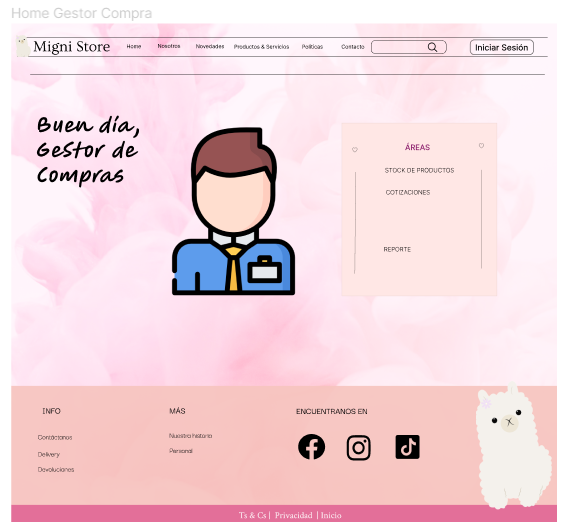
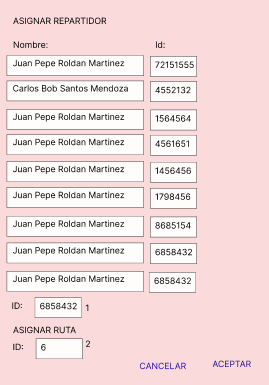
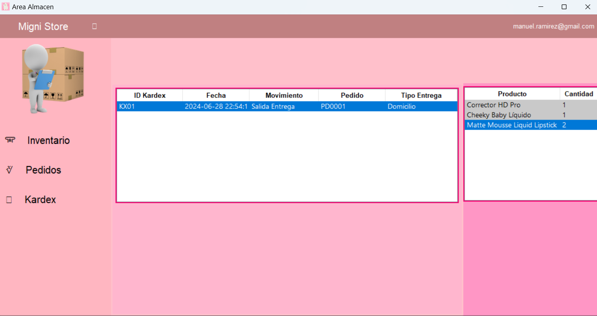

# Capítulo 12: Funcionalidad primaria

## Módulo de marketing

La funcionalidad primaria que se verá en el aplicativo es la linea de vida de la campaña, este se verá a través de 2 actores principales, el equipo de marketing y el gestor de marketing, por lo cual se tendrán 2 aplicativos para mostrar las campañas respectivas. 
En el aplicativo del gestor de marketing este ingresará directamente al ser el único gestor de marketing de la empresa, dentro de su aplicacion tendra 2 funcionalidades, la de "Mostrar campañas propuestas" y "Mostrar campañas vigentes"; en la primera de estas el gestor podrá ver las campañas que han sido propuestas por el equipo de marketing correspondiente, se hara un select de todas aquellas campañas que tengan el dia de hoy entre la fecha de inicio y la fecha final de la campaña, cuando seleccione una tendra la opcion de editar y borrar, editar mostrará los datos de la campaña para realizar un update posterior y borrar hara un delete. La funcionalidad de mostrar campañas propuestas, se hara un select de las campañas que tengan fecha de inicio mayor al dia actual, y el gestor tendra la opcion de observar la campaña, enviandole una descripcion de lo que esta mal al equipo de marketing correspondiente.

En el aplicativo de equipo de marketing se tendra un login para verificar el id del equipo de marketing ingresante, cuando se logea se tendra la opcion de generar propuesta y atender observaciones; la primera mostrara espacios de texto para ingresar los datos correspondientes a una campaña y se podrá generar tanto en la tabla campaña como en sus tablas con llaves foraneas campañaxprod y campañaxcanal, la funcionalidad de atender observaciones hara un select de todas aquellas observaciones realizadas a campañas que le pertenezcan al equipo de marketing y que esten en estado false, cuando se selecciona una observacion y se da en atender se mostrarán los datos correspondientes a la campaña asociada, luego de los cambios se presiona en actualizar y se hara un update en las tablas asociadas y la observacion pasara a ser estado atendido.

## Módulo de Compras

**Funcionalidad primaria elegida:** Gestionar todas las cotizaciones hechas por los proveedores 
**Sustentación:** La gestión de cotizaciones en una empresa de venta de productos es una funcionalidad importante debido a que se requiere un análisis de la viabilidad de la cantidad de productos entregados y los precios de cada uno. 

Esta funcionalidad permitirá cumplir con los requerimientos de las pantallas relacionadas a Cotizaciones Historial cotizaciones (R008), Detalle Cotizaciones (R009), Aceptar/Rechazar cotización del proveedor (R010) los cuales se encuentran relacionados con las interfaces I-008, I-009, I-0010.

| Actividad     | Descripción        | 
|:-------------:|:---------------:|
| 1       | Al ingresar en la opción de cotizaciones en el sistema (desde un correo autotizado), se podrá verificar el historial de cotizaciones que tenemos, dentro de este podemos ver en primer lugar los que están en estado pendiente, entonces el gestor de compras le dará en el botón de ver más, para poder ver el detalle de la cotización.   | 
| 2    | En el caso que le dé en ver más en una cotización que ya tiene un estado de aceptado o no aceptado, no aparecerán los botones (botones deshabilitados), de aceptar o rechazar oferta    | 
| 3 | En el caso que le dé en ver más en una cotización que tiene un estado de pendiente, tendrá habilitado la opcion de seleccionar y aceptar o rechazar la oferta.   

## MÓDULO : Distribucion
**Funcionalidad primaria elegida:** Flujo de entrega de pedido  
**Sustentación:** Para la empresa, el área de distribucion  es indispensable puesto que es una necesidad hacer llegar los productos a los cliente, es por ello que estara area se encargara de la gestion de distribucion desde la creacion del pedido hasta la entrega. 

Esta funcionalidad permitirá cumplir con los requerimientos Establecer fecha de entrega (R021), asignar repartidor y ruta (R023), visualizar el historial de pedidos (R024 y R027) y confirmar la entrega (RO26), estas tienen como interfaces a I021, I023, I024,I027 e I026 respectivamente.

| Actividad     | Descripción        | 
|:-------------:|:---------------:|
| 1       | El cliente ingresa a la página principal con una cuenta autorizada y se dirige al apartado de "ver mis pedidos".  | 
| 2    | Ya en la pantalla de "ver mis pedidos", el cliente escoge uno de los pedidos que le faltan entregar y selecciona la fecha de entrega.    | 
| 3 | Una vez seleccionada la fecha de entrega,esto creara el pedido y aparecera en el apartado de gestionar pedidos del gestor de distribucion.   |
| 4    |El gestor de distribucion accede al apartado de gestionar pedidos y escoge uno de los pedidos para asignarle un repartidor y una ruta    | 
| 5    | Cuando es seleccionado el repartidor este pedido aparecera en el apartado de "gestionar pedidos" del repartidor.    | 
| 6    | El repartidor acepta el pedido cuando este realizar la entrega puede confirmarlo,y asi actualizar el estado del pedido a ENTREGADO    |

## Módulo de Almacén

**Funcionalidad primaria elegida:** Gestionar el inventario de todos los productos 
**Sustentación:** Saber el stock disponible, la ubicación de cada producto, y el movimiento que se efectúa periodicamente para saber la disponibilidad de los productos para ofertarlos o realizar neuvas compras 

| Actividad     | Descripción        | 
|:-------------:|:---------------:|
| 1       | Al ingresar a la sección inventario se podrá visualizar la lista de todos los productos y poder filtrar según la necesidad que se busca  | 
| 2    | Para saber lso movimientos efectuados y los detalles de los productos con su cantidad, se podrá visualizar en la sección Kardex  |

## Módulo de Ventas
**Funcionalidad primaria elegida:** Gestionar el flujo de compra de prodcutos por parte de cliente 
**Sustentación:** Como se trata de una página web que permite ventas online, es muy importante manejar y controlar el flujo de ventas que al dia recibe la empresa por parte de numerosos clientes. 
Esta funcionalidad permitirá cumplir con los requerimientos de las pantallas relacionadas a Ver Cátalogo de productos, Realizar una compra , Elegir método de pago.

| Actividad     | Descripción        | 
|:-------------:|:---------------:|
| 1       | Al ingresar a la web el cliente podra ver todo el arsenal de productos con los que cuenta la empresa para que pueda encontrar el que desee comprar. | 
| 2    | Luego de escojer sus productos, el cliente pasa a la seccion del carrito de compras donde puede configurar ciertos aspectos de los porductos que esta comprando. Se le detalla los precios que va a tener que pagar y  tambien se le informa que prosiga con el proceso de pago con un método de pago permitido.   | 
| 3 | Se procede a elegir un método de pago y luego rellenar los datos correpsondientes a dicho pago.entonces ya podria procesarse y registrarse la compra en los historiales de venta de la empresa.   ! |

