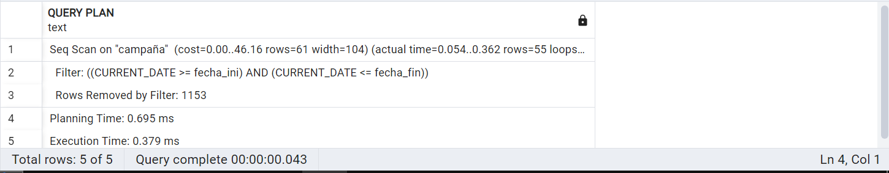
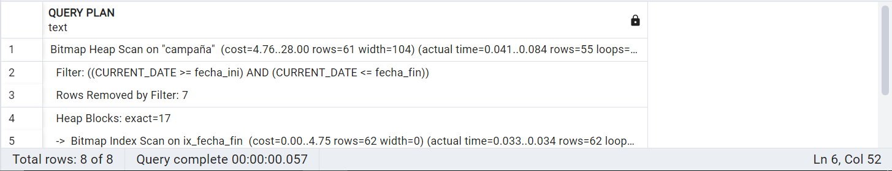

# Capítulo 13: Indices y otros objetos

## Módulo marketing

### Índice fecha_fin
```sql
DROP INDEX IX_fecha_fin;
CREATE INDEX IX_fecha_fin ON campaña(fecha_fin);

EXPLAIN ANALYZE
SELECT * FROM campaña
WHERE CURRENT_DATE BETWEEN fecha_ini AND fecha_fin;
```
Proceso Sin Índice:


Proceso Con Índice:


## Módulo Compras

### Índice RUC
```sql
DROP INDEX IX_RUC;
CREATE INDEX IX_RUC ON cotizacion(ruc_proveedor);

EXPLAIN ANALYZE
SELECT * FROM cotizacion
WHERE ruc_proveedor = '20780385968';
```
Proceso Sin Índice:


Proceso Con Índice:


## Módulo Almacen

### Indice Producto Marca

```sql
CREATE INDEX idx_marca ON Producto(id_marca);
```
Análisis
```sql
EXPLAIN ANALYZE
SELECT P.id_producto, P.nombre_producto, P.especificaciones
FROM Producto P
JOIN Marca M ON P.id_marca = M.id_marca
WHERE M.id_marca = 'Beauty Creations';
```
Proceso Sin Índice:


Proceso Con Índice:


### Indice Inventario Producto

```sql
CREATE INDEX idx_inv_prod ON Inventario(id_producto);
```
Análisis
```sql
EXPLAIN ANALYZE
SELECT I.id_producto, P.nombre_producto, I.entradas, I.salidas,
       (I.entradas - I.salidas) AS stock,
       U.seccion, U.id_stand, U.id_repisas
FROM Inventario I
JOIN Producto P ON I.id_producto = P.id_producto
JOIN Ubicacion U ON I.seccion = U.seccion
                AND I.id_stand = U.id_stand
                AND I.id_repisas = U.id_repisas
WHERE (I.entradas - I.salidas) > 10;
```
Proceso Sin Índice:


Proceso Con Índice:


