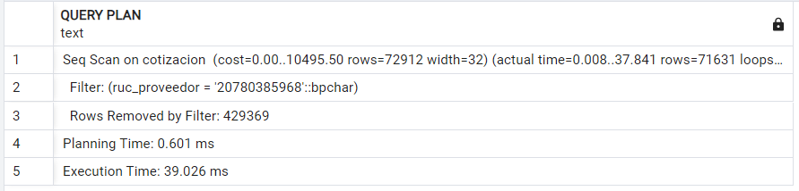

# Capítulo 13: Indices y otros objetos

## Módulo marketing

### Índice fecha_fin
```sql
DROP INDEX IX_fecha_fin;
CREATE INDEX IX_fecha_fin ON campaña(fecha_fin);

EXPLAIN ANALYZE
SELECT * FROM campaña
WHERE CURRENT_DATE BETWEEN fecha_ini AND fecha_fin;
```
Proceso Sin Índice:


Proceso Con Índice:


## Módulo Compras

### Índice RUC
```sql
DROP INDEX IX_RUC;
CREATE INDEX IX_RUC ON cotizacion(ruc_proveedor);

EXPLAIN ANALYZE
SELECT * FROM cotizacion
WHERE ruc_proveedor = '20780385968';
```
Proceso Sin Índice:


Proceso Con Índice:


