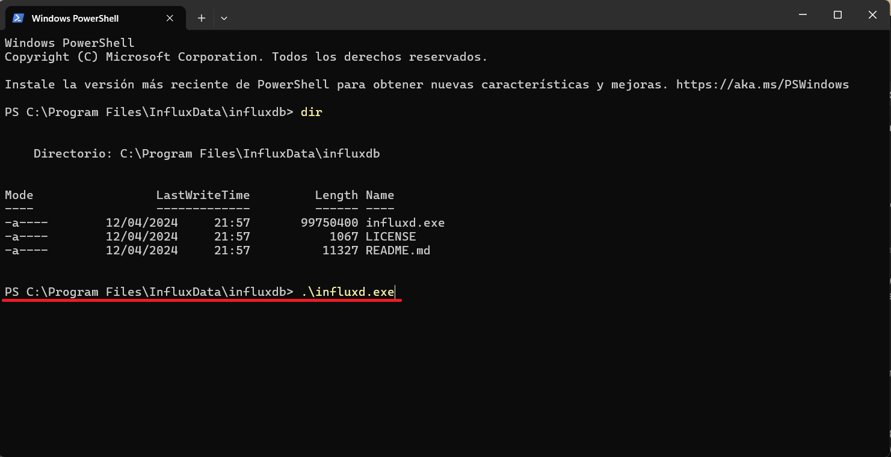
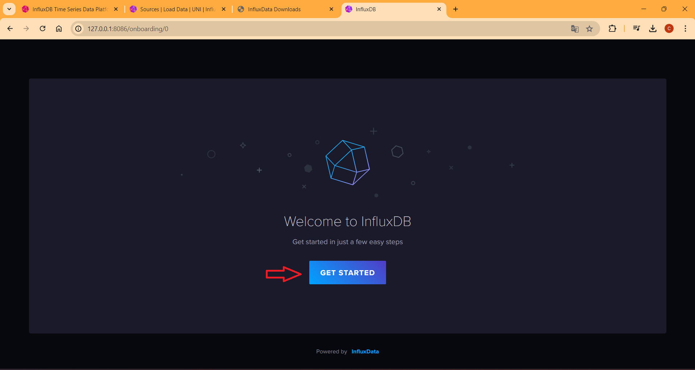
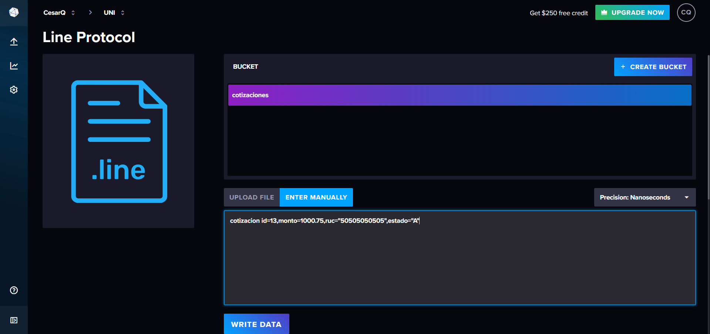

# Capítulo 18: Aplicación de una base de datos NoSQL
## Desarrollo conceptual
### ¿Que es una base de datos NoSQL?
- Una base de datos NoSQL es un tipo de sistema de gestión de bases de datos que no utiliza el modelo relacional tradicional basado en tablas. En lugar de eso, almacena datos de manera más flexible, como en documentos JSON, pares clave-valor, gráficos o columnas, lo que permite un escalado horizontal más fácil y una mejor gestión de grandes volúmenes de datos no estructurados o semi-estructurados.

### ¿Qué es InfluxDB?
- InfluxDB es una base de datos de series temporales (TSDB) diseñada para manejar grandes volúmenes de datos con marcas de tiempo, como registros de eventos, métricas y datos de monitoreo en tiempo real. Es especialmente útil para aplicaciones que requieren almacenamiento y análisis de datos en tiempo real, como la monitorización de infraestructura, el análisis de datos de sensores IoT y el seguimiento de datos de rendimiento de aplicaciones. InfluxDB es parte de la plataforma TICK stack de InfluxData, que incluye herramientas para la recolección, almacenamiento, visualización y procesamiento de datos de series temporales.

## Descripción del escenario de uso
### Escenario de uso
- Se creará la tabla de cotizacion, gracias a que InfluxDB nos permite tener una marca de tiempo en el momento en que se realiza una insercion de datos, sera mucho mas facil trabajar con los tiempo pues automaticamente se asignara una marca de tiempo.

## Configuración
### Instalación de InfluxDB
1. En el buscador de google, buscamos influxdb y en la pagina principal, seleccionamos InfluxData Downloads

2. Ya dentro de la página: https://www.influxdata.com/downloads/ | copiamos el comando marcado abajo

3. Ahora ejecutamos Windows PowerSheell como administrador

4. Ejecutamos el comando que antes copiamos

5. Ejecutamos WindowsPowerShell en la carpeta donde se instalo y usamos el comando ".\influxdb.exe"

6. Nos sale este texto, que indica el puerto que tenemos habilitado para ejecutar influxdb

7. En nuestro navegador ponemos "http://127.0.0.1:8086/signin" y le damos a Get Started

8. Nos registramos y le damos a Continue

9. En este pantalla podemos configurar más a detalle, por el momento le daremos a Configure Later

10. Y listo tendriamos influxdb operativo para trabajar

## Implementación
### Trabajar con InfluxDB

