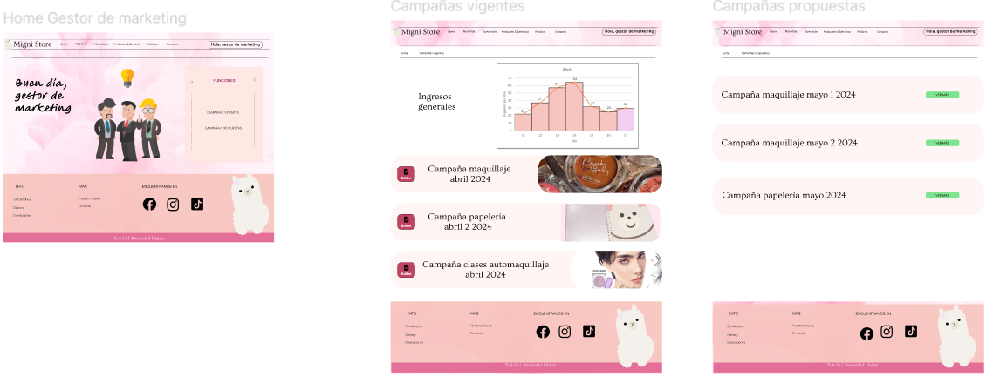
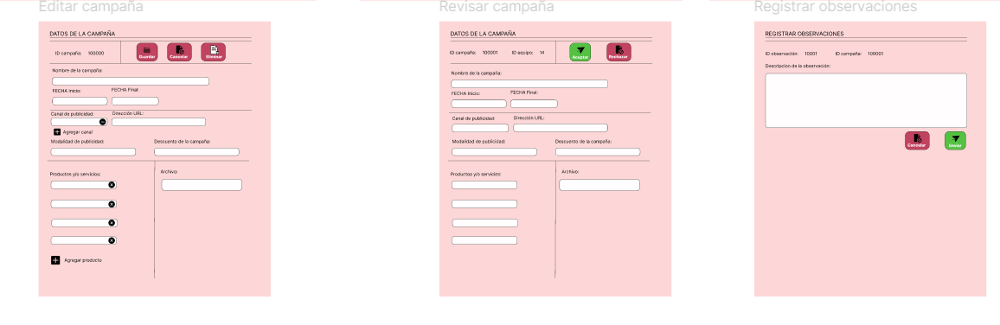
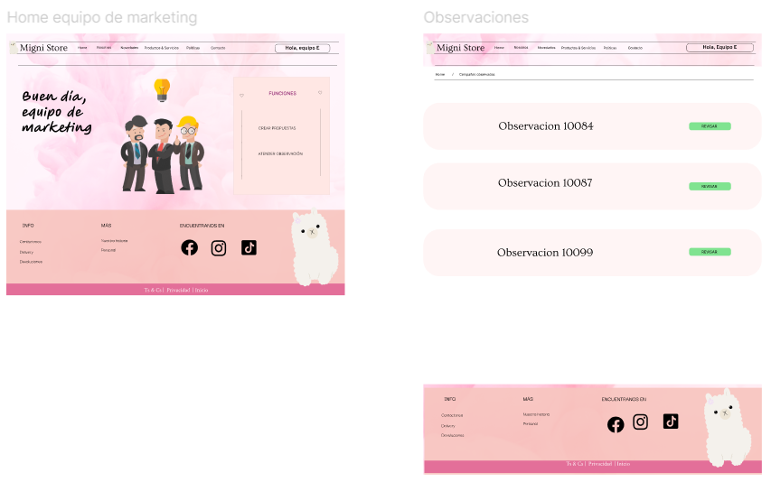
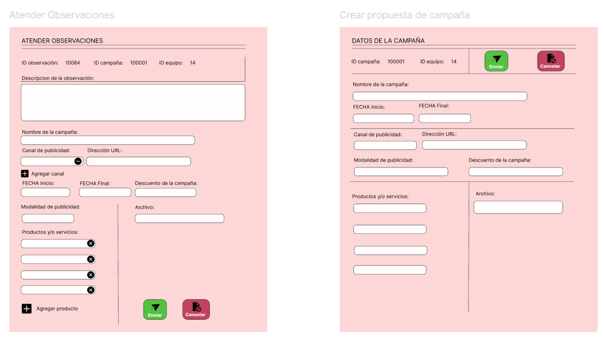
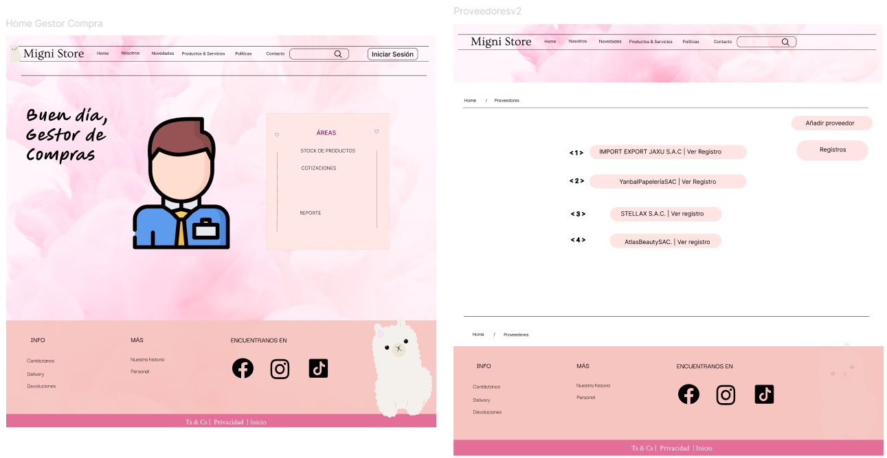
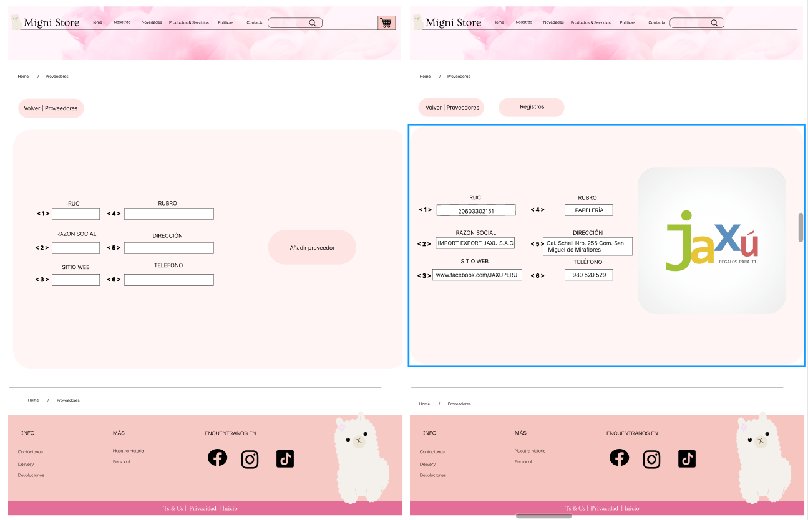
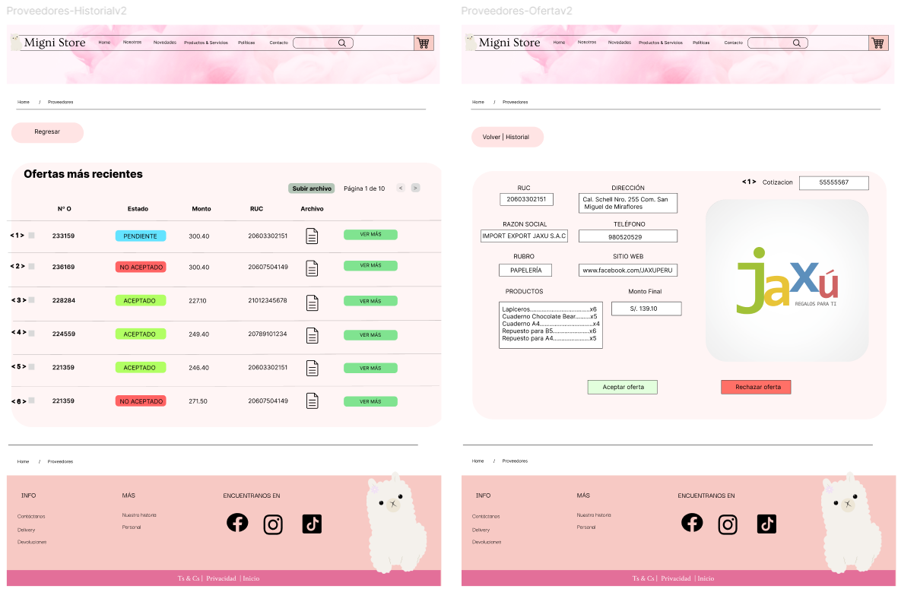

# Capítulo 04: Prototipo
Para ver el esquema completo, puede ingresar al figma del equipo: (https://www.figma.com/design/JaEtbwPTFhxpp8rVLio8Lc/Proyecto-Migni-Store?node-id=593-1980)

## Módulo Marketing:

## Módulo Compras:

