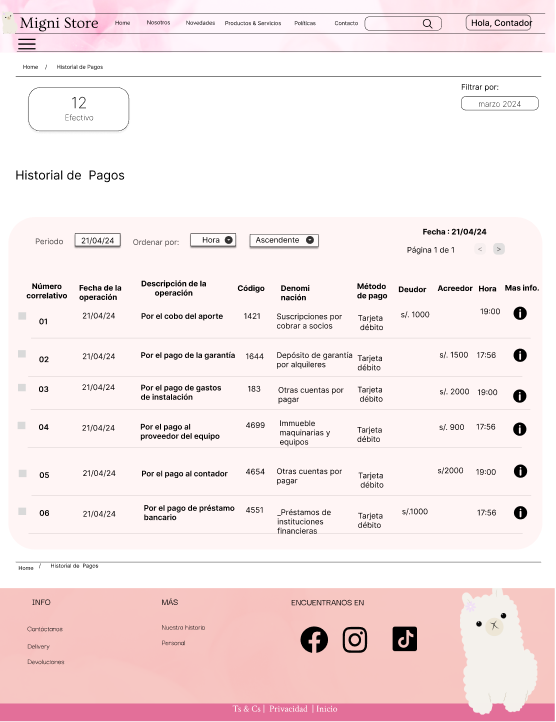
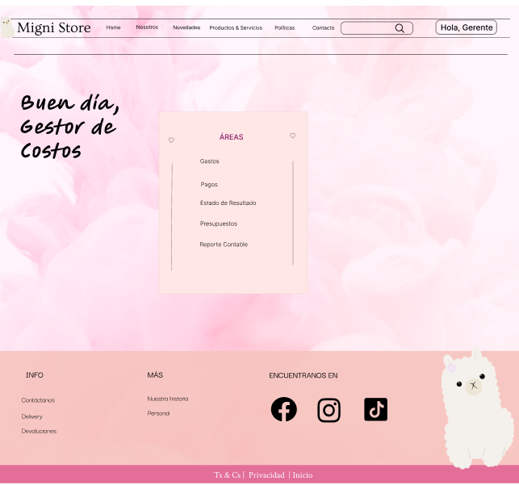

# Capítulo 04: Prototipo
Para ver el esquema completo, puede ingresar al figma del equipo: (https://www.figma.com/design/JaEtbwPTFhxpp8rVLio8Lc/Proyecto-Migni-Store?node-id=593-1980)

## Módulo Marketing:

## Módulo Compras:

## Módulo Distribucion:

## Módulo Ventas:

## Módulo Finanzas:
### Homes de los roles
#### Los roles para el módulo son Gerente General, Contador General y Gestor de Costos
###### Home Contador General: Se encargará de ver los estados de la Factura en el Resumen, el Reporte General, el Historial de pagos, gastos, compras, ventas, los asientos contables y el estado de resultados. Además de agregar Facturas según sea el tipo y subirlas.

##### Resumen de las facturas (estados)

##### Info de una factura

##### Facturas
###### Se podrá editar, registrar, eliminar facturas dentro del sistema.
###### Subir Factura:

###### Registrar Factura de venta:

###### Registrar Factura de compra:

###### Registrar Factura de pagos:

###### Registrar Factura de gastos:

###### - Además se puede visualizar el historial de las transacciones en la empresa:
###### Historial de ventas:

###### Historial de compras:

###### Historial de pagos:

###### Historial de gastos:

##### Asientos Contables

##### Estado de Resultados

##### Reporte Contable

###### Home Gerente General: Se encargará de ver el estado de resultados que le permitirá ver la rentabilidad d ela empresa así como dar soluciones estratégicas por lo que podrá visualizar el historial de compras, ventas, gastos, pagos, proveedores reporte que le dará una mirada esencial a la empresa.

##### Reporte Contable (Esencial para decisiones)

##### Proveedores: Esta vista será importante para el gerente general para entablar relaciones fuertes con sus proveedores.

###### Home Gestor de Costos: Se encargará de controlar los presupuestos para cada área y asignarlos por lo que también debe estar pendiente de los pagos, gastos así como el reporte.

##### Presupuestos: Se podrá editar los presupuestos generados así como enviarlos ya se al área y al gerente General.

## Módulo CRM:

