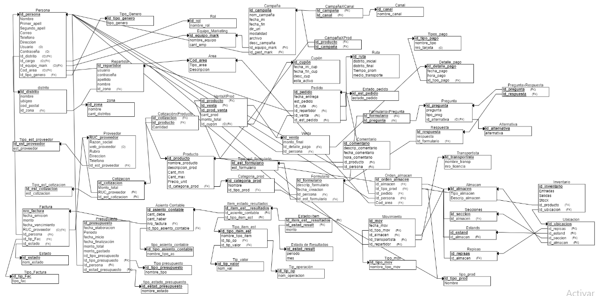

# Capítulo 06: Modelamiento Lógico

## 2.2 Diccionario de Datos

Entidad: Proveedor

Descripción: Empresa o persona que proporciona productos a la empresa
| Atributo | Descripción | Formato | Naturaleza | Valores |
|:----------:|:--------------------------------:|:---------------:|:------------------:|:--------:|
| RUC_proveedor | RUC del proveedor que lo identifica en la empresa | 99999999999 | CHAR(11) | NOT NULL |
| razon_social | Nombre con el que se constituye una empresa | A(100) | VARCHAR(100) | NOT NULL |
| web_proveedor | Sitio web del proveedor  | A(100) | VARCHAR(100) | - |
| rubro | Actividad económica que realiza una empresa | A(100) | VARCHAR(100) | NOT NULL |
| direccion | Ubicacion geográfica donde esta ubicado el proveedor | A(100) | VARCHAR(100) | NOT NULL |
| telefono | Numero de contacto con el proveedor | A(15) | VARCHAR(15) | NOT NULL |
| id_est_proveedor | Identificador único del estado del proveedor | A(10) | VARCHAR(10) | NOT NULL |

Entidad: Tipo_est_proveedor

Descripción: Estado del proveedor en la empresa.
| Atributo | Descripción | Formato | Naturaleza | Valores |
|:----------:|:--------------------------------:|:---------------:|:------------------:|:--------:|
| id_est_proveedor | Identificador único del estado del proveedor | A(10) | VARCHAR(10) | NOT NULL |
| est_proveedor | Estado del proveedor | A(100) | VARCHAR(100) | NOT NULL |

Entidad: Cotización

Descripción: Cotización realizada por el proveedor.
| Atributo | Descripción | Formato | Naturaleza | Valores |
|:----------:|:--------------------------------:|:---------------:|:------------------:|:--------:|
| id_cotizacion |  Identificador único de la cotización | 999999 | Int | >0 |
| monto_total | Cantidad total del dinero que vale la cotizacion | 9999999,99 | NUMERIC(7,2) | NOT NULL |
| RUC_proveedor | RUC del proveedor que lo identifica en la empresa | 99999999999 | CHAR(11) | NOT NULL |
| id_est_cotizacion | Identificador único del estado de la cotizacion | A | CHAR(1) | NOT NULL |

Entidad: Tipo_est_cotizacion

Descripción: Estado de la cotizacion presentada por el proveedor.
| Atributo | Descripción | Formato | Naturaleza | Valores |
|:----------:|:--------------------------------:|:---------------:|:------------------:|:--------:|
| id_est_cotizacion | Identificador único del estado de la cotizacion | A | CHAR(1) | NOT NULL |
| est_cotizacion | Estado de la cotizacion | A(100)| VARCHAR(100) | NOT NULL |

Entidad: Producto

Descripción: Son los bienes que la empresa tiene en venta
| Atributo | Descripción | Formato | Naturaleza | Valores |
|:----------:|:--------------------------------:|:---------------:|:------------------:|:--------:|
| id_producto | Identificador único del producto | 99999 | Int | >0 |
| nombre_producto | Nombre del producto | A(100) | VARCHAR(100) | NOT NULL |
| descripcion_prod | Descripcion de especificaciones del producto | A(100) | VARCHAR(100) | NOT NULL |
| cant_min | Cantidad minima que puede haber de un producto | 99 | Int | >0 |
| cant_max | Cantidad maxima que puede haber de un producto | 999 | Int | >0 |
| precio_unit | Precio unitario que la empresa asigno a un producto | 999 | Int | >0 |
| id_categoria_prod | Identificador unico de la categoria de un producto | 999 | Int | >0 |

Entidad: Categoria_prod

Descripción: Categoria al que pertenece un producto
| Atributo | Descripción | Formato | Naturaleza | Valores |
|:----------:|:--------------------------------:|:---------------:|:------------------:|:--------:|
| id_categoria_prod | Identificador unico de la categoria de un producto | 999 | Int | >0 |
| nombre | Nombre de la categoria del producto | A(100)| VARCHAR(100) | NOT NULL |
| id_tipo_prod | Identificador unico del tipo de producto | 999 | Int | >0 |

Entidad: tipo_prod

Descripción: Tipo de producto al que eertenece un producto
| Atributo | Descripción | Formato | Naturaleza | Valores |
|:----------:|:--------------------------------:|:---------------:|:------------------:|:--------:|
| id_tipo_prod | Identificador unico del tipo de producto | 999 | Int | >0 |
| nombre | Nombre del tipo de producto | A(100)| VARCHAR(100) | NOT NULL |

Entidad: ProveedorXProducto

Descripción: Relacion entre el proveedor y los productos que ofrece en una cotizacion
| Atributo | Descripción | Formato | Naturaleza | Valores |
|:----------:|:--------------------------------:|:---------------:|:------------------:|:--------:|
| id_producto | Identificador único del producto | 99999 | Int | >0 |
| RUC_proveedor | RUC del proveedor que lo identifica en la empresa | 99999999999 | CHAR(11) | NOT NULL |
| precio_prod_prov | Precio unitario que el proveedor asigno a un producto| 999 | Int | >0 |

Entidad: CotizacionXProducto

Descripción: Relacion entre la cotizacion y los productos que nos determina la cantidad de cada producto
| Atributo | Descripción | Formato | Naturaleza | Valores |
|:----------:|:--------------------------------:|:---------------:|:------------------:|:--------:|
| id_cotizacion |  Identificador único de la cotización | 999999 | Int | >0 |
| id_producto | Identificador único del producto | 99999 | Int | >0 |
| cantidad | Cantidad de un producto ofrecido en una cotizacion | 999 | Int | >0 |

Entidad: Distrito

Descripcion: Lugar donde reside la persona

|Atributo|Descripcion|Formato|Naturaleza|Valores|
|---------|-------|-------|----|-----------|
|Id_distrito|Codigo identificador del distrito|99|INT|NOT NULL|
|nombre|Nombre del distrito|A(100)|VARCHAR(100)|NOT NULL|
|ubigeo|Siglas oficiales para el codigo de ubicacion geografica del distrito|AAAAAA|VARCHAR(100)|NOT NULL|
|cod_postal|Codigo numérico que complementa la dirección física y representa una zona geográfica del país. |AA|VARCHAR(100)|NOT NULL|
|id_zona|Codigo identificador de la zona|99|INT|NOT NULL|

Entidad: Repartidor

Descripcion : Persona que realiza la entrega de los pedidos

|Atributo|Descripcion|Formato|Naturaleza|Valores|
|---------|-------|-------|----|-----------|
|Id_repartidor|Codigo identificador del repartidor|9999999|INT|NOT NULL|
|usuario|nombre del usuario de la cuenta del repartidor|A(100)|VARCHAR(100)|NOT NULL|
|contraseña|contraseña de la cuenta del repartidor|A(100)|VARCHAR(100)|NOT NULL|
|Apellido|Apellidos del repartidor|A(100)|VARCHAR(100)|NOT NULL|
|id_zona|zona asignada al repartidor|99|INT|NOT NULL|

Entidad: Zona

Descripcion: Area de agrupamiento para los distritos

|Atributo|Descripcion|Formato|Naturaleza|Valores|
|---------|-------|-------|----|-----------|
|id_zona|Codigo identificador de la zona|99|INT|NOT NULL|
|nombre|Nombre de la zona|A(100)|VARCHAR(100)|NOT NULL|
|cant_distritos|Cantidad de distritos en la zona|99|INT|NOT NULL|

Entidad: Ruta

Descripcion: Metodo de traslado recomendable para la entrega

|Atributo|Descripcion|Formato|Naturaleza|Valores|
|---------|-------|-------|----|-----------|
|id_ruta|Codigo identificador de la ruta|99|INT|NOT NULL|
|distrito_inicial|Distrito inicial de la ruta |A(100)|VARCHAR(100)|NOT NULL|
|distrito_final|Distrito final de la ruta|A(100)|VARCHAR(100)|NOT NULL|
|Tiempo_prom|Tiempo estimado que demora trasladar del primer distrito al otro|AA:AA:AA|TIME|NOT NULL
|medio_transporte|Medio de transporte |Medio de tranporte recomendo para trasladarse|A(100)|VARCHAR(100)|NOT NULL|

Entidad: Pedido 

Descripcion: Registro de las entregas que se realizan 

|Atributo|Descripcion|Formato|Naturaleza|Valores|
|---------|-------|-------|----|-----------|
|Id_pedido|Codigo identificador del pedido|9999|INT|NOT NULL|
|fecha_entrega|Fecha que se va a realizar la entrega|DD/MM/AA|DATE|Valido en calendario|
|id_est_pedido|Estado en que se encuentra el pedido|99|INT|NOT NULL|
|Id_ruta|Codigo de la ruta recomendada asignada a la entrega|99|INT|NOT NULL|
|Id_repartidor|Codigo del repartidor encargado de realizar la entrega |9999999|INT|NOT NULL|
|Id_vemta|Codigo de la venta realizada que se va a entregar|9999|INT|NOT NULL|
|Id_persona|Codigo de la persona/cliente que realizó compra|9999999|INT|NOT NULL|

Entidad : Tipo_est_pedido

|Atributo|Descripcion|Naturaleza|
|--|--|--|
|id_est_pedido|Codigo identificador del pedido|INT|
|estado_pedido|Estado en que se encuentra el pedido|VARCHAR(100)|

Entidad: Equipo marketing

Descripción: Conjunto de empleados pertenecientes al área de marketing encargados de crear las campañas.
| Atributo | Descripción | Formato | Naturaleza | Valores |
|:----------:|:--------------------------------:|:---------------:|:------------------:|:--------:|
| Id_equipo_mark | Identificador único del equipo de marketing | 99 | INT | NOT NULL |
| nombre_equipo | Nombre perteneciente al equipo de marketing | A(100) | VARCHAR(100) | NOT NULL |
| cant_emp | Cantidad de empleados del equipo de marketing  | 9 | INT | >0 |

Entidad: Cupón

Descripción: Billete que puede ser intercambiado por el descuento de un producto.
| Atributo | Descripción | Formato | Naturaleza | Valores |
|:----------:|:--------------------------------:|:---------------:|:------------------:|:--------:|
| Id_cupón | Identificador único del cupón | 9999 | INT | NOT NULL |
| fecha_ini_cup | Fecha a partir de la cual es válido el cupón | AAAA/MM/DD | DATE | NOT NULL |
| fecha_fin_cup | Fecha hasta la cual es válido el cupón  | AAAA/MM/DD | DATE | NOT NULL |
| desc_cup | Descuento porcentual en forma decimal que aplica el cupón a un producto | 9.99 | FLOAT | >0 |
| esta_activo | Respuesta a, ¿el estado del cupón es válido? | A(5) | BOOLEAN | NOT NULL |

Entidad: Campaña

Descripción: Proyecto de comunicación de los productos y sus promociones en la tienda.
| Atributo | Descripción | Formato | Naturaleza | Valores |
|:----------:|:--------------------------------:|:---------------:|:------------------:|:--------:|
| Id_campaña | Identificador único de la campaña | 999999 | INT | NOT NULL |
| nom_campaña | mo,bre de la campaña | A(100) | VARCHAR | NOT NULL |
| fecha_ini | Fecha a partir de la cual es válida la campaña | AAAA/MM/DD | DATE | NOT NULL |
| fecha_fin | Fecha hasta la cual es válida la campaña  | AAAA/MM/DD | DATE | NOT NULL |
| dir_url | Dirección URL a la que se redirige al usuario al precionar en la publicidad | A(100) | VARCHAR(100) | NOT NULL |
| modalidad | Modalidad de publicidad en la red social o página web | A(100) | VARCHAR(100) | NOT NULL |
| archivo | Dirección URL que contiene el archivo jpg o mp4 de la publicidad | A(100) | VARCHAR(100) | NOT NULL |
| desc_campaña | Descuento porcentual en forma decimal que realiza la campaña a los productos que contiene | 9.99 | FLOAT | >0 |
| Id_equipo_mark | Identificador único del equipo de marketing que creó la campaña | 99 | INT | NOT NULL |
| Id_gest_mark | Identificador único del gestor de marketing que gestionó la campaña | 9999999 | INT | NOT NULL |

Entidad: CampañaXProd

Descripción: Es la campaña relacionada con el producto que promociona.
| Atributo | Descripción | Formato | Naturaleza | Valores |
|:----------:|:--------------------------------:|:---------------:|:------------------:|:--------:|
| id_producto | identificador único del producto | 99999 | INT | NOT NULL |
| Id_campaña | Identificador único de la campaña | 999999 | INT | NOT NULL |

Entidad: Canal

Descripción: Canal por el cual se transmite la publicidad a los posibles compradores.
| Atributo | Descripción | Formato | Naturaleza | Valores |
|:----------:|:--------------------------------:|:---------------:|:------------------:|:--------:|
| Id_canal | Identificador único del canal | 999 | INT | NOT NULL |
| nombre_canal | Nombre perteneciente al canal | A(100) | VARCHAR(100) | NOT NULL |

Entidad: CampañaXCanal

Descripción: Relación entre el canal y las campañas transmitidas en este.
| Atributo | Descripción | Formato | Naturaleza | Valores |
|:----------:|:--------------------------------:|:---------------:|:------------------:|:--------:|
| Id_campaña | Identificador único de la campaña | 999999 | INT | NOT NULL |
| Id_canal | Identificador único del canal | 999 | INT | NOT NULL |

Entidad: Tipo de Pago

Descripción: Métodos de pago aceptados en el sistema de ventas

| Atributo    | Descripción                                 | Formato     | Naturaleza | Valores    |
|-------------|---------------------------------------------|-------------|------------|------------|
| id_tipo_pago| Código identificador del tipo de pago       | 99          | INT        | NOT NULL   |
| nombre_tipo | Nombre del tipo de pago                     | A(100)      | VARCHAR(100) | NOT NULL |
| nro_tarjeta | Número de tarjeta asociado al tipo de pago | A(50)       | VARCHAR(50)  |     >0   |

Entidad: Detalle de Pago

Descripción: Registro detallado de los pagos realizados en el sistema de ventas

| Atributo       | Descripción                            | Formato     | Naturaleza | Valores    |
|----------------|----------------------------------------|-------------|------------|------------|
| id_detalle_pago| Código identificador del detalle de pago | 9999      | INT        | NOT NULL   |
| fecha_pago     | Fecha en la que se realizó el pago     | DD/MM/AAAA  | DATE       | NOT NULL   |
| hora_pago      | Hora en la que se realizó el pago      | HH:MM       | VARCHAR(10)| NOT NULL   |
| id_tipo_pago   | ID del tipo de pago utilizado          | 99          | INT        | NOT NULL   |

Entidad: Venta

Descripción: Registro de las transacciones comerciales realizadas por los clientes.

| Atributo       | Descripción                                   | Formato     | Naturaleza | Valores    |
|----------------|-----------------------------------------------|-------------|------------|------------|
| id_venta       | Código identificador de la venta              | 9999        | INT        | NOT NULL   |
| Id_persona     | Identificador único del cliente               | 99999999    | INT | NOT NULL   |
| monto_final    | Monto total de la venta                       | 99.99       | FLOAT      | NOT NULL   |
| id_detalle_pago| ID del detalle de pago asociado a la venta    | 9999        | INT        | NOT NULL   |

Entidad: VentaXProd

Descripción: Registro de los productos vendidos en cada transacción.

| Atributo       | Descripción                                            | Formato   | Naturaleza | Valores  |
|----------------|--------------------------------------------------------|-----------|------------|----------|
| id_venta_prod  | Código identificador de la venta del producto          | 999999    | INT        | NOT NULL |
| id_venta       | Identificador único de la venta asociada               | 9999      | INT        | NOT NULL |
| id_producto    | Identificador único del producto vendido               | 9999      | INT        | NOT NULL |
| cant_prod      | Cantidad del producto vendido                          | 9999      | INT        | NOT NULL |
| monto_prod     | Monto total del producto vendido                       | 99.99     | FLOAT      | NOT NULL |
| Id_cupón       | Identificador del cupón usado en la venta del producto | 9999      | INT        |    >0    |

Entidad: Alternativa

Descripcion: Entidad el cual almacena en forma de catalogo las alternativas de la pregunta, son opcionales y depende del tipo de pregunta.

|Atributo|Descripcion|Formato|Naturaleza|Valores|
|---------|-------|-------|----|-----------|
|id_alternativa|Codigo identificador de la alternativa|999|INT|NOT NULL|
|alternativa|son las alternativas en forma de array| [A,B,C,..] |VARCHAR[] |NOT NULL|

Entidad Pregunta

Descripción: Entidad la cual almacena las preguntas que se van a usar en un formulario , este llama o toma en cuenta la alterntiva aunque no necesariamente.

|Atributo|Descripcion|Formato|Naturaleza|Valores|
|---------|-------|-------|----|-----------|
|Id_pregunta|Codigo identificador de la Pregunta|99999|INT|NOT NULL|
|Pregunta|Es la pregunta pero explicada , que es visible para el encuestado| A(200) |VARCHAR(200) |NOT NULL|
|tipo_preg|Es el tipo de pregunta , dependiendo de este se llamara o no a la alternativa| A(100) |VARCHAR(100) |NOT NULL|
|Id_alternativa|Codigo identificador de la alternativa|999|INT|NOT NULL|

Entidad Respuesta

Descripción: Entidad la cual almacena las respuestas a las preguntas del formulario.

|Atributo|Descripcion|Formato|Naturaleza|Valores|
|---------|-------|-------|----|-----------|
|Id_respuesta|Codigo identificador de la Respuesta |99999|INT|NOT NULL|
|Respuesta|Es la respuesta descrita como envio el encuestado| A(500) |VARCHAR(500) |NOT NULL|
|Id_formulario|Codigo identificador del formulario |99999|INT|NOT NULL|

Entidad PreguntaxRespuesta

Descripción: Entidad que almacena la relacion de respuestas por cada pregunta.

|Atributo|Descripcion|Formato|Naturaleza|Valores|
|---------|-------|-------|----|-----------|
|Id_pregunta|Codigo identificador de la Pregunta|99999|INT|NOT NULL|
|Id_respuesta|Codigo identificador de la Respuesta |99999|INT|NOT NULL|

Entidad FormularioxPregunta

Descripción: Entidad la cual almacena la relacion de preguntas que pertenecen a un formulario.

|Atributo|Descripcion|Formato|Naturaleza|Valores|
|---------|-------|-------|----|-----------|
|Id_pregunta|Codigo identificador de la Pregunta|99999|INT|NOT NULL|
|Id_formulario|Codigo identificador del formulario|99999|INT|NOT NULL|

Entidad Formulario

Descripción: Entidad la cual almacena los formularios asi como sus caracteristicas claves.

|Atributo|Descripcion|Formato|Naturaleza|Valores|
|---------|-------|-------|----|-----------|
|Id_formulario|Codigo identificador del formulario|99999|INT|NOT NULL|
|descrip_formulario|Es la explicación de que trata el formulario creado| A(500) |VARCHAR(500) |NOT NULL|
|fecha_creacion|Fecha en la que se creo el formulario |DD/MM/AA|DATE|Valido en calendario|
|Id_est_formulario|Codigo identificador del estado en el que se encuentra el formulario |999|INT|NOT NULL|
|Id_persona|Codigo identificador de la persona|99999999|INT|NOT NULL|

Entidad Tipo_est_formulario

Descripción: Entidad la cual almacena los estados en el que se encuentra o podria encontrarse el formulario.

|Atributo|Descripcion|Formato|Naturaleza|Valores|
|---------|-------|-------|----|-----------|
|Id_est_formulario|Codigo identificador del estado en el que se encuentra el formulario |999|INT|NOT NULL|
|est_formulario|Es la descripción del estado del formulario | A(100) |VARCHAR(100) |NOT NULL|

Entidad Comentario

Descripción: Entidad la cual almacena los comentarios de los usuarios que esten registrados a la plataforma , estos comentarios estan referidos a un producto.

|Atributo|Descripcion|Formato|Naturaleza|Valores|
|---------|-------|-------|----|-----------|
|Id_comentario|Codigo identificador del Comentario |99999|INT|NOT NULL|
|descrip_comentario|Es la parte descriptiva el cual muestra lo que el usuario escribio sobre el producto| A(200) |VARCHAR(200) |NOT NULL|
|fecha_comentario|Fecha en la que se envio el comentario del usuario |DD/MM/AA|DATE|Valido en calendario|
|hora_entrega|Hora que se entrego el comentario del usuario|hh:mm|TIME|NOT NULL|
|Id_persona|Codigo identificador de la persona|99999999|INT|NOT NULL|
|Id_producto|Codigo identificador del producto|99999999|INT|NOT NULL|

# Módulo de Finanzas
## Factura
| Campo            | Tipo      | Descripción                            |
|------------------|-----------|----------------------------------------|
| nro_factura      | INT       | Número único de factura.               |
| fecha_emision    | DATE      | Fecha de emisión de la factura.       |
| fecha_vencimiento | DATE     | Fecha de vencimiento de la factura, útlimo día de pago.|
| monto            | FLOAT     | Monto de la factura.                   |
| RUC_proveedor    | CHAR(11)  | RUC del proveedor asociado a la factura. |
| Id_persona       | VARCHAR   | Identificador único de la persona asociada a la factura. |
| id_tip_Fac      | INT   | Identificador único del tipo de factura ya sea compra, venta, gastos, etc. |
| Id_estado       | INT   | Identificador único del estado de la factura según la cantidad que se ha pagado. |

## Estado
| Campo             | Tipo      | Descripción                            |
|-------------------|-----------|----------------------------------------|
| Id_estado | INT     | Identificador único del estado de la factura según la cantidad que se ha pagado. |
| nombre_estado       | VARCHAR   | Nombre del estado de la factura (pagado, No pagado, falta pagar). |

## Tipo_factura
| Campo             | Tipo      | Descripción                            |
|-------------------|-----------|----------------------------------------|
| id_tip_Fac      | INT   | Identificador único del tipo de factura ya sea compra, venta, gastos, etc. |
| tipo_fac      | VARCHAR   | Nombre del tipo de factura.       |

## Tipo_presupuesto
| Campo             | Tipo      | Descripción                            |
|-------------------|-----------|----------------------------------------|
| Id_tipo_presupuesto | INT     | Identificador único del tipo de presupuesto. |
| nombre_tipo       | VARCHAR   | Nombre del tipo de presupuesto.        |

## Presupuesto
| Campo             | Tipo      | Descripción                            |
|-------------------|-----------|----------------------------------------|
| Id_presupuesto    | INT       | Identificador único del presupuesto.   |
| fecha_elaboracion | DATE      | Fecha de elaboración del presupuesto. |
| fecha_inicio | DATE | Fecha de inicio en el que se puede usar el presupuesto. |
| fecha_finalización | DATE | Fecha de finalización en el que se debe usar en su totalidad el presupuesto. |
| Id_tipo_presupuesto | INT     | Identificador del tipo de presupuesto asociado. |
| Id_persona        | VARCHAR   | Identificador único de la persona asociada al presupuesto. |
| monto total | FLOAT     | Monto total del presupuesto. |
| monto gastado | FLOAT     | Monto que se ha gastado del presupuesto. |
| periodo  | VARCHAR    | Periodo en el que se designa el presupuesto.  |
| estado | VARCHAR  | Estado del presupuesto si fue aprobado o no. |

## Estado de presupuesto
| Campo             | Tipo      | Descripción                            |
|-------------------|-----------|----------------------------------------|
| Id_estado | INT     | Identificador único del estado del presupuesto según su aprobación. |
| nombre_estado       | VARCHAR   | Nombre del estado del presupuesto. |

## Tipo_valor
| Campo             | Tipo      | Descripción                            |
|-------------------|-----------|----------------------------------------|
| Id_tip_valor | INT     | Identificador único del tipo de valor de un item del Estado de Resultado. |
| nombre_val     | VARCHAR   | Nombre del estado del presupuesto. |

## Tipo_operación
| Campo             | Tipo      | Descripción                            |
|-------------------|-----------|----------------------------------------|
| Id_tip_op | INT     | Identificador único del tipo de operación de un item del Estado de Resultado. |
| nom_operacion    | VARCHAR   | Nombre de la opración de un item del Estado de Resultado ya que puede ser una operación simple o calculada de los demás items. |

## Tipo_item_est
| Campo              | Tipo      | Descripción                            |
|--------------------|-----------|----------------------------------------|
| Id_tipo_item_est   | INT       | Identificador único del tipo de item del estado de resultados. |
| nombre_tipo_item   | VARCHAR   | Nombre del tipo de item del estado de resultados. |
| Id_tip_valor | INT     | Identificador único del tipo de valor de un item del Estado de Resultado. |
| Id_tip_op | INT     | Identificador único del tipo de operación de un item del Estado de Resultado. |

## tipo_asiento_contable
| Campo                   | Tipo      | Descripción                            |
|-------------------------|-----------|----------------------------------------|
| id_tipo_asiento_contable | INT     | Identificador único del tipo de asiento contable. |
| nombre_tipo_as   | VARCHAR   | Nombre del tipo de asiento contable. |

## Asiento_Contable
| Campo                    | Tipo      | Descripción                            |
|--------------------------|-----------|----------------------------------------|
| Id_asiento_contable      | INT       | Identificador único del asiento contable. |
| cant_debe                | FLOAT     | Cantidad a debitar en el asiento contable. |
| cant_haber               | FLOAT     | Cantidad a acreditar en el asiento contable. |
| nro_factura              | INT       | Número de factura asociado al asiento contable. |
| id_tipo_asiento_contable | INT       | Identificador del tipo de asiento contable asociado. |

## Item_estado_resultados
| Campo                  | Tipo      | Descripción                            |
|------------------------|-----------|----------------------------------------|
| Id_item_est__resultados | INT      | Identificador único del item del estado de resultados. |
| Id_asiento_contable   | INT       | Identificador del asiento contable asociado al item del estado de resultados. |
| Id_tipo_item_est      | INT       | Identificador del tipo de item del estado de resultados asociado. |

## EstadoxItem
| Campo                  | Tipo      | Descripción                            |
|------------------------|-----------|----------------------------------------|
| Monto                | INT       | Monto asociado al item del estado de resultados. |
| Id_item_est__resultados | INT      | Identificador del item del estado de resultados asociado. |
| id_estad_result | INT       | Identificador del estado de resultados asociado. |

## Estado_de_Resultados
| Campo                   | Tipo      | Descripción                            |
|-------------------------|-----------|----------------------------------------|
| id_estad_result | INT     | Identificador único del estado de resultados. |
| periodo                 | VARCHAR      | Periodo del estado de resultados.     |
| mes                     | VARCHAR      | Mes del estado de resultados.         |

