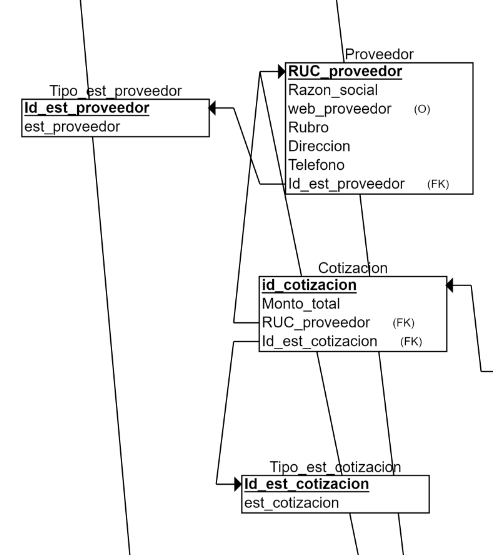

# Capítulo 07: Validación del esquema (Look Up Tables)

### Cotizacion
- Tipo estado Cotizacion
Columnas: id_est_cotizacion, est_cotizacion

|id_est_cotizacion|est_cotizacion|
|----------------------|------------|
|A|Aceptado|
|N|No Aceptado|
|P|Pendiente|

### Proveedor

- Tipo estado Proveedor
Columnas: id_est_proveedor, est_proveedor

|id_est_proveedor|est_proveedor|
|----------------------|------------|
|A|Activo|
|N|No Activo|

### Pedido
- Tipo estado pedido
Columnas: id_est_pedido, estado_pedido

|id_est_pedido|estado_pedido|
|----------------------|------------|
|E|ENTREGADO|
|P|PENDIENTE|
|C|CANCELADO|

### Estado_Cliente
Columnas: id_estado_cliente, id_estado_cliente

|id_estado_cliente|id_estado_cliente|
|----------------------|------------|
|A|Activo|
|C|No concurrente|
|F|Falta pago|
|I|Incomunicado|

### Tipo_Almacén
Columnas: id_almacen, tipo_almacen

|id_almacen|tipo_almacen|
|----------------------|------------|
|A1|Maquillaje|
|A2|Papelería|

### Tipo_Movimiento
Columnas: id_movimiento,nombre_movimiento

|id_movimiento|nombre_movimiento|
|----------------------|------------|
|1|Salida Entrega|
|2|Salida Despacho|
|3|Salida Envío|
|4|Entrada Recepción|
|5|Entrada Devolución|

### Tipo_Entrega
Columnas: id_tipo_entrega,nombre_tipo_entrega

|id_tipo_entrega|nombre_tipo_entrega|
|----------------------|------------|
|A|Domicilio|
|B|Recojo|
|C|Envío|

### Estado_Pedido
Columnas: id_estado_pedido,nombre_tipo_entrega

|id_estado_pedido|nombre_estado_pedido|
|----------------------|------------|
|L|Leído|
|P|En Preparación|
|D|Despachado|
|R|Retornado|

### Tipos de pago
Columnas: id_tipo_pago, nombre_tipo 

| id_tipo_pago | nombre_tipo |
|------------------|----------------------|
| 11                | Tarjeta de crédito               |
| 12               | Tarjeta de débito      |
| 13               | Efectivo         |
| 14                | Contraentrega            |
| 15                | Yape/Plin          |

### Tipos de factura
Columnas: id_tip_fac, tipo_fac
|id_tip_fac	| tipo_fac|
|------------------|----------------------|
| 1	 | Compra |
| 2	 | Venta  |
| 3	 | Gastos |
| 4	 | Pagos |

### Tipos de presupuestos
Columnas: id_tipo_presupuesto, nombre_tipo
| id_tipo_presupuesto	| nombre_tipo |
|------------------|----------------------|
| 1	 | Compra |
| 2	 | Venta  |
| 3	 | Marketing |
| 4	 | CRM |
| 5	 | Distribución |
| 6	 | Almacén |

### Tipos de valor
Columnas: id_tip_valor, nombre_val
| id_tip_valor| nombre_val |
|------------------|----------------------|
| 1	 | Positivo |
| 2	 | Negativo  |

### Tipos de operación
Columnas: id_tip_op, nom_operacion
| id_tip_op | nom_operacion |
|------------------|----------------------|
| 1	 | Operación simple |
| 2	 | Operación compuesta |

### Tipo_asiento_contable
Columnas: id_tipo_asiento_contable, nombre_tipo_as
| id_tipo_asiento_contable | nombre_tipo_as |
|------------------|----------------------|
| 1	 | Apertura |
| 2	 | Cierre |
| 3	 | Ajuste |
| 4	 | Ingreso |
| 5	 | Gasto |
| 6	 | Pago |
| 7	 | Cobro |
| 8	 | Compras |
| 9	 | Ventas |
| 10	| Provisión |

### Pipeline
Columnas: id_persona,estado

|id_persona|estado|
|----------------------|------------|
|A|nuevo|
|B|calificado|
|C|propuesta|
|D|negociacion|
|E|ganado|