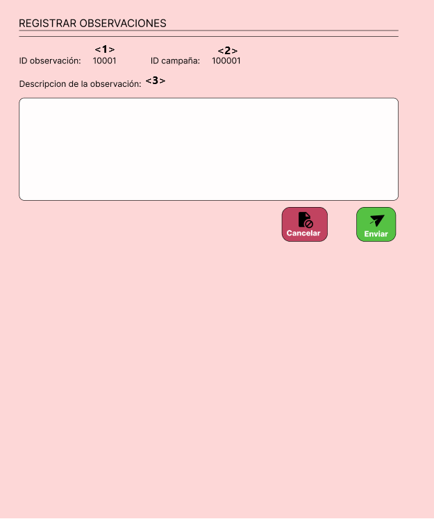
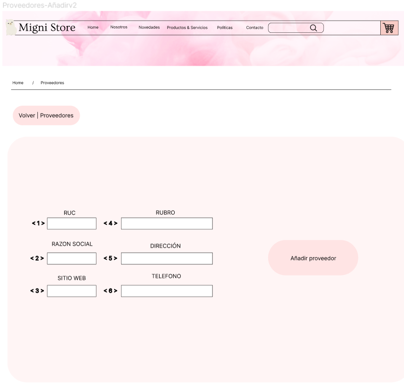
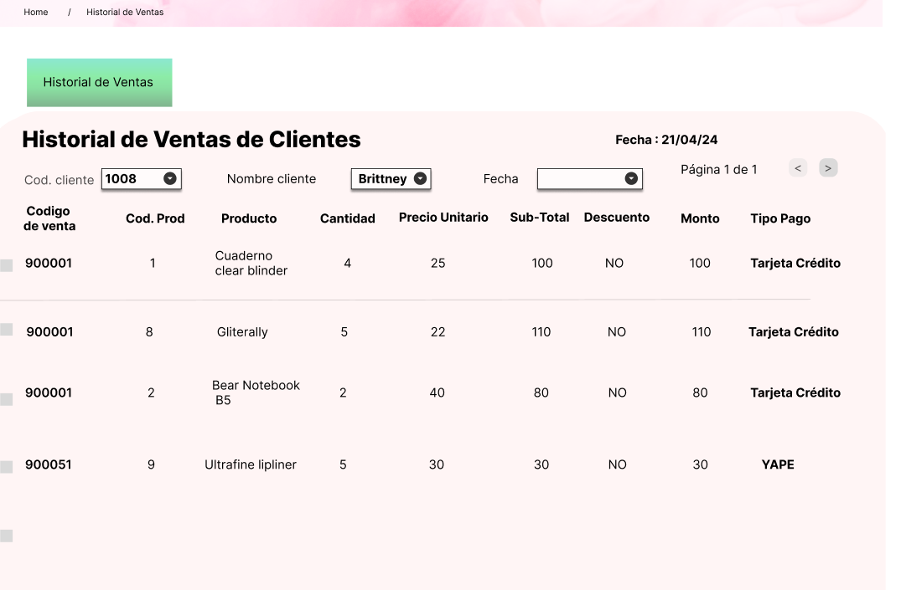
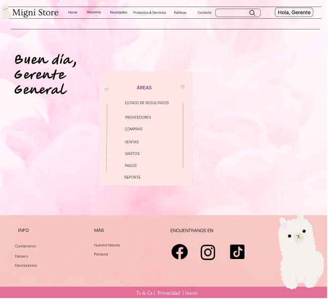
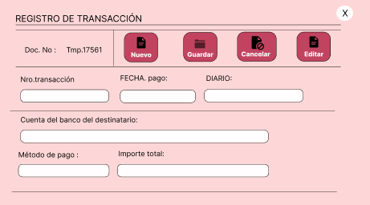
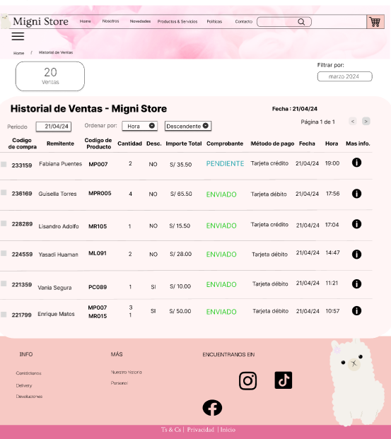
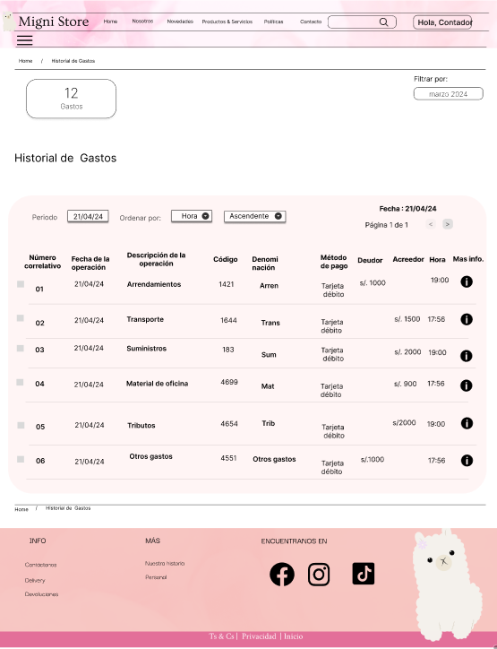
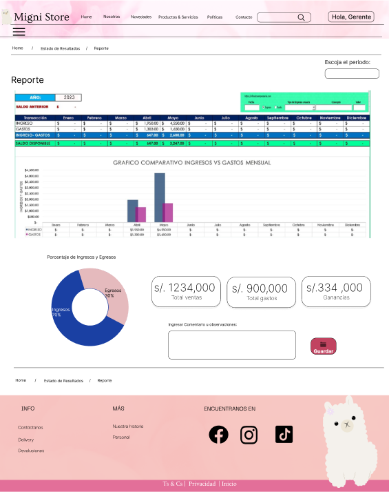
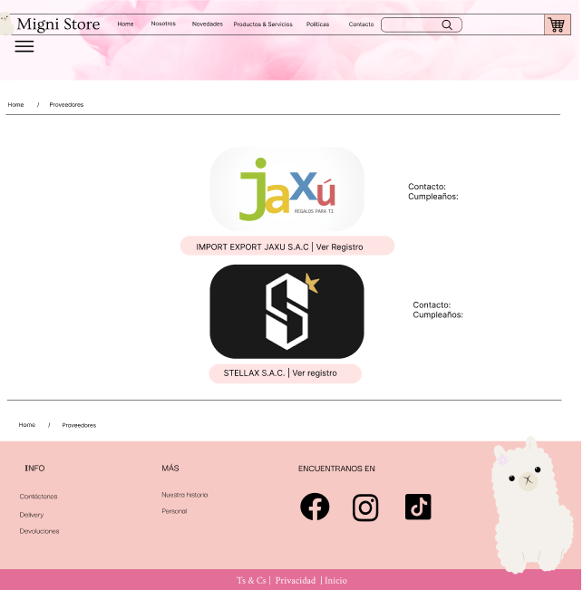
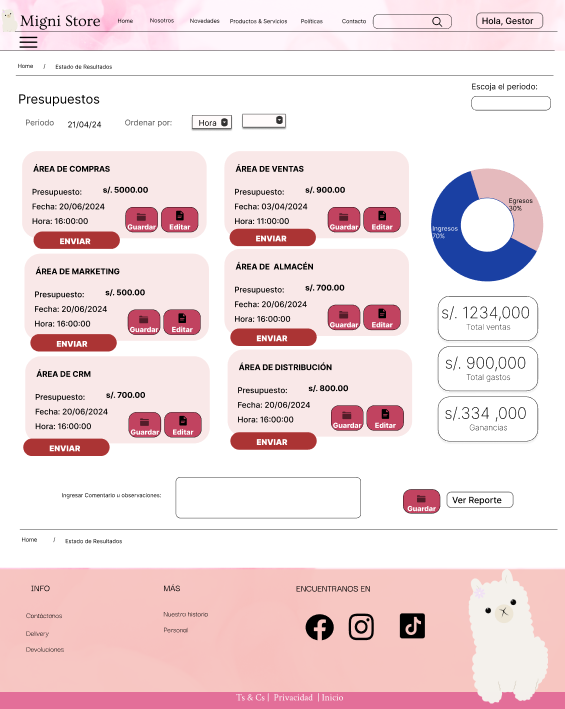

# Capítulo 09: Asignación de códigos

## Codificación de requerimientos
### Módulo de Marketing
| Código | R001  |
|----------|----------|
|Nombre  | Proponer Campaña |
| Objetivo | 
 Permitir que el Equipo de marketing proponga una campaña.
 | 
| Descripción | Proceso mediante el cual el Equipo de marketing puede proponer una campaña para su posterior revisión de parte del Gestor de marketing. | 
| Actor primario   | Equipo de marketing | 
|Actor secundario| Gestor de marketing |
|Precondiciones | - |

| Código | R002  |
|----------|----------|
|Nombre  | Observar campaña |
| Objetivo | 
 Enviar observaciones de una campaña es específico al equipo de marketing que la diseño.
 | 
| Descripción | Proceso mediante el cual el Gestor de marketing envía las observaciones de campañas propuestas al equipo de amrketing correspondiente. | 
| Actor primario   | Gestor de marketing | 
|Actor secundario| Equipo de marketing |
|Precondiciones | El equipo de marketing debe haber propuesto una campaña |

| Código | R003  |
|----------|----------|
|Nombre  | Atender Observaciones |
| Objetivo | 
 Permitir que el Equipo de marketing realice las correcciones de una campaña.
 | 
| Descripción | Proceso mediante el cual el Equipo de marketing puede realizar las correcciones de campañas que les corresponda, siguiendo las observaciones realizadas por el Gestor de marketing. | 
| Actor primario   | Equipo de marketing | 
|Actor secundario| Gestor de marketing |
|Precondiciones | El Gestor de marketing debe haber realizado una observación a la campaña. |

| Código | R004  |
|----------|----------|
|Nombre  | Editar campañas vigentes |
| Objetivo | 
 Permitir que el Gestor de marketing edite las campañas vigentes.
 | 
| Descripción | Proceso mediante el cual el Gestor de marketing puede editar las campañas que ya están vigentes, se limita a los datos necesarios y posibles de editar. | 
| Actor primario   | Gestor de marketing | 
|Actor secundario| - |
|Precondiciones | Debe existir al menos una campaña vigente. |

### Módulo de Compras

| Código | R005  |
|----------|----------|
|Nombre  |Visualizar proveedores|
|Objetivo  |Permitir a los gestores poder visualizar los proveedores que estan registrados.|
| Descripción   | Proceso mediante el cual los gestores pueden acceder a la visualización de todos los proveedores dentro de los registros|
| Actor primario    | Gestor de compras |
| Actor secundario    | -  |
| Precondiciones    | El proveedor ya debe haber contactado con la empresa previamente |

| Código | R006  |
|----------|----------|
|Nombre  |Añadir proveedor|
|Objetivo  |Permitir que el Gestor de compras pueda añadir proveedores a la página de Migni Store|
| Descripción   | Proceso de registro de proveedores en la aplicación, con datos de empresa ya sea ruc, razon social, dirección, telefono, rubro, correo y sitio web|
| Actor primario    | Gestor de compras |
| Actor secundario    | -  |
| Precondiciones    | El proveedor ya debe haber contactado con la empresa previamente |

| Código | R007  |
|----------|----------|
|Nombre  |Detalle proveedores|
|Objetivo  |Permitir a los gestores poder acceder y visualizar de un proveedor específico dentro de los registros|
| Descripción   | Proceso mediante el cual los gestores pueden acceder a la visualización de un proveedor específico dentro de los registros |
| Actor primario    | Gestor de compras|
| Actor secundario    | -  |
| Precondiciones    | El proveedor ya debe haber contactado con la empresa previamente |

| Código | R008  |
|----------|----------|
|Nombre  |Historial cotizaciones|
| Objetivo  |Permitir a los gestores poder acceder y visualizar las cotizaciones realizadas por un proveedor|
| Descripción   |Proceso mediante el cual los gestores pueden acceder a la visualización de las cotizaciones, con sus respectivos datos|
| Actor primario    | Gestor de compras|
| Actor secundario    | -  |
| Precondiciones    | El proveedor ya debe haber contactado con la empresa previamente |

| Código | R009  |
|----------|----------|
|Nombre  |Detalle Cotizaciones|
|Objetivo  |Permitir a los gestores poder acceder y visualizar de una cotizacion específica dentro del historial|
| Descripción   | Proceso mediante el cual los gestores pueden acceder a la visualización de una cotizacion específica dentro del historial|
| Actor primario    | Gestor de compras|
| Actor secundario    | -  |
| Precondiciones    | El proveedor ya debe haber contactado con la empresa previamente|

| Código | R010  |
|----------|----------|
|Nombre  |Aceptar/Rechazar cotizacion del proveedor|
|Objetivo  |Permitir que el gestor de compras pueda aceptar o rechazar la cotizacion realizada por el proveedor |
| Descripción   | Proceso en el cual se puede visualizar la cotizacion, con estado pendiente y aceptar o rechazar dicha cotizacion|
| Actor primario    | Gestor de compras |
| Actor secundario    | -  |
| Precondiciones    | El proveedor debe haber sido registrado por el gestor de compras |

### Modulo de distribucion

| Código | R011  |
|----------|----------|
|Nombre  |Visualizar compras|
|Objetivo  |Permitir a los clientes poder ver sus compras y entregas pendientes.|
| Descripción   | Proceso mediante el cual los clientes pueden acceder a la visualización de todas sus compras sin entregar|
| Actor primario    | Cliente |
| Actor secundario    | -  |
| Precondiciones    | El cliente debe haber realizado una compra previamente |

| Código | R012  |
|----------|----------|
|Nombre  |Establecer fecha de la entrega|
|Objetivo  |Permitir a los clientes definir la fecha que desean que se le entregue su compra.|
| Descripción   | Proceso mediante el cual los clientes pueden establecer la fecha de su entrega y ademas se crea el pedido|
| Actor primario    | Cliente |
| Actor secundario    | -  |
| Precondiciones    | El cliente debe haber realizado una compra previamente |

| Código | R013  |
|----------|----------|
|Nombre  |Visualizar pedidos|
|Objetivo  |Permitir al gestor de distribucion visualizar los pedidos pendientes.|
| Descripción   | Proceso mediante el cual el gestor de distribucion pueden ver los pedidos que se encuentran pendientes|
| Actor primario    | Gestor de distribucion |
| Actor secundario    | -  |
| Precondiciones    | El cliente debe haber establecido una fecha de entrega previamente |

| Código | R014  |
|----------|----------|
|Nombre  |Asignar|
|Objetivo  |Permitir al gestor de distribucion asignar un repartidor a un pedido  y una ruta segun la zona establecida.|
| Descripción   | Proceso mediante el cual el gestor de distribucion pueden establecer los repartidores y las rutas a cada pedido|
| Actor primario    | Gestor de distribucion |
| Actor secundario    | -  |
| Precondiciones    | El cliente debe haber establecido una fecha de entrega previamente y los pedidos debe estar pendientes |

| Código | R015  |
|----------|----------|
|Nombre  |Visualizar el historial de pedidos|
|Objetivo  |Permitir al gestor de distribucion visualizar todas los pedidos y entregas realizadas.|
| Descripción   | Proceso mediante el cual el gestor de distribucion pueden visualizar todos los pedidos y entregas realizadas en un lapso de tiempo|
| Actor primario    | Gestor de distribucion |
| Actor secundario    | -  |
| Precondiciones    | Deben haber existido entregas realizadas con exito |

| Código | R016  |
|----------|----------|
|Nombre  |Visualizar las entregas pendientes|
|Objetivo  |Permitir al repartidor visualizar todos los pedidos pendientes.|
| Descripción   | Proceso mediante el cual el repartidor pueden visualizar todos los pedidos que se encuentra aun pendientes|
| Actor primario    | Repartidor |
| Actor secundario    | -  |
| Precondiciones    | El repartidor se le debe haber asignado pedidos |

| Código | R017  |
|----------|----------|
|Nombre  |Entregado|
|Objetivo  |Permitir al repartidor confirmar que la entrega se realizó con exito.|
| Descripción   | Proceso el cual el repartidor confirma que ha realizado la entrega y actualiza el estado del pedido |
| Actor primario    | Repartidor |
| Actor secundario    | -  |
| Precondiciones    | El repartidor debe haber aceptado el pedido |

| Código | R018  |
|----------|----------|
|Nombre  |Visualizar el historial de pedidos|
|Objetivo  |Permitir al repartidor visualizar sus pedidos y entregas realizadas.|
| Descripción   | Proceso mediante el cual el repartidor puede visualizar todos los sus pedidos y entregas realizadas en un lapso de tiempo|
| Actor primario    | Gestor de distribucion |
| Actor secundario    | -  |
| Precondiciones    | Deben haber existido entregas realizadas con exito |

| Código | R019  |
|----------|----------|
|Nombre  |Ver detalles/ver mas|
|Objetivo  |Permitir al gestor de distribucion y el repartidor ver los detalles del pedido.|
| Descripción   | Proceso mediante el cual el gerente de distribucion y el repartidor pueden visualizar mas detalles acerca del pedido
| Actor primario    | Gestor de distribucion y repartidor |
| Actor secundario    | -  |
| Precondiciones    | Debe existir el pedido, con la fecha establecidad previamente |

### Módulo de Ventas

| Código | R020 |
|----------|----------|
|Nombre  | Ver Catálogo de Productos|
| Objetivo | 
 Permitir que el cliente visualice el catálogo completo de productos disponibles en la plataforma de ventas.
 | 
| Descripción |  Facilitar al cliente la exploración de todos los productos disponibles para su compra, mostrando información básica de cada producto. | 
| Actor primario   | Cliente | 
|Actor secundario| Plataforma de Ventas|
|Precondiciones |El cliente ha accedido a la plataforma de ventas|

| Código | R021 |
|----------|----------|
|Nombre  | Ver Detalle de Producto desde el Catálogo|
| Objetivo | 
 Permitir que el cliente acceda a una vista detallada de un producto mientras navega por el catálogo en la plataforma de ventas.
| 
| Descripción | Facilitar al cliente la visualización de información detallada sobre un producto específico mientras navega por el catálogo de la plataforma de ventas, brindando detalles como descripción, código, marca, tipo de producto, precio y disponibilidad en stock.| 
| Actor primario   | Cliente | 
|Actor secundario| Plataforma de Ventas|
|Precondiciones |El cliente ha iniciado sesión en la plataforma de ventas |

| Código | R022 |
|----------|----------|
|Nombre  | Realizar una compra (carrito de compras)|
| Objetivo | 
 Permitir que el cliente realice una compra en la plataforma de ventas y pueda cambiar su dirección de envío antes de finalizar la transacción si lo desea.
 | 
| Descripción | Facilitar el proceso de compra para el cliente, desde la selección de productos hasta la finalización de la transacción. | 
| Actor primario   | Cliente | 
|Actor secundario| Plataforma de Ventas|
|Precondiciones |El cliente ha accedido a la plataforma de ventas y ha agregado productos al carrito de compras. |

| Código | R023 |
|----------|----------|
|Nombre  | Elegir Método de Pago|
| Objetivo | 
 Permitir que el cliente elija el método de pago al realizar una compra en la plataforma de ventas.
 | 
| Descripción | Facilitar al cliente la selección de su método de pago preferido durante el proceso de compra, limitando las opciones a tarjeta de débito o crédito. | 
| Actor primario   | Cliente | 
|Actor secundario| Plataforma de Ventas|
|Precondiciones |El cliente ha accedido a la plataforma de ventas y ha agregado productos al carrito de compras|

| Código | R024 |
|----------|----------|
|Nombre  | Ver Detalles del Producto|
| Objetivo | 
 Permitir que el cliente acceda a una vista detallada del producto en la plataforma de ventas después de elegir su método de pago correspondiente.
 | 
| Descripción | Facilitar al cliente la visualización de información detallada sobre un producto seleccionado. | 
| Actor primario   | Cliente | 
|Actor secundario| Plataforma de Ventas|
|Precondiciones |El cliente ha iniciado el proceso de pago y ha ingresado los datos de su tarjeta|

| Código | R025 |
|----------|----------|
|Nombre  | Añadir Nueva Dirección de Envío|
| Objetivo | 
 Permitir que el cliente agregue una nueva dirección de envío para recibir sus productos comprados en la plataforma de ventas.
 | 
| Descripción | Facilitar al cliente la posibilidad de registrar una dirección adicional donde desee recibir sus pedidos, aumentando la flexibilidad en la entrega de productos. | 
| Actor primario   | Cliente | 
|Actor secundario| Plataforma de Ventas|
|Precondiciones |El cliente ha iniciado sesión en su cuenta en la plataforma de ventas|

| Código | R026 |
|----------|----------|
|Nombre  | Consultar Historial de Ventas de la Empresa|
| Objetivo | 
 Permitir que el gestor acceda al historial de ventas de la empresa en la plataforma de ventas.
 | 
| Descripción | Facilitar al gestor el acceso a información detallada sobre las ventas realizadas por la empresa, incluyendo datos como fechas, productos vendidos, montos y clientes. | 
| Actor primario   | Gestor de Ventas | 
|Actor secundario| Plataforma de Ventas|
|Precondiciones |El gestor ha accedido a la plataforma de ventas|

| Código | R027 |
|----------|----------|
|Nombre  | Consultar Historial de ventas de algun cliente|
| Objetivo | 
 Permitir que el gestor acceda al historial de ventas del cliente para realizar seguimientos.
 | 
| Descripción | Facilitar al gestor el acceso a información detallada sobre las ventas realizadas por el cliente. | 
| Actor primario   | Gestor de Ventas | 
|Actor secundario| Plataforma de Ventas|
|Precondiciones |El gestor ha accedido a la plataforma de ventas|

### Módulo de CRM

| Código | R028 |
|----------|----------|
|Nombre  | Análisis de Datos de Productos|
| Objetivo | 
 Permitir al gestor de CRM realizar análisis de datos sobre los productos vendidos.
 | 
| Descripción | Facilitar al gestor el acceso a información detallada sobre las tendencias de compra, los productos menos comprados y los patrones de comportamiento de los clientes. | 
| Actor primario   | Gestor de CRM | 
|Actor secundario| Plataforma de CRM|
|Precondiciones |El gestor ha accedido a la plataforma de CRM|

| Código | R029 |
|----------|----------|
|Nombre  | Gestión de Comentarios de Clientes |
| Objetivo | 
 Permitir al gestor de CRM revisar y clasificar los comentarios enviados por los clientes.
 | 
| Descripción | Facilitar al gestor la capacidad de ver, clasificar y responder a los comentarios de los clientes para mejorar la atención y satisfacción del cliente. | 
| Actor primario   | Gestor de CRM | 
|Actor secundario| Clientes|
|Precondiciones |El gestor ha accedido a la plataforma de CRM|

| Código | R030 |
|----------|----------|
|Nombre  | Envío de Correos a Clientes |
| Objetivo | 
 Permitir al gestor de CRM enviar correos electrónicos a los clientes seleccionados.
 | 
| Descripción | acilitar al gestor la capacidad de enviar correos electrónicos masivos o individuales para promociones, actualizaciones o comunicaciones generales. | 
| Actor primario   | Gestor de CRM | 
|Actor secundario| Clientes|
|Precondiciones |El gestor ha accedido a la plataforma de CRM y ha seleccionado los destinatarios|

| Código | R031 |
|----------|----------|
|Nombre  | Creación y Envío de Formularios |
| Objetivo | 
 Permitir al gestor de CRM crear y enviar formularios para recoger las preferencias y opiniones de los clientes.
 | 
| Descripción | personalizados y enviarlos a los clientes para recopilar datos importantes que ayuden a mejorar el servicio y los productos. | 
| Actor primario   | Gestor de CRM | 
|Actor secundario| Clientes|
|Precondiciones |El gestor ha accedido a la plataforma de CRM|

| Código | R032 |
|----------|----------|
|Nombre  | 	Acceso al Módulo de CRM desde el Home |
| Objetivo | 
 Permitir a los usuarios acceder a las distintas funcionalidades del módulo de CRM desde la página principal.
 | 
| Descripción | Facilitar un acceso rápido y sencillo a las diferentes secciones del módulo de CRM desde el home de la plataforma. | 
| Actor primario   | Gestor de CRM | 
|Actor secundario| Plataforma de CRM|
|Precondiciones |El gestor ha accedido a la plataforma de CRM|

| Código | R033 |
|----------|----------|
|Nombre  | 	Gestión de Usuarios en el Pipeline |
| Objetivo | 
 Permitir al gestor de CRM gestionar los usuarios en diferentes etapas del pipeline de ventas.
 | 
| Descripción | Facilitar al gestor la capacidad de mover a los usuarios entre las diferentes etapas del pipeline (nuevo, calificado, propuesta, negociación, ganado) según su estado en el proceso de ventas. | 
| Actor primario   | Gestor de CRM | 
|Actor secundario| Clientes|
|Precondiciones |El gestor ha accedido a la plataforma de CRM|

| Código | R034 |
|----------|----------|
|Nombre  | 	Envío de Mensajes de WhatsApp |
| Objetivo | 
 Permitir al gestor de CRM enviar mensajes de WhatsApp a los clientes seleccionados.
 | 
| Descripción | Facilitar al gestor la capacidad de enviar mensajes de WhatsApp masivos o individuales para promociones, actualizaciones o comunicaciones generales. | 
| Actor primario   | Gestor de CRM | 
|Actor secundario| Clientes|
|Precondiciones |El gestor ha accedido a la plataforma de CRM y ha seleccionado los destinatarios|

| Código | R035 |
|----------|----------|
|Nombre  | 	Vista de Preferencias del Usuario |
| Objetivo | 
 Permitir a los usuarios ver sus preferencias y datos recopilados mediante formularios.
 | 
| Descripción | Facilitar a los usuarios el acceso a sus preferencias y respuestas a formularios, para que puedan revisarlas y actualizarlas si es necesario. | 
| Actor primario   | Usuario | 
|Actor secundario| Plataforma|
|Precondiciones |El usuario ha accedido a su cuenta en la plataforma |

| Código | R036 |
|----------|----------|
|Nombre  | 	Envío de Comentarios por Parte del Usuario |
| Objetivo | 
 Permitir a los usuarios enviar comentarios sobre productos y servicios.
 | 
| Descripción | Facilitar a los usuarios la capacidad de enviar comentarios y opiniones sobre productos y servicios, para que el gestor de CRM pueda revisarlos y actuar en consecuencia. | 
| Actor primario   | Usuario | 
|Actor secundario| Gestor de CRM|
|Precondiciones |El usuario ha accedido a su cuenta en la plataforma |

### Módulo de Finanzas

| Código             | R037 |
|--------------------|----------|
| Nombre             | Añadir Factura |
| Objetivo           | Permitir al contador ingresar facturas. |
| Descripción        | PRoceso mediante el contador agrega una factura según la transacciones que tiene la Empresa. |
| Actor primario | Contador |
| Actor secundario | - |
| *Precondiciones* | - El usuario ha iniciado sesión en el sistema. - El usuario tiene permisos para añadir facturas. |
| *Flujo Alternativo* | - Si hay errores en los datos ingresados, el sistema muestra mensajes de error y permite al usuario corregir la información. |

| Código             | R038 |
|--------------------|------|
| Nombre             | Ver Historial de Facturas |
| Objetivo           | Permitir al contador general y al gerente general consultar el historial de facturas. |
| Descripción        | Proceso mediante el cual se muestra el historial completo de facturas de la empresa. |
| Actor primario     | Contador General, Gerente General |
| Actor secundario   | - |
| *Precondiciones*   | - El usuario ha iniciado sesión en el sistema. - El usuario tiene permisos para ver el historial de facturas. |
| *Flujo Alternativo*| - Si no hay facturas registradas, el sistema muestra un mensaje indicando la ausencia de facturas. |

| Código             | R039 |
|--------------------|------|
| Nombre             | Ver estado de Facturas |
| Objetivo           | Permitir al contador general y al gerente general consultar el estado de las facturas. |
| Descripción        | Proceso mediante el cual se muestra el estado actual de las facturas (pendientes, pagadas, vencidas, etc.). |
| Actor primario     | Contador General, Gerente General |
| Actor secundario   | - |
| *Precondiciones*   | - El usuario ha iniciado sesión en el sistema. - El usuario tiene permisos para ver el estado de las facturas. |
| *Flujo Alternativo*| - Si no hay facturas con el estado seleccionado, el sistema muestra un mensaje indicando la ausencia de facturas en ese estado. |

| Código             | R040 |
|--------------------|------|
| Nombre             | Ver asientos contables |
| Objetivo           | Permitir al contador general y al gerente general consultar los asientos contables. |
| Descripción        | Proceso mediante el cual se muestran los asientos contables registrados en el sistema. |
| Actor primario     | Contador General, Gerente General |
| Actor secundario   | - |
| *Precondiciones*   | - El usuario ha iniciado sesión en el sistema. - El usuario tiene permisos para ver los asientos contables. |
| *Flujo Alternativo*| - Si no hay asientos contables registrados, el sistema muestra un mensaje indicando la ausencia de asientos contables. |

| Código             | R041 |
|--------------------|------|
| Nombre             | Ver estado de resultados |
| Objetivo           | Permitir al contador general y al gerente general consultar el estado de resultados de la empresa. |
| Descripción        | Proceso mediante el cual se muestra el estado de resultados, incluyendo ingresos, gastos y utilidades de la empresa. |
| Actor primario     | Contador General, Gerente General |
| Actor secundario   | - |
| *Precondiciones*   | - El usuario ha iniciado sesión en el sistema. - El usuario tiene permisos para ver el estado de resultados. |
| *Flujo Alternativo*| - Si no hay datos disponibles para el estado de resultados, el sistema muestra un mensaje indicando la ausencia de información. |

| Código             | R042 |
|--------------------|------|
| Nombre             | Gestionar Presupuesto |
| Objetivo           | Permitir al usuario gestionar los presupuestos asignados a diferentes departamentos. |
| Descripción        | Proceso mediante el cual se asignan, modifican y consultan presupuestos en el sistema. |
| Actor primario     | Gerente de Finanzas |
| Actor secundario   | - |
| *Precondiciones*   | - El usuario ha iniciado sesión en el sistema. - El usuario tiene permisos para gestionar presupuestos. |
| *Flujo Alternativo*| - Si hay errores en la asignación de presupuesto, el sistema muestra mensajes de error y permite al usuario corregir la información. |

| Código             | R043 |
|--------------------|------|
| Nombre             | Asignar Presupuesto |
| Objetivo           | Permitir al usuario asignar presupuesto a proyectos específicos. |
| Descripción        | Proceso mediante el cual se asigna presupuesto a proyectos o departamentos según las necesidades de la empresa. |
| Actor primario     | Gerente de Proyectos |
| Actor secundario   | - |
| *Precondiciones*   | - El usuario ha iniciado sesión en el sistema. - El usuario tiene permisos para asignar presupuesto. |
| *Flujo Alternativo*| - Si el presupuesto asignado excede los límites, el sistema muestra un mensaje de advertencia. |

| Código             | R044 |
|--------------------|------|
| Nombre             | Ver Reporte Contable |
| Objetivo           | Permitir al contador general y al gerente general consultar reportes contables. |
| Descripción        | Proceso mediante el cual se muestran reportes contables detallados, incluyendo balances y estados financieros. |
| Actor primario     | Contador General, Gerente General |
| Actor secundario   | - |
| *Precondiciones*   | - El usuario ha iniciado sesión en el sistema. - El usuario tiene permisos para ver reportes contables. |
| *Flujo Alternativo*| - Si no hay reportes disponibles, el sistema muestra un mensaje indicando la ausencia de información. |

## Interfaces de requerimientos
### Módulo de Marketing
| Código Interfaz | I001  |
|----------|----------|
|Imagen interfaz||

| Código Interfaz | I002  |
|----------|----------|
|Imagen interfaz||

| Código Interfaz | I003  |
|----------|----------|
|Imagen interfaz||

| Código Interfaz | I004  |
|----------|----------|
|Imagen interfaz||

### Módulo de Compras

| Código Interfaz | I005 |
|----------|----------|
|Imagen interfaz||

| Código Interfaz | I006 |
|----------|----------|
|Imagen interfaz||

| Código Interfaz | I007  |
|----------|----------|
|Imagen interfaz||

| Código Interfaz | I008  |
|----------|----------|
|Imagen interfaz||

| Código Interfaz | I009  |
|----------|----------|
|Imagen interfaz||

| Código Interfaz | I0010 |
|----------|----------|
|Imagen interfaz||

### Módulo de Distribucion

| Código Interfaz | I011 |
|----------|----------|
|Imagen interfaz||

| Código Interfaz | I012 |
|----------|----------|
|Imagen interfaz||

| Código Interfaz | I013 |
|----------|----------|
|Imagen interfaz||

| Código Interfaz | I014 |
|----------|----------|
|Imagen interfaz||

| Código Interfaz | I015 |
|----------|----------|
|Imagen interfaz||

| Código Interfaz | I016 |
|----------|----------|
|Imagen interfaz||

| Código Interfaz | I017 |
|----------|----------|
|Imagen interfaz||

| Código Interfaz | I018 |
|----------|----------|
|Imagen interfaz||

| Código Interfaz | I019 |
|----------|----------|
|Imagen interfaz||

### Modulo de Ventas

| Código Interfaz | I020 |
|----------|----------|
|Imagen interfaz||

| Código Interfaz | I021 |
|----------|----------|
|Imagen interfaz||

| Código Interfaz | I022 |
|----------|----------|
|Imagen interfaz||

| Código Interfaz | I023 |
|----------|----------|
|Imagen interfaz||

| Código Interfaz | I024 |
|----------|----------|
|Imagen interfaz||

| Código Interfaz | I025 |
|----------|----------|
|Imagen interfaz||

| Código Interfaz | I026 |
|----------|----------|
|Imagen interfaz||

| Código Interfaz | I027 |
|----------|----------|
|Imagen interfaz||

### Modulo de CRM

| Código Interfaz | I028 |
|----------|----------|
|Imagen interfaz||

| Código Interfaz | I029 |
|----------|----------|
|Imagen interfaz||

| Código Interfaz | I030 |
|----------|----------|
|Imagen interfaz||

| Código Interfaz | I031 |
|----------|----------|
|Imagen interfaz||

| Código Interfaz | I032 |
|----------|----------|
|Imagen interfaz||

| Código Interfaz | I033 |
|----------|----------|
|Imagen interfaz||

| Código Interfaz | I034 |
|----------|----------|
|Imagen interfaz||

| Código Interfaz | I035 |
|----------|----------|
|Imagen interfaz||

| Código Interfaz | I036 |
|----------|----------|
|Imagen interfaz||

### Modulo de Finanzas

| Código Interfaz | I037 |
|-----------------|------|
|Imagen interfaz|  |

| Código Interfaz | I038 |
|-----------------|------|
|Imagen interfaz|  |

| Código Interfaz | I039 |
|-----------------|------|
|Imagen interfaz|  |

| Código Interfaz | I040 |
|-----------------|------|
|Imagen interfaz|   |

| Código Interfaz | I041 |
|-----------------|------|
|Imagen interfaz|  |

| Código Interfaz | I042 |
|-----------------|------|
|Imagen interfaz|  |

| Código Interfaz | I043 |
|-----------------|------|
|Imagen interfaz|  |

| Código Interfaz | I044 |
|-----------------|------|
|Imagen interfaz|  |

| Código Interfaz | I045 |
|-----------------|------|
|Imagen interfaz|  |

| Código Interfaz | I046 |
|-----------------|------|
|Imagen interfaz|  |

| Código Interfaz | I047 |
|-----------------|------|
|Imagen interfaz|  |

| Código Interfaz | I048 |
|-----------------|------|
|Imagen interfaz|  |

| Código Interfaz | I049 |
|-----------------|------|
|Imagen interfaz|  |

| Código Interfaz | I050 |
|-----------------|------|
|Imagen interfaz|   |

| Código Interfaz | I051 |
|-----------------|------|
|Imagen interfaz|  |

| Código Interfaz | I052 |
|-----------------|------|
|Imagen interfaz|  |

| Código Interfaz | I053 |
|-----------------|------|
|Imagen interfaz|  |

| Código Interfaz | I054 |
|-----------------|------|
|Imagen interfaz|  |

| Código Interfaz | I055 |
|-----------------|------|
|Imagen interfaz|  |
