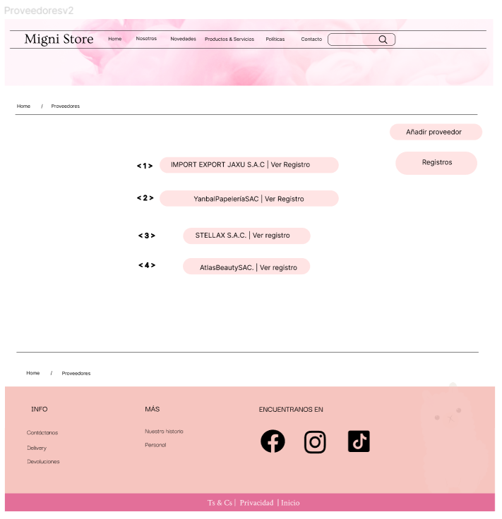
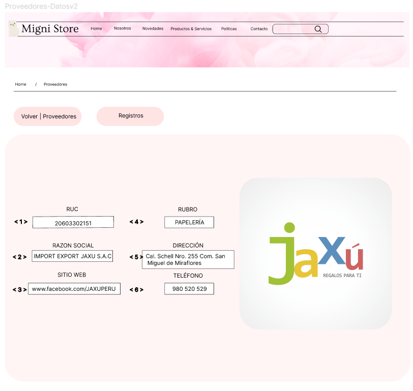
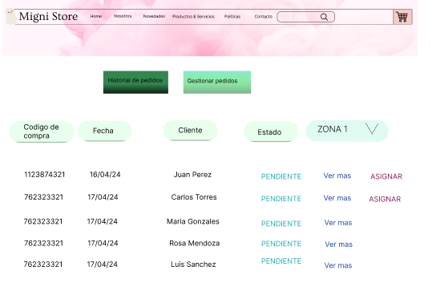
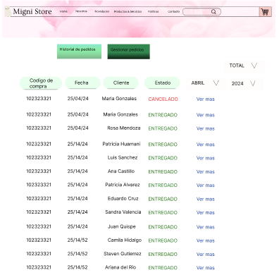
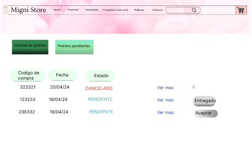

# Capítulo 09: Asignación de códigos

## Codificación de requerimientos
### Módulo de Marketing
| Código | R001  |
|----------|----------|
|Nombre  | Proponer Campaña |
| Objetivo | 
 Permitir que el Equipo de marketing proponga una campaña.
 | 
| Descripción | Proceso mediante el cual el Equipo de marketing puede proponer una campaña para su posterior revisión de parte del Gestor de marketing. | 
| Actor primario   | Equipo de marketing | 
|Actor secundario| Gestor de marketing |
|Precondiciones | - |

| Código | R002  |
|----------|----------|
|Nombre  | Observar campaña |
| Objetivo | 
 Enviar observaciones de una campaña es específico al equipo de marketing que la diseño.
 | 
| Descripción | Proceso mediante el cual el Gestor de marketing envía las observaciones de campañas propuestas al equipo de amrketing correspondiente. | 
| Actor primario   | Gestor de marketing | 
|Actor secundario| Equipo de marketing |
|Precondiciones | El equipo de marketing debe haber propuesto una campaña |

| Código | R003  |
|----------|----------|
|Nombre  | Atender Observaciones |
| Objetivo | 
 Permitir que el Equipo de marketing realice las correcciones de una campaña.
 | 
| Descripción | Proceso mediante el cual el Equipo de marketing puede realizar las correcciones de campañas que les corresponda, siguiendo las observaciones realizadas por el Gestor de marketing. | 
| Actor primario   | Equipo de marketing | 
|Actor secundario| Gestor de marketing |
|Precondiciones | El Gestor de marketing debe haber realizado una observación a la campaña. |

| Código | R004  |
|----------|----------|
|Nombre  | Editar campañas vigentes |
| Objetivo | 
 Permitir que el Gestor de marketing edite las campañas vigentes.
 | 
| Descripción | Proceso mediante el cual el Gestor de marketing puede editar las campañas que ya están vigentes, se limita a los datos necesarios y posibles de editar. | 
| Actor primario   | Gestor de marketing | 
|Actor secundario| - |
|Precondiciones | Debe existir al menos una campaña vigente. |

### Módulo de Compras

| Código | R005  |
|----------|----------|
|Nombre  |Visualizar proveedores|
|Objetivo  |Permitir a los gestores poder visualizar los proveedores que estan registrados.|
| Descripción   | Proceso mediante el cual los gestores pueden acceder a la visualización de todos los proveedores dentro de los registros|
| Actor primario    | Gestor de compras |
| Actor secundario    | -  |
| Precondiciones    | El proveedor ya debe haber contactado con la empresa previamente |

| Código | R006  |
|----------|----------|
|Nombre  |Añadir proveedor|
|Objetivo  |Permitir que el Gestor de compras pueda añadir proveedores a la página de Migni Store|
| Descripción   | Proceso de registro de proveedores en la aplicación, con datos de empresa ya sea ruc, razon social, dirección, telefono, rubro, correo y sitio web|
| Actor primario    | Gestor de compras |
| Actor secundario    | -  |
| Precondiciones    | El proveedor ya debe haber contactado con la empresa previamente |

| Código | R007  |
|----------|----------|
|Nombre  |Detalle proveedores|
|Objetivo  |Permitir a los gestores poder acceder y visualizar de un proveedor específico dentro de los registros|
| Descripción   | Proceso mediante el cual los gestores pueden acceder a la visualización de un proveedor específico dentro de los registros |
| Actor primario    | Gestor de compras|
| Actor secundario    | -  |
| Precondiciones    | El proveedor ya debe haber contactado con la empresa previamente |

| Código | R008  |
|----------|----------|
|Nombre  |Historial cotizaciones|
| Objetivo  |Permitir a los gestores poder acceder y visualizar las cotizaciones realizadas por un proveedor|
| Descripción   |Proceso mediante el cual los gestores pueden acceder a la visualización de las cotizaciones, con sus respectivos datos|
| Actor primario    | Gestor de compras|
| Actor secundario    | -  |
| Precondiciones    | El proveedor ya debe haber contactado con la empresa previamente |

| Código | R009  |
|----------|----------|
|Nombre  |Detalle Cotizaciones|
|Objetivo  |Permitir a los gestores poder acceder y visualizar de una cotizacion específica dentro del historial|
| Descripción   | Proceso mediante el cual los gestores pueden acceder a la visualización de una cotizacion específica dentro del historial|
| Actor primario    | Gestor de compras|
| Actor secundario    | -  |
| Precondiciones    | El proveedor ya debe haber contactado con la empresa previamente|

| Código | R010  |
|----------|----------|
|Nombre  |Aceptar/Rechazar cotizacion del proveedor|
|Objetivo  |Permitir que el gestor de compras pueda aceptar o rechazar la cotizacion realizada por el proveedor |
| Descripción   | Proceso en el cual se puede visualizar la cotizacion, con estado pendiente y aceptar o rechazar dicha cotizacion|
| Actor primario    | Gestor de compras |
| Actor secundario    | -  |
| Precondiciones    | El proveedor debe haber sido registrado por el gestor de compras |

### Modulo de distribucion

| Código | R011  |
|----------|----------|
|Nombre  |Visualizar compras|
|Objetivo  |Permitir a los clientes poder ver sus compras y entregas pendientes.|
| Descripción   | Proceso mediante el cual los clientes pueden acceder a la visualización de todas sus compras sin entregar|
| Actor primario    | Cliente |
| Actor secundario    | -  |
| Precondiciones    | El cliente debe haber realizado una compra previamente |

| Código | R012  |
|----------|----------|
|Nombre  |Establecer fecha de la entrega|
|Objetivo  |Permitir a los clientes definir la fecha que desean que se le entregue su compra.|
| Descripción   | Proceso mediante el cual los clientes pueden establecer la fecha de su entrega y ademas se crea el pedido|
| Actor primario    | Cliente |
| Actor secundario    | -  |
| Precondiciones    | El cliente debe haber realizado una compra previamente |

| Código | R013  |
|----------|----------|
|Nombre  |Visualizar pedidos|
|Objetivo  |Permitir al gestor de distribucion visualizar los pedidos pendientes.|
| Descripción   | Proceso mediante el cual el gestor de distribucion pueden ver los pedidos que se encuentran pendientes|
| Actor primario    | Gestor de distribucion |
| Actor secundario    | -  |
| Precondiciones    | El cliente debe haber establecido una fecha de entrega previamente |

| Código | R014  |
|----------|----------|
|Nombre  |Asignar|
|Objetivo  |Permitir al gestor de distribucion asignar un repartidor a un pedido  y una ruta segun la zona establecida.|
| Descripción   | Proceso mediante el cual el gestor de distribucion pueden establecer los repartidores y las rutas a cada pedido|
| Actor primario    | Gestor de distribucion |
| Actor secundario    | -  |
| Precondiciones    | El cliente debe haber establecido una fecha de entrega previamente y los pedidos debe estar pendientes |

| Código | R015  |
|----------|----------|
|Nombre  |Visualizar el historial de pedidos|
|Objetivo  |Permitir al gestor de distribucion visualizar todas los pedidos y entregas realizadas.|
| Descripción   | Proceso mediante el cual el gestor de distribucion pueden visualizar todos los pedidos y entregas realizadas en un lapso de tiempo|
| Actor primario    | Gestor de distribucion |
| Actor secundario    | -  |
| Precondiciones    | Deben haber existido entregas realizadas con exito |

| Código | R016  |
|----------|----------|
|Nombre  |Visualizar las entregas pendientes|
|Objetivo  |Permitir al repartidor visualizar todos los pedidos pendientes.|
| Descripción   | Proceso mediante el cual el repartidor pueden visualizar todos los pedidos que se encuentra aun pendientes|
| Actor primario    | Repartidor |
| Actor secundario    | -  |
| Precondiciones    | El repartidor se le debe haber asignado pedidos |

| Código | R017  |
|----------|----------|
|Nombre  |Entregado|
|Objetivo  |Permitir al repartidor confirmar que la entrega se realizó con exito.|
| Descripción   | Proceso el cual el repartidor confirma que ha realizado la entrega y actualiza el estado del pedido |
| Actor primario    | Repartidor |
| Actor secundario    | -  |
| Precondiciones    | El repartidor debe haber aceptado el pedido |

| Código | R018  |
|----------|----------|
|Nombre  |Visualizar el historial de pedidos|
|Objetivo  |Permitir al repartidor visualizar sus pedidos y entregas realizadas.|
| Descripción   | Proceso mediante el cual el repartidor puede visualizar todos los sus pedidos y entregas realizadas en un lapso de tiempo|
| Actor primario    | Gestor de distribucion |
| Actor secundario    | -  |
| Precondiciones    | Deben haber existido entregas realizadas con exito |

| Código | R019  |
|----------|----------|
|Nombre  |Ver detalles/ver mas|
|Objetivo  |Permitir al gestor de distribucion y el repartidor ver los detalles del pedido.|
| Descripción   | Proceso mediante el cual el gerente de distribucion y el repartidor pueden visualizar mas detalles acerca del pedido
| Actor primario    | Gestor de distribucion y repartidor |
| Actor secundario    | -  |
| Precondiciones    | Debe existir el pedido, con la fecha establecidad previamente |

## Interfaces de requerimientos
### Módulo de Marketing
| Código Interfaz | I001  |
|----------|----------|
|Imagen interfaz||

| Código Interfaz | I002  |
|----------|----------|
|Imagen interfaz||

| Código Interfaz | I003  |
|----------|----------|
|Imagen interfaz||

| Código Interfaz | I004  |
|----------|----------|
|Imagen interfaz||

### Módulo de Compras

| Código Interfaz | I005 |
|----------|----------|
|Imagen interfaz||

| Código Interfaz | I006 |
|----------|----------|
|Imagen interfaz||

| Código Interfaz | I007  |
|----------|----------|
|Imagen interfaz||

| Código Interfaz | I008  |
|----------|----------|
|Imagen interfaz||

| Código Interfaz | I009  |
|----------|----------|
|Imagen interfaz||

| Código Interfaz | I0010 |
|----------|----------|
|Imagen interfaz||

### Módulo de Distribucion

| Código Interfaz | I011 |
|----------|----------|
|Imagen interfaz||

| Código Interfaz | I012 |
|----------|----------|
|Imagen interfaz||

| Código Interfaz | I013 |
|----------|----------|
|Imagen interfaz||

| Código Interfaz | I014 |
|----------|----------|
|Imagen interfaz||

| Código Interfaz | I015 |
|----------|----------|
|Imagen interfaz||

| Código Interfaz | I016 |
|----------|----------|
|Imagen interfaz||

| Código Interfaz | I017 |
|----------|----------|
|Imagen interfaz||

| Código Interfaz | I018 |
|----------|----------|
|Imagen interfaz||

| Código Interfaz | I019 |
|----------|----------|
|Imagen interfaz||
