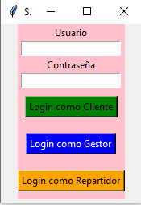
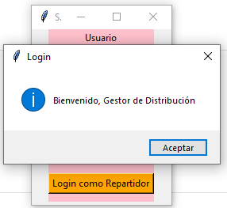
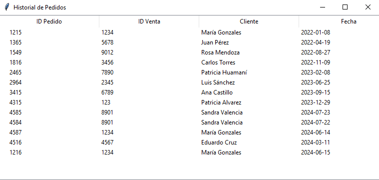
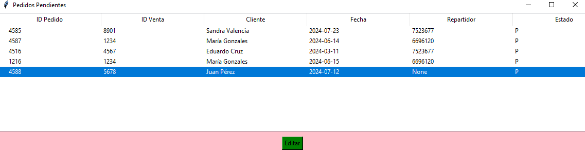
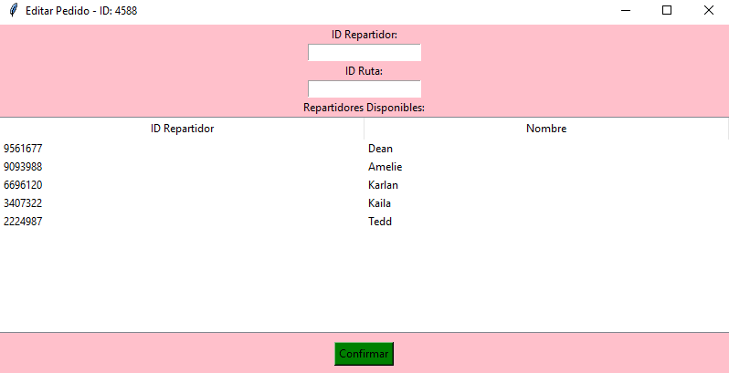
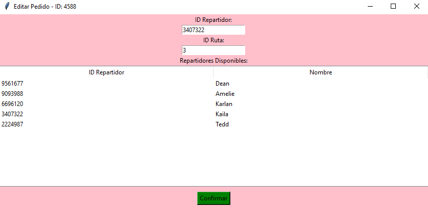
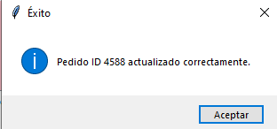
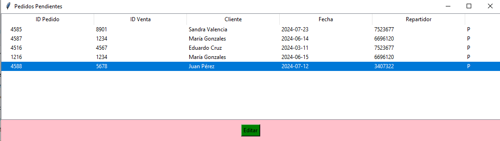

## Explicación de las funcionalidades

Gestor de distribucion 

El gestor se loguea con exito para ver los pedidos 

En la pantalla apareceran las opciones para ver el historial de pedidos y los pedidos pendientes 

El gestor podra visualizar el listado de todos los pedidos que se han realizado hasta el momento

Cuando ingresa a la pantalla de ver pedidos pendientes,apareceran el listado de pedidos que se encuentran pendientes,incluidos los que aun no tienen asignado un repartidor

Cuando selecciona uno de los pedidos y le da a editar, aparecera una pantalla para poder asignarle un repartidor y una ruta al pedido,en la parte inferior apareceran los repartidores disponibles de acuerdo a la zona que se encuentra el cliente

El gestor ingresa los datos y le da a confirmar

Aparecerá un aviso que nos notifica que el pedido fue actualizado y asignado su repartidor y ruta

Vemos como se actualiza el pedido en el listado,y cuando antes era "NONE" ,ahora si aparece un id_repartidor en el pedido

## DATOS
Anteriormente se le asigno una fecha al pedido por parte del cliente, luego el repartidor asignado puede aceptar el pedido y actualizar el estado,esto no se logró en las pantallas del aplicativo

