# MODULO DE COMPRAS

## EXPLICACION DE LAS PANTALLAS
### GESTOR DE COMPRAS
- Menu Principal, aqui se veran las 3 opciones que son: Añadir Proveedores, Añadir Cotizacion, Ver Cotizacion/Proveedor

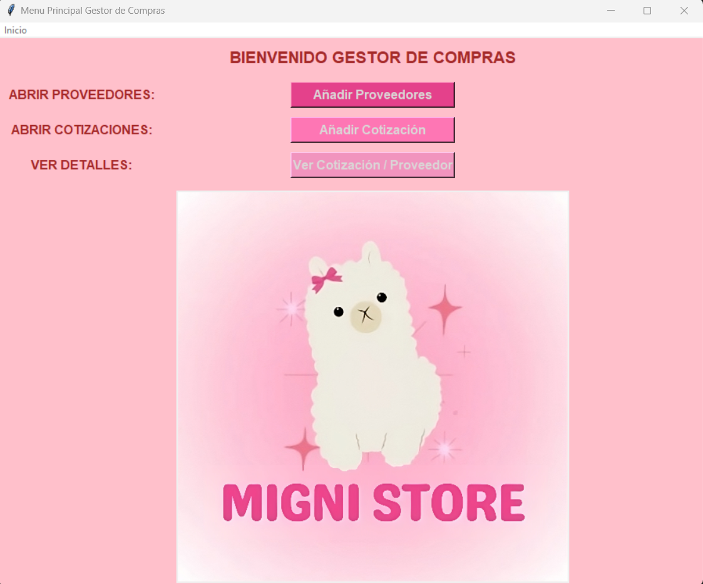

- Al Presionar el boton de Añadir Proveedores nos dirigira a su respectiva pantalla, tenemos las opciones:
  - Nuevo: Nos Permite habilitar los campos para ingresar los datos del proveedor
  - Guardar: Nos permite guardar los datos que se introducieron previamente.
  - Cancelar: Nos desabilita los campos y borra todo lo intruducido.
  - Editar: Al seleccionar uno de los campos, nos permite editarlo.
  - Volver: Nos regresa a la pantalla anterior

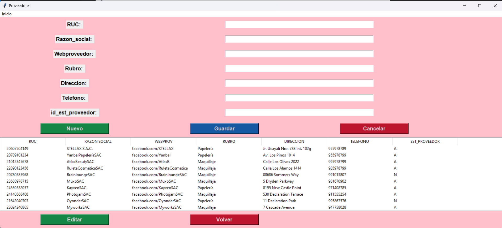

- Aqui se visualiza un ejemplo de insercion de datos

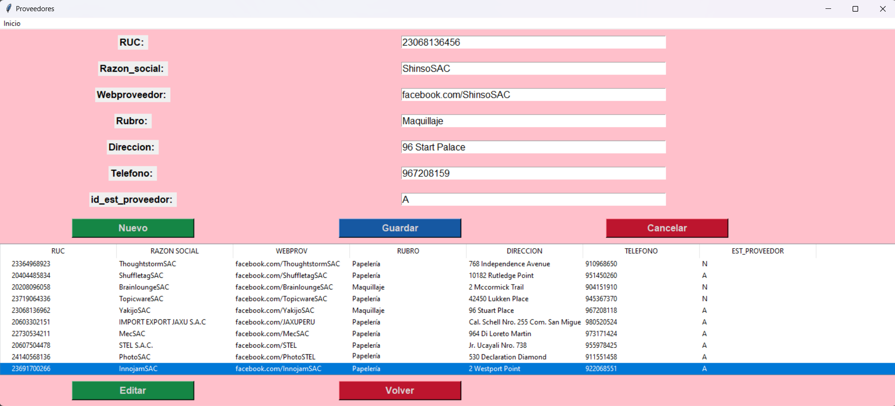

- Aqui se visualiza que el dato ha sido guardado en la base de datos correctamente

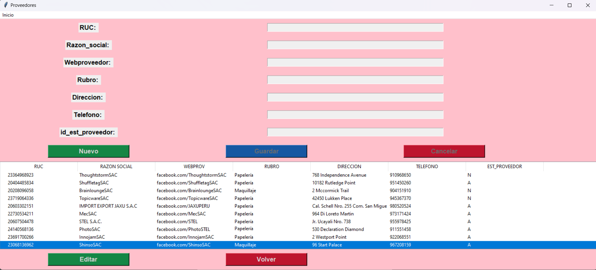

- Al Presionar el boton de Añadir Cotizacion nos dirigira a su respectiva pantalla, tenemos las opciones:
  - Nuevo: Nos Permite habilitar los campos para ingresar los datos de la cotizacion
  - Guardar: Nos permite guardar los datos que se introducieron previamente.
  - Cancelar: Nos desabilita los campos y borra todo lo intruducido.
  - Editar: Al seleccionar uno de los campos, nos permite editarlo.
  - Volver: Nos regresa a la pantalla anterior

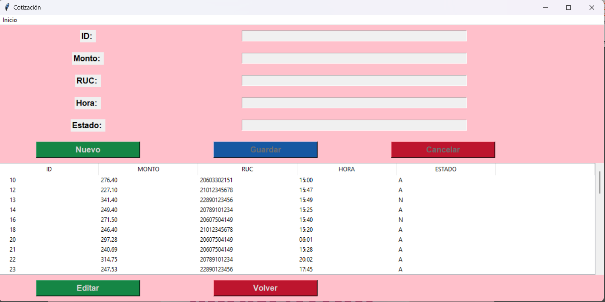

- Aqui se visualiza un ejemplo de insercion de datos

- Aqui se visualiza que el dato ha sido guardado en la base de datos correctamente

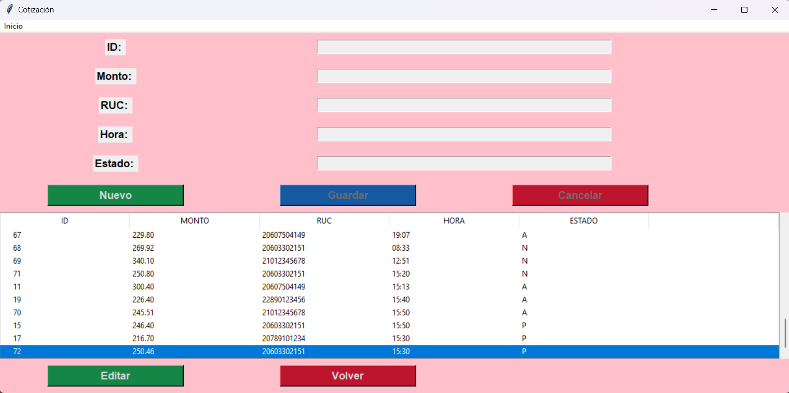

- Al Presionar el boton de Ver Cotizacion/Proveedor nos saldra una pantalla emergente y tenemos las opciones:
  - Ver Historial de Proveedores: Esta opcion nos dirigira a la pantalla de historial de proveedores activos
  - Ver Cotizaciones Pendientes: Esta opcion nos dirigira a la pantalla de cotizaciones pendientes para poder aceptar o rechazar cotizaciones
  - Volver: Nos regresa a la pantalla anterior

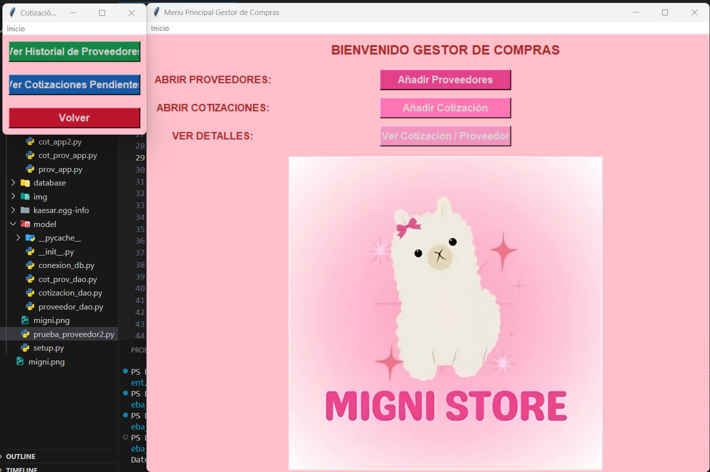

Pantalla de Ver Historial de Proveedores
- Seleccionamos el proveedor activo que queramos ver sus cotizaciones

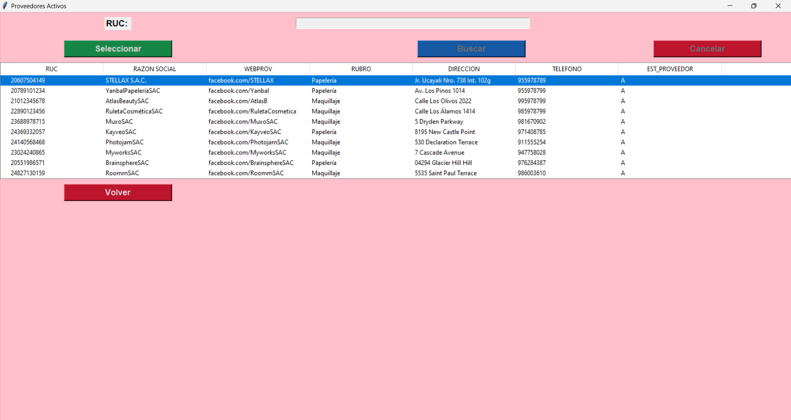

- Al presionar el boton seleccionar nos pondra en la entrada el ruc que hemos elegido

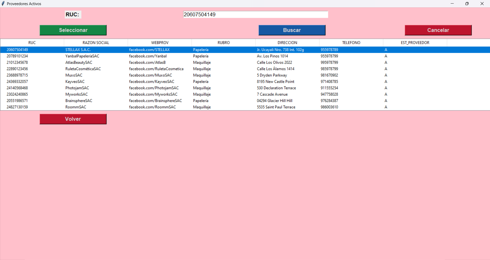

- Luego se presiona el boton de buscar y entonces podemos ver las cotizaciones del proveedor que escojamos

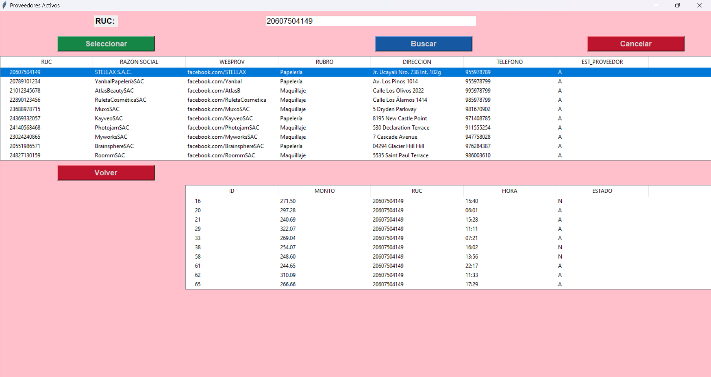

Pantalla de Ver Cotizaciones Pendientes

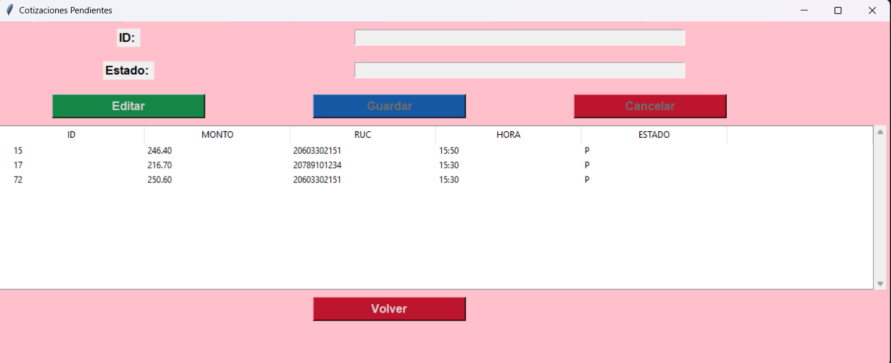

- Seleccionamos la cotizacion que deseamos aceptar o rechazar y le damos al boton editar, que nos pondra los campos en la pantalla

- En este caso se pone "A" de Aceptado y entonces se click en el boton de guardar

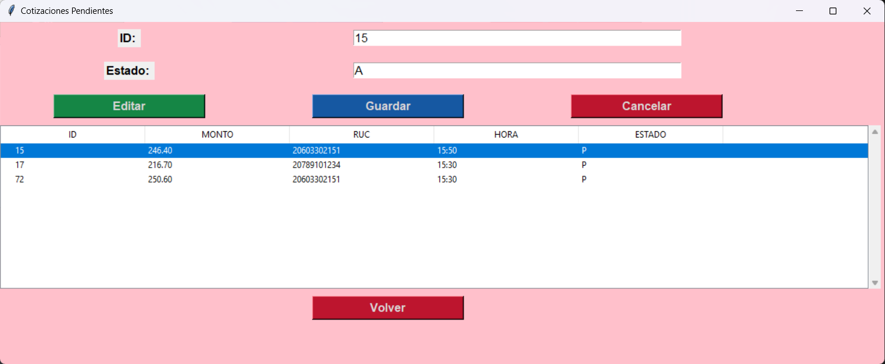

- Entonces se ve que la cotizacion ya no aparece pues ya no esta en un estado de pendiente

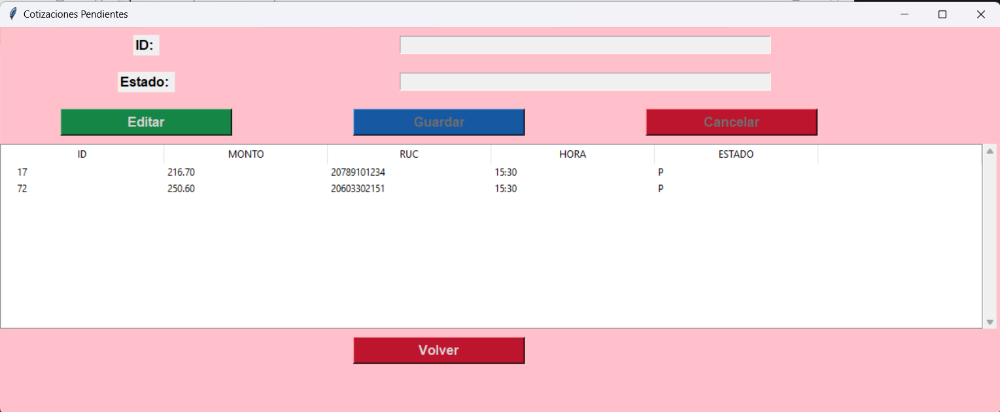

## CODIGO DEL APLICATIVO
[APLICATIVO COMPRAS](COMPRAS)

