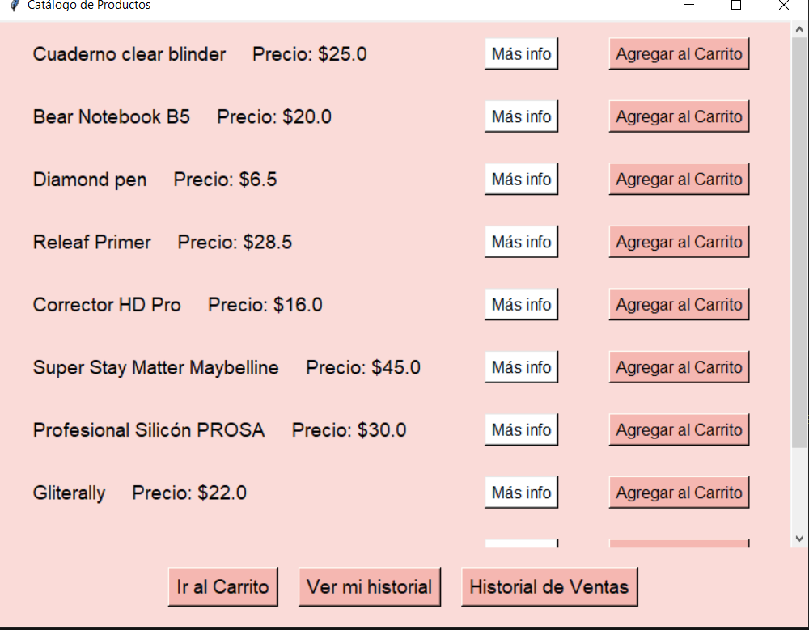
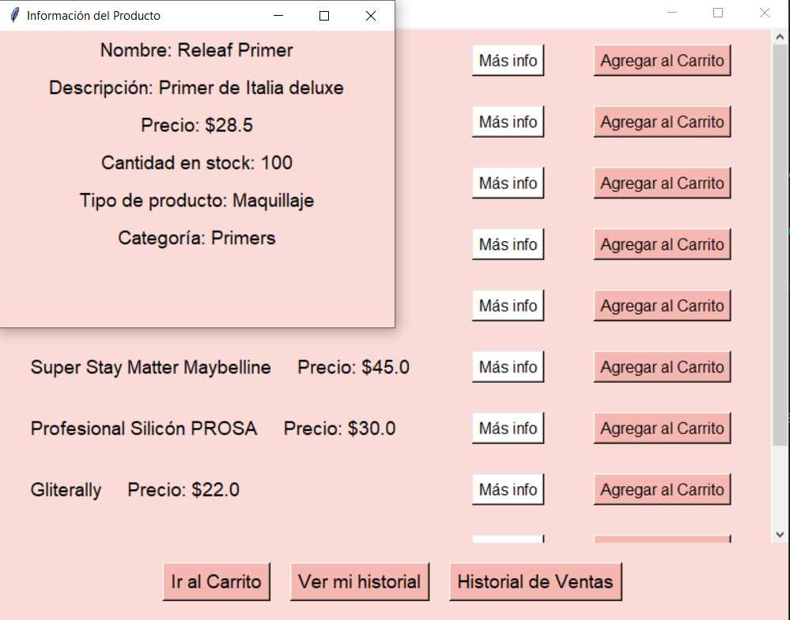
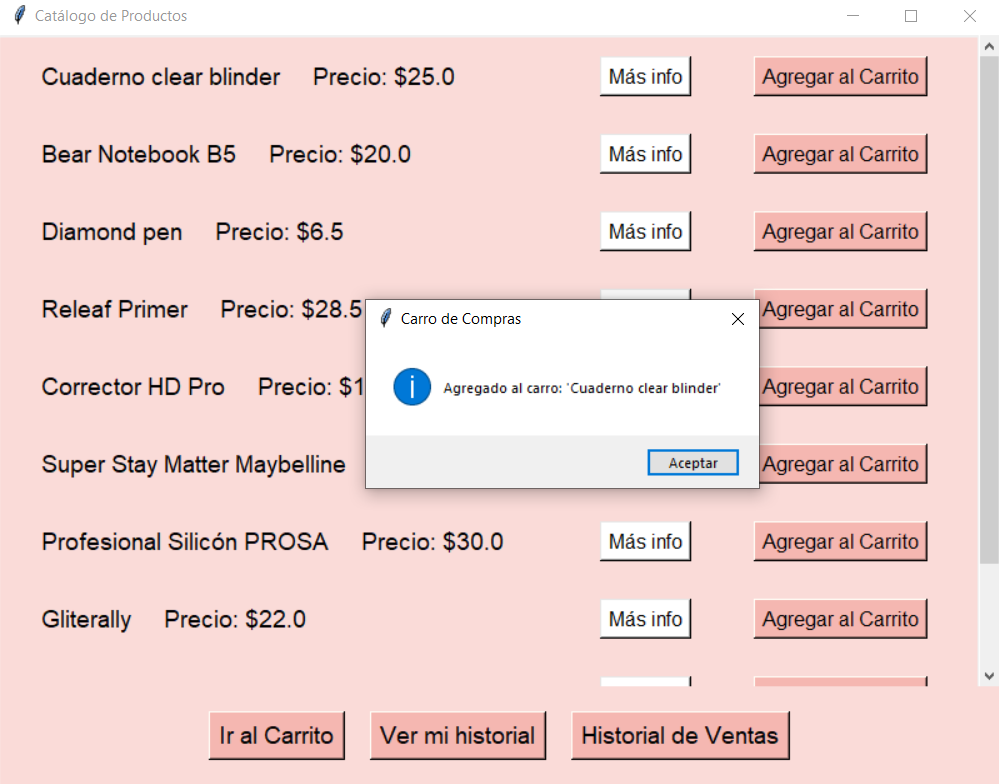
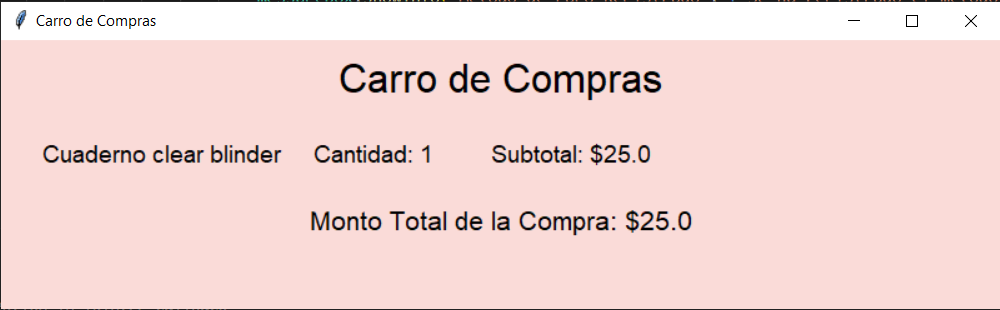
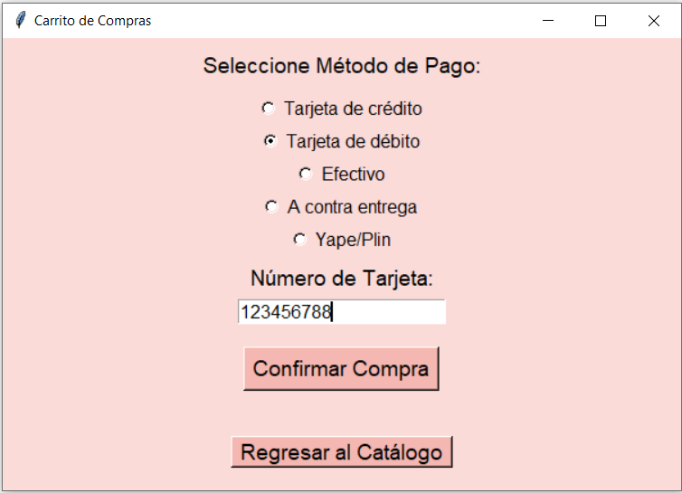

## EXPLICACION DEL APLICATIVO DEL MODULO DE VENTAS
### FLUJO DE COMPRAS
Se aplico diversas ventanas para poder satisfacer, de manera simple, un flujo de compras general. Desde el catálogo , hasta la finalizacion de compra.

1. Catálogo de compras: Se uso un catálogo para poder mostrar los diversos productos que ofrece Migni Store
   
2. Se utilizo botones configurados para detallar los productos y luego para agregarlos al carro de compra, sin embargo al agregar solo es posbile con el click, todavia no esta implementado una caja de texto que permita una cantidad de datos específica.
    
    
3. Se muestra el famosos carrito de compras donde se ve resumida la compra,los productos y el precio total. Además, se puede regresar al cátalogo con el boton "regresar al catálogo"
    
4. Se muestra el tipo de pago y poder complementarlo con un número de tarjeta.
    
