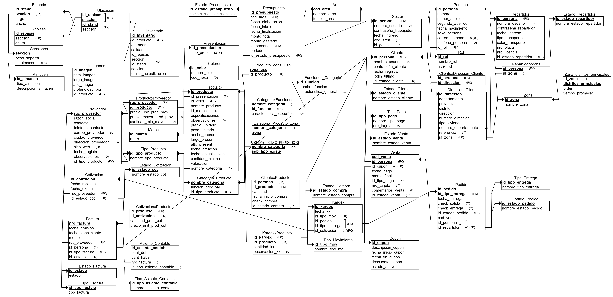

# MODULO DE ALMACEN
## NOTA: TRABAJÉ MI FLUJO DE ALMACÉN CON EL SIGUIENTE MODELO CONCEPTUAL Y LÓGICO QUE ELABORÉ A BASE DEL INICIAL (que por tema de tiempo no se pudo consolidar)




## EXPLICACION DE LAS PANTALLAS
### GESTOR DE ALMACEN
- Menu Principal, donde se visualizarán las opciones de Inventario, Pedidos y Kardex


Al dar clic en Iventario se visualizará todo el inventario disponible de los 2 almacenes, con los campos de tabla:
  - ID Producto
  - Nombre
  - Presentación
  - Color
  - Stock
  - Ubicación

Y que se puede filtrar bajos los parámetro:
  - Ver todo
  - Ver solo maquillaje
  - Ver solo papelería
  - Ver los productos que no se tiene Stock
  - Buscar por Codigo Producto que puede ser las 3 iniciales
  - Buscar por la marca del producto
  - Buscar por stock mínimo (si ingreso 15 me mostrará los producto que tengo más de 15und)
  - Buscar por categoría

Al dar clic en cada fila de la tabla que se muestra, en el lado derecho se mostrará la imagen del producto junto con su importe de inventario total que existe, y el volumen del producto para su respectivo despacho.


*Acción de seleccionar una fila

```py
query2 = '''
          SELECT
            i.id_producto,
            p.nombre_producto,
            pr.tipo_presentacion,
            c.nombre_color,
            (i.entradas - i.salidas) AS stock,
            CONCAT(i.seccion, '-', i.id_stand, '-', i.id_repisas) AS ubicacion
            FROM Inventario i
            JOIN Producto p ON i.id_producto = p.id_producto
            JOIN Presentacion pr ON p.id_presentacion = pr.id_presentacion
            JOIN Colores c ON p.id_color = c.id_color
        '''
        cursor.execute(query2)
        self.tabla_frame(cursor.fetchall())
```

```py
conn,cursor = bd.conectar()
query3 = '''
    SELECT 
        p.id_producto,
        i.path_imagen,
        (p.precio_unitario*(inv.entradas - inv.salidas)) AS importe,
        CONCAT(p.ancho_present*p.largo_present*p.alto_present,' cm³') AS volumen
            FROM 
                Producto p
            JOIN 
                Imagenes i ON p.id_producto = i.id_producto
            JOIN 
                Inventario inv ON p.id_producto = inv.id_producto
        '''
        cursor.execute(query3)
        img = cursor.fetchall()
        self.id_img_prod = {str(imagen[0]):
            {'path_imagen': imagen[1],'Importe': imagen[2],'Volumen': imagen[3]} for imagen in img}
 cursor.close()
conn.commit()
conn.close()
  '''
```


* Filtrar por las iniciales PAL
  
```py
query = '''
                    SELECT
                        p.id_producto,
                        p.nombre_producto,
                        pr.tipo_presentacion,
                        c.nombre_color,
                        (i.entradas - i.salidas) AS stock,
                        CONCAT(i.seccion, '-', i.id_stand, '-', i.id_repisas) AS ubicacion
                    FROM
                        Inventario i
                        JOIN Producto p ON i.id_producto = p.id_producto
                        JOIN Presentacion pr ON p.id_presentacion = pr.id_presentacion
                        JOIN Colores c ON p.id_color = c.id_color
                    WHERE
                        p.id_producto LIKE %s
                    ORDER BY
                        p.id_producto           
                '''
                cursor.execute(query,('%'+valor_producto+'%',))
                rows = cursor.fetchall()
```


*Filtrar por Marca

```py
    query = '''
            SELECT id_marca FROM Marca
        '''
        cursor.execute(query)
        rows = cursor.fetchall()
        id_marcas = [marca[0] for marca in rows]
```

```py
query = '''
                    SELECT
                        p.id_producto,
                        p.nombre_producto,
                        pr.tipo_presentacion,
                        c.nombre_color,
                        (i.entradas - i.salidas) AS stock,
                        CONCAT(i.seccion, '-', i.id_stand, '-', i.id_repisas) AS ubicacion
                    FROM
                        Inventario i
                        JOIN Producto p ON i.id_producto = p.id_producto
                        JOIN Presentacion pr ON p.id_presentacion = pr.id_presentacion
                        JOIN Colores c ON p.id_color = c.id_color
                        JOIN Marca m ON p.id_marca = m.id_marca
                    WHERE
                        m.id_marca = %s
                    ORDER BY
                        p.id_producto
                '''
                cursor.execute(query,(valor_marca,))
                rows = cursor.fetchall()
```


*Todo lo que es papelería

```py
query = '''
            SELECT
                i.id_producto,
                p.nombre_producto,
                pr.tipo_presentacion,
                c.nombre_color,
                (i.entradas - i.salidas) AS stock,
                CONCAT(i.seccion, '-', i.id_stand, '-', i.id_repisas) AS ubicacion
            FROM Inventario i
            JOIN Producto p ON i.id_producto = p.id_producto
            JOIN Presentacion pr ON p.id_presentacion = pr.id_presentacion
            JOIN Colores c ON p.id_color = c.id_color
            JOIN Categoria_Producto cp ON p.nombre_categoria = cp.nombre_categoria
            JOIN Tipo_Producto tp ON cp.id_tipo_producto = tp.id_tipo_producto
            WHERE tp.id_tipo_producto = 2;
        '''
```


*Productos que no se tiene Stock
```py
query = '''
          SELECT
                i.id_producto,
                p.nombre_producto,
                pr.tipo_presentacion,
                c.nombre_color,
                (i.entradas - i.salidas) AS stock,
                CONCAT(i.seccion, '-', i.id_stand, '-', i.id_repisas) AS ubicacion
            FROM
                Inventario i
            JOIN
                Producto p ON i.id_producto = p.id_producto
            JOIN
                Presentacion pr ON p.id_presentacion = pr.id_presentacion
            JOIN
                Colores c ON p.id_color = c.id_color
            WHERE
                (i.entradas - i.salidas) = 0
        '''
        cursor.execute(query)
        self.tabla_frame(cursor.fetchall())
```


*Productos que tienes stock mayor al ingresado

```py
query = '''
                    SELECT
                        p.id_producto,
                        p.nombre_producto,
                        pr.tipo_presentacion,
                        c.nombre_color,
                        (i.entradas - i.salidas) AS stock,
                        CONCAT(i.seccion, '-', i.id_stand, '-', i.id_repisas) AS ubicacion
                    FROM
                        Inventario i
                        JOIN Producto p ON i.id_producto = p.id_producto
                        JOIN Presentacion pr ON p.id_presentacion = pr.id_presentacion
                        JOIN Colores c ON p.id_color = c.id_color
                    WHERE
                        (i.entradas - i.salidas) >= %s
                    ORDER BY
                        p.id_producto
                '''
                cursor.execute(query,(valor_stock,))
                rows = cursor.fetchall()
```


*Filtrar por categoría del producto

```py
 query4 = '''
            SELECT nombre_categoria FROM Categoria_Producto
        '''
        cursor.execute(query4)
        rows = cursor.fetchall()
        id_categorias = [categoria[0] for categoria in rows]
```

```py
query = '''
                    SELECT
                        p.id_producto,
                        p.nombre_producto,
                        pr.tipo_presentacion,
                        c.nombre_color,
                        (i.entradas - i.salidas) AS stock,
                        CONCAT(i.seccion, '-', i.id_stand, '-', i.id_repisas) AS ubicacion
                    FROM
                        Inventario i
                        JOIN Producto p ON i.id_producto = p.id_producto
                        JOIN Presentacion pr ON p.id_presentacion = pr.id_presentacion
                        JOIN Colores c ON p.id_color = c.id_color
                        JOIN Categoria_Producto cp ON p.nombre_categoria = cp.nombre_categoria
                    WHERE
                        cp.nombre_categoria = %s
                    ORDER BY
                        p.id_producto
                '''
                cursor.execute(query,(valor_categoria,))
                rows = cursor.fetchall()
```


*Para maximizar la pantalla, clic en el ícono al costado del nombre Migni Store


*Mensaje si se da clic en buscar pero no se da ningún parámetro de entrada


*Vista de la sección Pedidos que están en estado L (Leídos para procedor a preparar)

```py
  query = '''
            SELECT
                p.id_pedido,
                te.nombre_tipo_entrega,
                p.fecha_entrega,
                (p.fecha_entrega - CURRENT_DATE) AS dias_faltantes,
                p.cod_venta,
                CONCAT(pe.nombre, ' ', pe.primer_apellido) AS nombre_repartidor
            FROM
                Pedido p
            INNER JOIN
                Tipo_Entrega te ON p.id_tipo_entrega = te.id_tipo_entrega
            LEFT JOIN
                Persona pe ON p.id_repartidor = pe.id_persona
            WHERE
                p.id_estado_pedido = 'L'
        '''
        cursor.execute(query)
        self.tabla_frame(cursor.fetchall())
```


* Al dar clic en la fila de la tabla pedido, se mostrará al lado derecho los detalles de la venta que se ha efectuado

```py
query = '''
            SELECT 
                cxp.id_producto,
                p.nombre_producto,
                cxp.cantidad,
                CONCAT(inv.seccion, '-', inv.id_stand, '-', inv.id_repisas) AS ubicacion
            FROM 
                Pedido pd
            JOIN 
                Venta v ON pd.cod_venta = v.cod_venta AND pd.id_persona = v.id_persona
            JOIN 
                Cliente cl ON v.id_persona = cl.id_persona
            JOIN 
                ClientexProducto cxp ON cl.id_persona = cxp.id_persona
            JOIN 
                Producto p ON cxp.id_producto = p.id_producto
            LEFT JOIN
                Inventario inv ON p.id_producto = inv.id_producto
            WHERE 
                pd.id_pedido = %s  
        '''
        cursor.execute(query,(id_pedido,))
```


*Se puede filtrar para ver pedidos actuales o pasados por tipo de entrega o estado de pedido

```py
query = '''
                    SELECT
                        p.id_pedido,
                        te.nombre_tipo_entrega,
                        p.fecha_entrega,
                        (p.fecha_entrega - CURRENT_DATE) AS dias_faltantes,
                        p.cod_venta,
                        CONCAT(pe.nombre, ' ', pe.primer_apellido) AS nombre_repartidor
                    FROM
                        Pedido p
                    INNER JOIN
                        Tipo_Entrega te ON p.id_tipo_entrega = te.id_tipo_entrega
                    LEFT JOIN
                        Persona pe ON p.id_repartidor = pe.id_persona
                    WHERE
                        te.nombre_tipo_entrega = %s           
                '''
query = '''
                    SELECT
                        p.id_pedido,
                        te.nombre_tipo_entrega,
                        p.fecha_entrega,
                        (p.fecha_entrega - CURRENT_DATE) AS dias_faltantes,
                        p.cod_venta,
                        CONCAT(pe.nombre, ' ', pe.primer_apellido) AS nombre_repartidor
                    FROM
                        Pedido p
                    INNER JOIN
                        Tipo_Entrega te ON p.id_tipo_entrega = te.id_tipo_entrega
                    LEFT JOIN
                        Persona pe ON p.id_repartidor = pe.id_persona
                    INNER JOIN
                        Estado_Pedido ep ON p.id_estado_pedido = ep.id_estado_pedido
                    WHERE
                        ep.nombre_estado_pedido = %s
                '''
                cursor.execute(query,(valor_estado,))
```


*Al darle en registrar, se insertaré los detalles de pedido en mis tablas Kardex y KardexxProducto
*Y SE ACTUALIZARÁ EL ESTADO DEL PEDIDO A P (EN PROCESO) Y EL ESTADO DE LA VENTA PARA QUE VISUALICE EL CLIENTE QUE SU PEDIDO ESTÁ EN PREPARACIÓN

```py
query2 = '''
            SELECT id_tipo_entrega
            FROM Pedido
            WHERE id_pedido = %s        
        '''
        cursor.execute(query2,(pedidokx,))
        one = cursor.fetchone()

        if one:
            id_tipo_entrega = one[0]
        else:
            id_tipo_entrega = None

        if id_tipo_entrega == 'A':
            mov = 1
        elif id_tipo_entrega == 'B':
            mov = 2
        elif id_tipo_entrega == 'C':
            mov = 3
        else:
            mov = None          

        query = '''
            WITH NumerosKardex AS (
                SELECT COUNT(*) + 1 AS siguiente_numero
                FROM Kardex
            )

            INSERT INTO Kardex (id_kardex,fecha_kx,id_tipo_mov,id_pedido,id_tipo_entrega)
            VALUES (
                (SELECT 'KX0' || siguiente_numero FROM NumerosKardex),
                CURRENT_TIMESTAMP,%s,%s,%s
            )  
        '''
        cursor.execute(query,(mov,pedidokx,id_tipo_entrega))

        query6 = '''
            WITH NumerosKardex AS (
                SELECT COUNT(*) AS siguiente_numero
                FROM Kardex
            )
            SELECT 'KX0' || siguiente_numero AS id_kardex
            FROM NumerosKardex
        '''
        cursor.execute(query6)
        id_kx = cursor.fetchone()
        id_kx2 = id_kx[0]

        query7 = '''
            SELECT id_persona
            FROM Pedido
            WHERE id_pedido = %s
        '''
        cursor.execute(query7,(pedidokx,))
        person = cursor.fetchone()
        person2 = person[0]
        
        query5 = '''
            INSERT INTO KardexxProducto (id_kardex,id_producto,cantidad_kx)
            SELECT %s,id_producto,cantidad
            FROM ClientexProducto
            WHERE id_persona = %s AND id_estado_compra = 'C';       
        '''
        cursor.execute(query5,(id_kx2,person2,))

        query3 = '''
            UPDATE Pedido
            SET id_estado_pedido = 'P'
            WHERE id_pedido = %s
        '''
        cursor.execute(query3,(pedidokx,))

        query4 = '''
            UPDATE Venta
            SET id_estado_venta = 'D'
            WHERE cod_venta = (
                SELECT cod_venta
                FROM Pedido
                WHERE id_pedido = %s
            )
        '''
        cursor.execute(query4,(pedidokx,))
        util_mensaje.ConfirmarRegistro()

                cursor.execute(query,(valor_entrega,))
                rows = cursor.fetchall()
```


*Se visualiza los movimientos de los productos con sus detalles de cantidad y productos por cada id_kardex

```py
query = '''
            SELECT
                k.id_kardex,
                TO_CHAR(k.fecha_kx,'YYYY-MM-DD HH24:MI:SS') AS fecha_kx,
                tm.nombre_movimiento,
                k.id_pedido,
                te.nombre_tipo_entrega
            FROM
                Kardex k
            INNER JOIN
                Tipo_Movimiento tm ON k.id_tipo_mov = tm.id_tipo_mov
            INNER JOIN
                Pedido p ON k.id_pedido = p.id_pedido
            INNER JOIN
                Tipo_Entrega te ON p.id_tipo_entrega = te.id_tipo_entrega        
        '''
        cursor.execute(query)
        self.tabla_frame(cursor.fetchall())
```

```py
query = '''
            SELECT p.nombre_producto,kp.cantidad_kx
            FROM KardexxProducto kp
            JOIN Producto p ON kp.id_producto = p.id_producto
            WHERE kp.id_kardex = %s
        '''
        cursor.execute(query,(id_detalle,))
```
