# Módulo marketing

[archivos aplicativo marketing](archivos_cap16/modulo_marketing)

## Explicación de las funcionalidades

Gestor de marketing

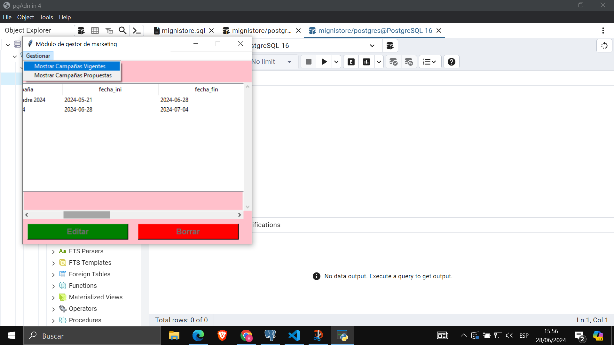
La primera funcionalidad es la de mostrar campañas vigentes, con un select para aquellas campañas que tengan a la fecha de hoy entre la fecha de inicio y la fecha de fin.

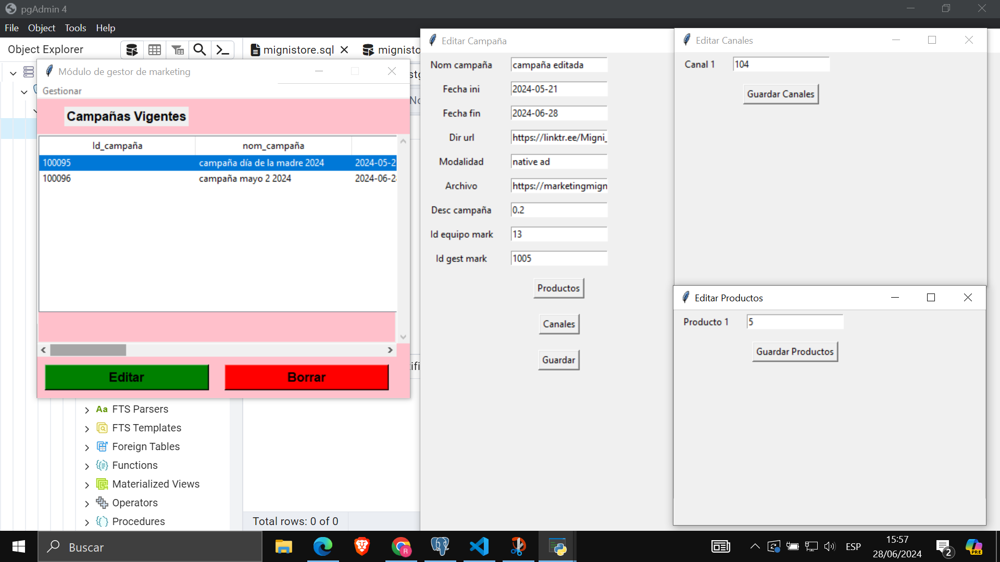
Al seleccionar una campaña vigente, y presionar en editar se nos habre una ventana emergente, esta tendra los espacios de los datos de la campaña y tendra los botones de productos (para que te muestre los productos asociados a la campaña), boton canales (para que te muestre los canales asociados) y guardar (para realizar los cambios).

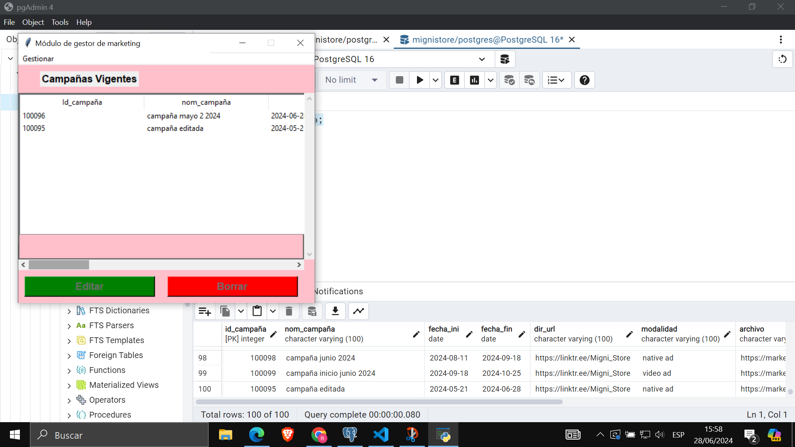
Como se aprecia en la base de datos, se actualizo la campaña elegida (por lo que esta al final de la tabla).

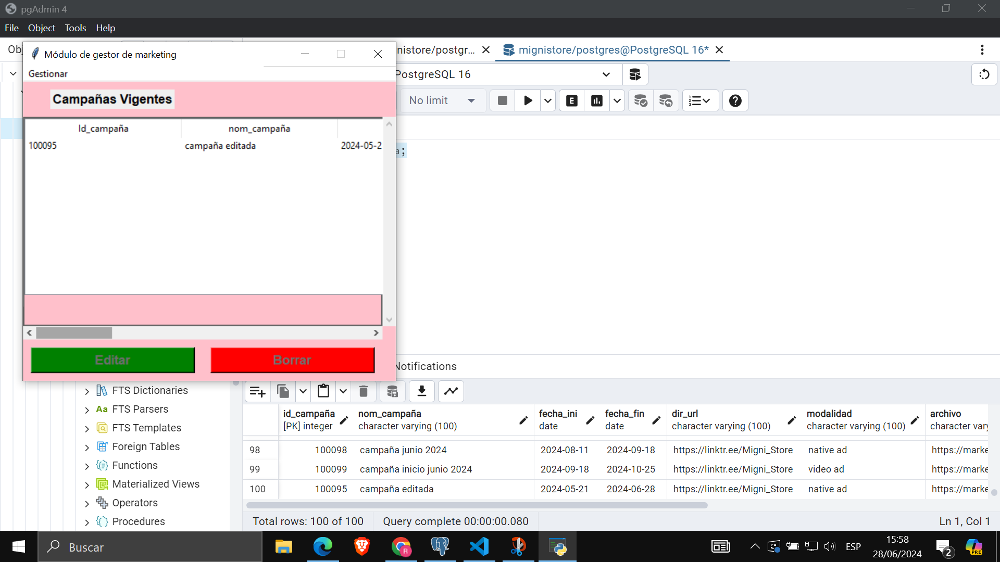
Como se aprecia, la campaña 10096 ha sido borrada al seleccionarla y presionar en borrar.

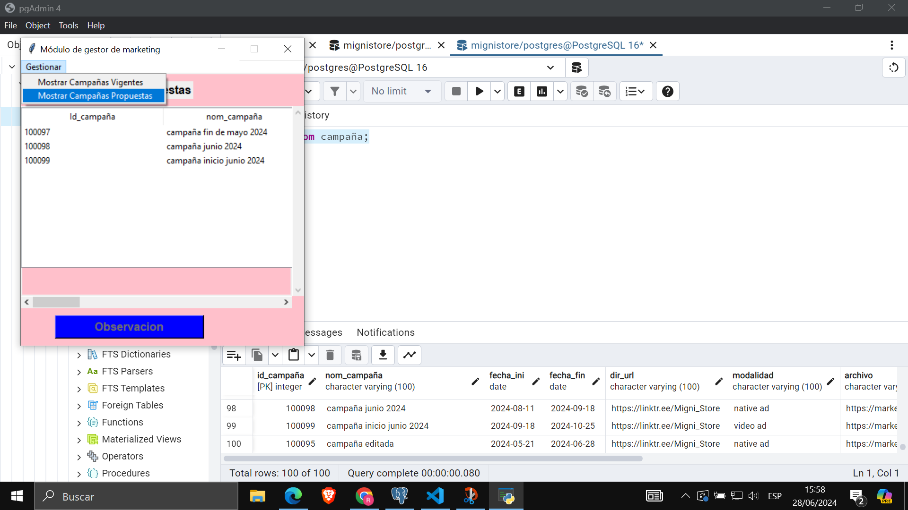
Cuando se presiona en mostrar campañas propuestas, el frame se refresca para mostrarnos las campañas que tengan la fecha de inicio mas adelante que la de hoy.

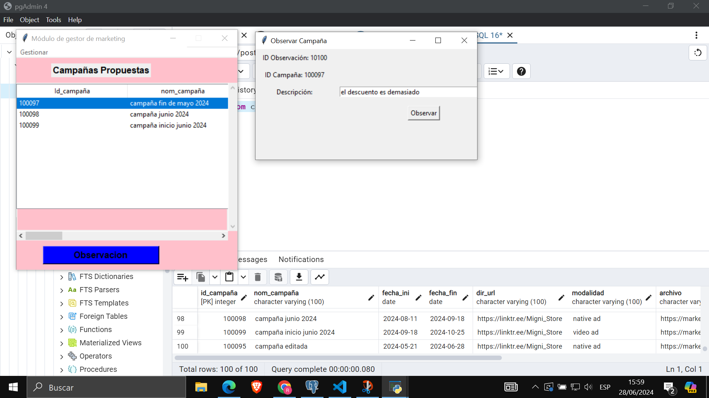
Cuando se selecciona una campaña se activa el boton observacion, al presionarlo se habre una ventana con los datos asociados para generar la observacion y un cuadro de texto donde insertar la descripcion

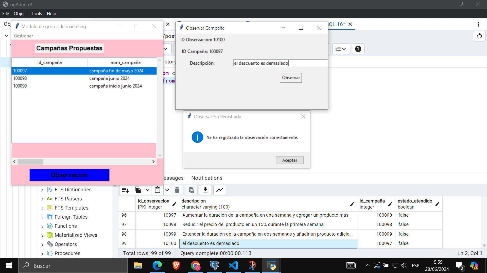
Se verifica que en la tabla observacion de la base de datos se ha generado la observacion con estado atendido en false ya que aun no se atiende.

## Equipo de marketing

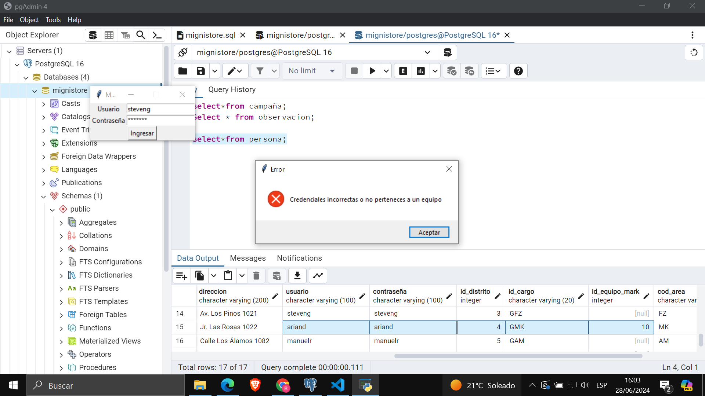
El login solo deja ingresar a los que pertenezcan a un equipo de marketing, esto ademas sirve para saber que equipo de marketing va a realizar las siguientes funcionalidades.

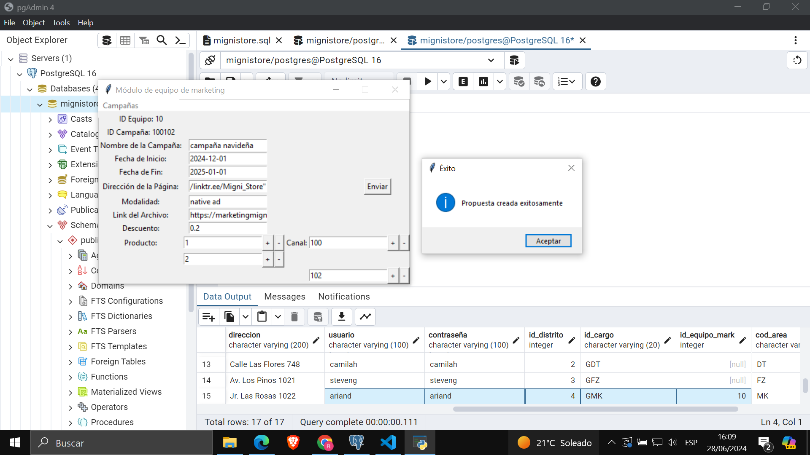
La opcion desplegable de Campañas tiene la funcion de crear propuestas y atender observaciones, al dar en crear propuestas podemos ingresar los datos de la campaña a ingresar, ademas de agregar cuantos productos queramos, al presionar en enviar se hacen los inserts en la tabla campaña y asociados.

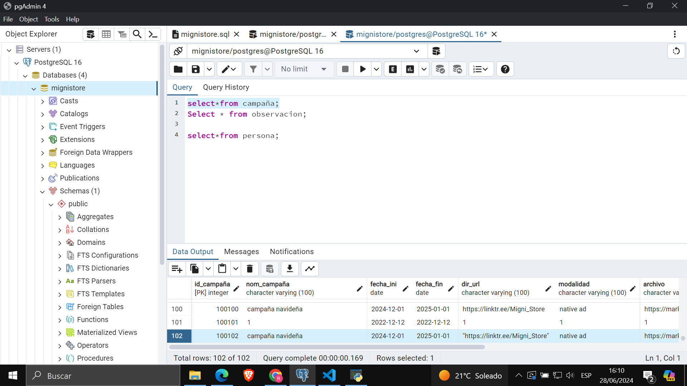
Se verifica que en la base de datos se realizó un insert con los datos brindados.

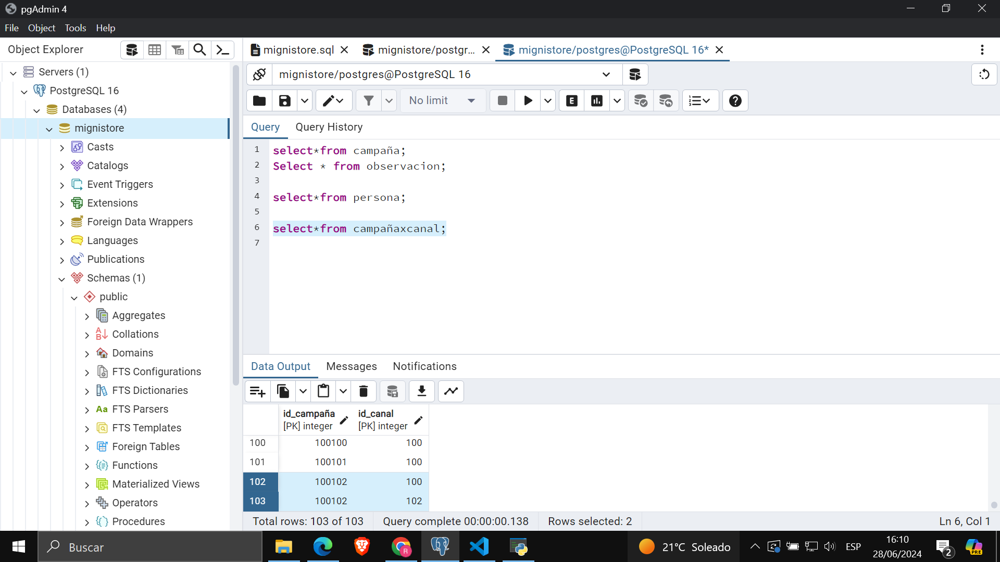
Se verifica tambien que se han registrado los productos escritos en campañaxcanal, estotambien va para campañaxprod.

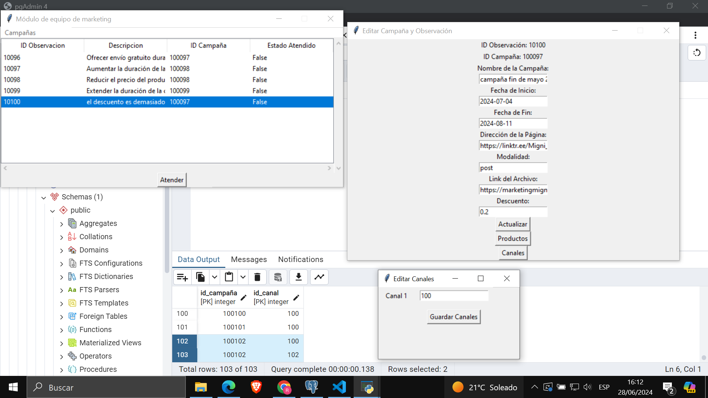
La otra funcionalidad desplegable es la de atender observaciones, se mostraran las observaciones que tengan estado atendido en false y cuya campaña pertenezca al equipo de marketing, al seleccionar una observacion y darle a atender, se habre una ventana con los datos de la campaña, los botones productos y canales muestran los productos y canales respectivos asociados a la campaña y observacion.

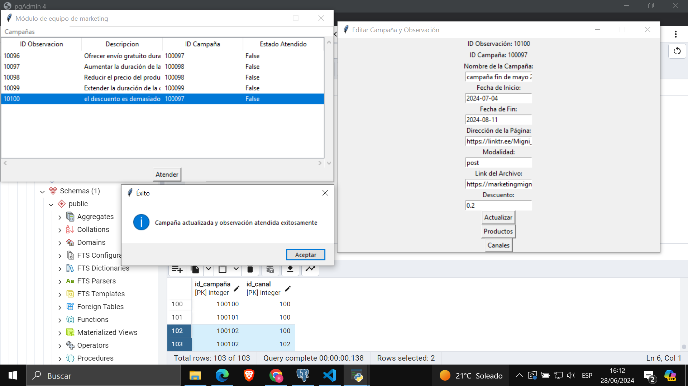
El boton actualizar realiza los updates tanto a observacion, campaña, campañaxprod y campañaxcanal, la observacion pasa a estar en estado atendido true.

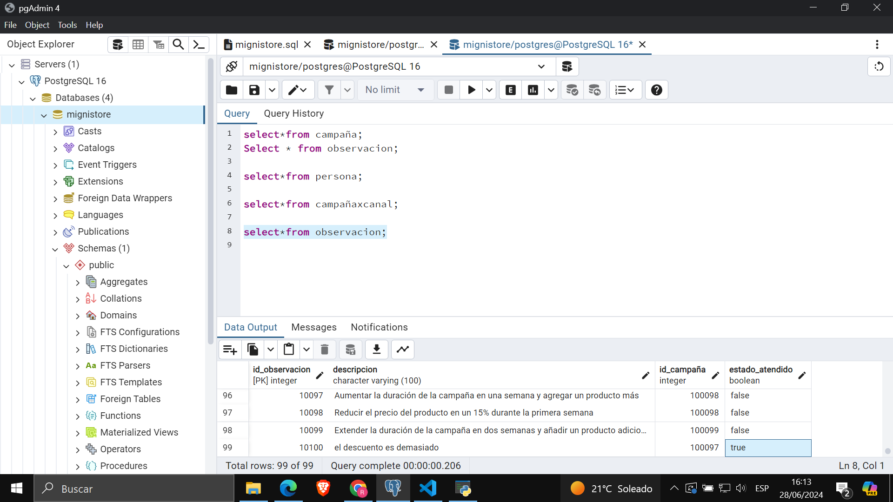
Se verifica que se actualizó la observación.

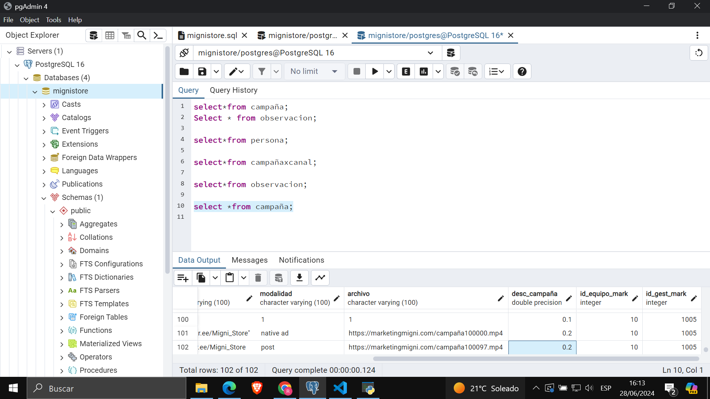
Se verifica que se realizo la correccion con respecto a la descripcion de la observacion (se disminuyo el descuento).

## CODIGO DEL APLICATIVO
[APLICATIVO MARKETING](../modulo_marketing)
